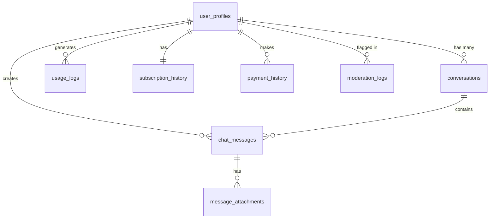

# AIRI SaaS Database Schema Documentation

## Overview

The AIRI SaaS platform uses Supabase (PostgreSQL) as its primary database. The schema is designed for scalability, performance, and security, with a focus on efficient chat history storage and retrieval.

## Chat History Storage Architecture

### Design Principles

1. **Conversation-Based Structure**: Chat history is organized into conversations (threads), with each conversation containing multiple messages
2. **Efficient Retrieval**: Optimized indexes and materialized views for fast message retrieval
3. **Scalability**: Partitioning support for handling millions of messages
4. **Full-Text Search**: Built-in search capabilities across all conversations
5. **Soft Deletes**: Messages are marked as deleted rather than removed, preserving audit trails
6. **Token Tracking**: Comprehensive tracking of token usage for billing and analytics

### Core Tables

#### 1. `conversations` Table
Stores conversation threads/sessions between users and AI.

**Key Features:**
- Each conversation represents a chat session with consistent context
- Stores model/provider configuration per conversation
- Tracks total tokens and message count
- Supports starring and archiving

**Storage Strategy:**
- Conversations are never deleted, only archived
- Last message timestamp is denormalized for performance
- Settings stored as JSONB for flexibility

#### 2. `chat_messages` Table
Stores individual messages within conversations.

**Key Features:**
- Supports multiple content types (text, image, audio, code)
- Tracks token usage per message for accurate billing
- Includes embeddings for semantic search (requires pgvector)
- Soft delete with `deleted_at` timestamp
- Attachment support via JSONB array

**Storage Strategy:**
- Messages are immutable once created (except for soft delete)
- Content is stored as TEXT for unlimited length
- Attachments metadata stored inline, files in object storage
- Full-text search index on content

#### 3. `message_attachments` Table
Stores file attachments for messages.

**Key Features:**
- References to files stored in Supabase Storage/S3
- Metadata for images (dimensions) and media (duration)
- Supports multiple attachments per message

### Performance Optimizations

#### 1. Indexes
```sql
-- Conversation retrieval
idx_conversations_user_id
idx_conversations_last_message_at
idx_conversations_is_archived

-- Message retrieval
idx_chat_messages_conversation_id
idx_chat_messages_created_at
idx_chat_messages_content_search (GIN for full-text search)
```

#### 2. Materialized Views
- `recent_conversations`: Pre-computed view of conversations from last 7 days
- Refreshed every 5 minutes for near real-time performance

#### 3. Partitioning (Future Scale)
- `chat_messages_partitioned`: Monthly partitions for handling billions of messages
- Automatic partition creation via scheduled function

### Query Patterns

#### Loading Conversations List
```sql
-- Optimized function: get_conversations_with_last_message()
-- Returns paginated conversations with last message preview
-- Sorted by starred status and last activity
```

#### Loading Messages in a Conversation
```sql
-- Optimized function: get_conversation_messages()
-- Uses cursor pagination for infinite scroll
-- Returns messages in reverse chronological order
```

#### Searching Across All Chats
```sql
-- Function: search_messages()
-- Full-text search across all user's messages
-- Returns ranked results with conversation context
```

### Data Retention

1. **Active Messages**: Kept indefinitely in main tables
2. **Soft Deletes**: Messages older than 90 days can be soft-deleted
3. **Archiving**: Inactive conversations auto-archived after 30 days
4. **Export**: Users can export conversations as JSON

### Storage Estimates

For 10,000 users with average usage:
- **Conversations**: ~50 per user = 500,000 rows (~100 MB)
- **Messages**: ~1,000 per user = 10,000,000 rows (~10 GB)
- **Attachments**: ~10 per user = 100,000 rows (~20 MB)
- **Indexes**: ~2 GB
- **Total Database Size**: ~15 GB

### Backup Strategy

1. **Automatic Backups**: Supabase point-in-time recovery (7 days)
2. **Daily Exports**: Scheduled export of user data to S3
3. **Conversation Archives**: Monthly archive of inactive conversations

## Table Relationships



## Security Model

### Row Level Security (RLS)
All tables have RLS enabled with policies ensuring users can only access their own data.

### Key Policies:
1. **user_profiles**: Users can view/update only their own profile
2. **conversations**: Full CRUD for user's own conversations
3. **chat_messages**: Create/read for user's own messages
4. **usage_logs**: Read-only access to own usage data
5. **subscription_history**: Read-only access to own billing data

## Usage Tracking Tables

### `usage_logs`
- Tracks every API call with token consumption
- Used for rate limiting and billing
- Stores request/response metadata for debugging

### `usage_daily_aggregates`
- Pre-computed daily summaries for dashboard
- Reduces query load for analytics
- Updates via scheduled job

## Subscription & Billing Tables

### `user_profiles`
- Stores current subscription tier and status
- Links to Stripe customer/subscription IDs
- Tracks daily/total message counts

### `subscription_history`
- Historical record of all subscription changes
- Used for revenue reporting and analytics

### `payment_history`
- Record of all payments processed
- Links to Stripe payment intents

## Moderation Tables

### `moderation_logs`
- Records all content moderation checks
- Stores OpenAI moderation API results
- Used for user safety monitoring

### `user_violations`
- Tracks policy violations per user
- Supports progressive enforcement
- Auto-expiring suspensions

## Migration Strategy

### Initial Setup
```bash
# Run migrations in order
supabase migration up
```

### Adding New Features
1. Create new migration file: `00X_feature_name.sql`
2. Test in development environment
3. Apply to staging
4. Deploy to production during maintenance window

### Rollback Procedures
Each migration should include rollback commands:
```sql
-- Rollback example
DROP TABLE IF EXISTS table_name CASCADE;
DROP FUNCTION IF EXISTS function_name CASCADE;
```

## Performance Monitoring

### Key Metrics to Track
1. **Query Performance**: Via `query_performance_logs` table
2. **Table Size**: Monitor growth of messages table
3. **Index Usage**: Check for unused or missing indexes
4. **Cache Hit Ratio**: Monitor materialized view usage

### Optimization Checklist
- [ ] Vacuum large tables weekly
- [ ] Reindex after bulk operations
- [ ] Update table statistics regularly
- [ ] Monitor slow query log
- [ ] Review and optimize common query patterns

## Maintenance Jobs

### Required Scheduled Jobs
1. **Every 5 minutes**: Refresh materialized views
2. **Every 30 minutes**: Clean up inactive sessions
3. **Hourly**: Clear expired cache entries
4. **Daily**: Update usage aggregates
5. **Weekly**: Archive old conversations
6. **Monthly**: Create new message partition

### Setup with pg_cron
```sql
-- Enable pg_cron extension
CREATE EXTENSION pg_cron;

-- Schedule jobs
SELECT cron.schedule('refresh-views', '*/5 * * * *', 
  'SELECT refresh_recent_conversations();');
```

## Disaster Recovery

### Backup Locations
1. **Primary**: Supabase automatic backups
2. **Secondary**: S3 bucket with daily exports
3. **Tertiary**: Local development snapshots

### Recovery Time Objectives
- **RPO (Recovery Point Objective)**: < 1 hour
- **RTO (Recovery Time Objective)**: < 4 hours

### Recovery Procedures
1. Identify failure point
2. Restore from most recent backup
3. Replay transaction logs if available
4. Verify data integrity
5. Update DNS/connection strings
6. Test application functionality