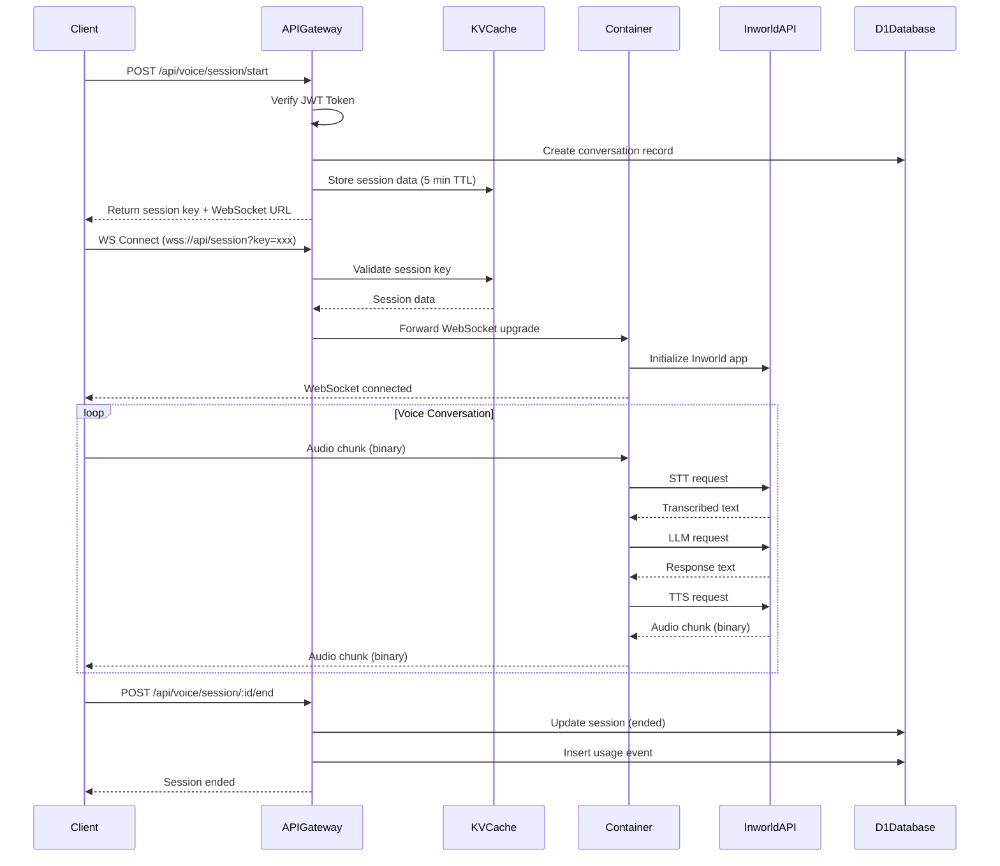

# Voice Agent Container - Integration Guide

**Version:** 2.0 (Multi-Tenant)
**Last Updated:** 2025-10-07
**Author:** Phantom Systems Inc

---

## Table of Contents

1. [Overview](#overview)
2. [Architecture](#architecture)
3. [Cloudflare Container Integration](#cloudflare-container-integration)
4. [Multi-Tenant Session Management](#multi-tenant-session-management)
5. [Inworld Runtime Integration](#inworld-runtime-integration)
6. [API Gateway Integration](#api-gateway-integration)
7. [Database Integration](#database-integration)
8. [Authentication & Session Management](#authentication--session-management)
9. [Usage Tracking & Billing](#usage-tracking--billing)
10. [WebSocket Communication](#websocket-communication)
11. [Deployment](#deployment)
12. [Testing & Monitoring](#testing--monitoring)
13. [Troubleshooting](#troubleshooting)
14. [Reference Links](#reference-links)

---

## Overview

This document provides a comprehensive guide for integrating the Voice Agent Container with the Mirai MVP platform. The container runs Inworld Runtime's voice agent template on Cloudflare's Container platform, providing:

- **Real-time voice communication** via WebSocket
- **Multi-modal AI interaction** (Speech-to-Text, LLM, Text-to-Speech)
- **Multi-tenant architecture** (one container serves 100+ concurrent users)
- **Scalable infrastructure** with auto-scaling and scale-to-zero
- **Seamless integration** with Better-Auth, D1, R2, and KV

### Key Technologies

- **Cloudflare Containers**: Serverless container platform with auto-scaling
- **Inworld Runtime SDK**: Multi-modal AI orchestration (STT/LLM/TTS)
- **Express.js + WebSocket**: HTTP server and real-time communication
- **Docker**: Multi-stage container builds for production deployment
- **Better-Auth**: Authentication and session management
- **Drizzle ORM**: Type-safe database access with D1

### Multi-Tenant Architecture

**Critical Design Principle:** One container instance serves multiple users simultaneously by:
- **Character-based pooling**: One Inworld app instance per unique character (not per user)
- **Session multiplexing**: Multiple user sessions within each character instance
- **Connection map management**: Efficient mapping of sessions to character instances
- **Resource limits**: Max 100 concurrent sessions per container before auto-scaling

---

## Architecture

### System Overview

```
┌─────────────────────────────────────────────────────────────────────┐
│                    Multiple Clients (Browsers)                       │
│              User A | User B | User C | ... | User N                │
└────────────────────────────┬────────────────────────────────────────┘
                             │ HTTPS/WSS (100+ concurrent connections)
                             ↓
┌─────────────────────────────────────────────────────────────────────┐
│                    API Gateway Worker (Hono)                         │
├─────────────────────────────────────────────────────────────────────┤
│  • Better-Auth Authentication                                       │
│  • Session Management (KV Cache)                                    │
│  • Rate Limiting (per user)                                         │
│  • Request Validation                                               │
│  • Load Balancing to Containers                                     │
└────────────────────────────┬────────────────────────────────────────┘
                             │ Container.fetch()
                             ↓
┌─────────────────────────────────────────────────────────────────────┐
│         Single Voice Agent Container (Multi-Tenant)                  │
├─────────────────────────────────────────────────────────────────────┤
│  Express + WebSocket Server                                         │
│  ┌───────────────────────────────────────────────────────────────┐  │
│  │ Character Pool (Character-based Instances)                    │  │
│  │                                                               │  │
│  │  Character A (Inworld App Instance)                           │  │
│  │    ├─ User 1 Session (WS connection)                          │  │
│  │    ├─ User 2 Session (WS connection)                          │  │
│  │    └─ User 5 Session (WS connection)                          │  │
│  │                                                               │  │
│  │  Character B (Inworld App Instance)                           │  │
│  │    ├─ User 3 Session (WS connection)                          │  │
│  │    └─ User 7 Session (WS connection)                          │  │
│  │                                                               │  │
│  │  Character C (Inworld App Instance)                           │  │
│  │    ├─ User 4 Session (WS connection)                          │  │
│  │    ├─ User 6 Session (WS connection)                          │  │
│  │    └─ User 8 Session (WS connection)                          │  │
│  └───────────────────────────────────────────────────────────────┘  │
│                                                                      │
│  Connection Map: { characterId → InworldApp → [sessions...] }       │
│  Active Sessions: 100 concurrent users (max before scaling)          │
│  Memory Management: Auto-cleanup idle characters after 10 min        │
└────────────────────────────┬─────────────────────────────────────────┘
                             │ HTTPS/API (multiplexed)
                             ↓
┌─────────────────────────────────────────────────────────────────────┐
│                     Inworld Platform (API)                           │
├─────────────────────────────────────────────────────────────────────┤
│  • Character Studio API                                             │
│  • Long-term Memory (Enterprise)                                    │
│  • Knowledge Base (Enterprise)                                      │
│  • STT (Chirp-2, Whisper)                                           │
│  • LLM (GPT-4o, Claude, Gemini)                                     │
│  • TTS (Google, ElevenLabs)                                         │
└─────────────────────────────────────────────────────────────────────┘

Data Storage:
┌─────────────┬──────────────┬──────────────┬─────────────────┐
│ D1 Database │ R2 Storage   │ KV Cache     │ Durable Objects │
│             │              │              │                 │
│ • Users     │ • Audio      │ • Sessions   │ • Voice Session │
│ • Characters│ • Recordings │ • User State │   (future)      │
│ • Sessions  │ • Exports    │ • Configs    │ • Multi-user    │
│ • Usage     │ • Assets     │ • Rate Limit │   rooms         │
└─────────────┴──────────────┴──────────────┴─────────────────┘
```

### Multi-Tenant Container Architecture

**Key Insight:** Multiple users share ONE Inworld app instance per character.

```
Container Instance (serves 100+ concurrent users)
│
├─ InworldApp Instance: Character "Hiyori" (characterId: abc-123)
│  ├─ Session 1: User Alice → userId: user-1, sessionKey: sess-a1
│  ├─ Session 2: User Bob   → userId: user-2, sessionKey: sess-b1
│  ├─ Session 3: User Carol → userId: user-3, sessionKey: sess-c1
│  └─ Session 4: User Alice → userId: user-1, sessionKey: sess-a2 (new session)
│
├─ InworldApp Instance: Character "Miko" (characterId: xyz-456)
│  ├─ Session 5: User Dave  → userId: user-4, sessionKey: sess-d1
│  └─ Session 6: User Eve   → userId: user-5, sessionKey: sess-e1
│
└─ InworldApp Instance: Character "Sora" (characterId: def-789)
   └─ Session 7: User Frank → userId: user-6, sessionKey: sess-f1

Total: 3 Character Instances, 7 Active Sessions, 6 Unique Users
```

**Benefits:**
- **Cost Efficiency**: Share infrastructure costs across users
- **Resource Optimization**: Better CPU/memory utilization
- **Reduced Cold Starts**: Characters stay warm with any active session
- **Simplified Scaling**: Scale based on total session count, not user count

### Request Flow



---

## Cloudflare Container Integration

### Container Configuration

The voice agent runs as a Cloudflare Container with the following configuration:

```toml
# wrangler.toml
[[containers]]
binding = "VOICE_AGENT"
image = "voice-agent-runtime:latest"
max_instances = 10
```

### Container Class

```typescript
// src/worker.ts
import { Container, getContainer } from '@cloudflare/containers'

export class VoiceAgentContainer extends Container {
  defaultPort = 4000              // Container listening port
  sleepAfter = '5m'               // Scale to zero after 5 min idle
  maxInstances = 10               // Max concurrent instances
}
```

### Worker Entry Point

```typescript
export default {
  async fetch(request: Request, env: Env): Promise<Response> {
    const url = new URL(request.url)

    // Health check (worker-level)
    if (url.pathname === '/health') {
      return new Response(JSON.stringify({ status: 'ok' }), {
        headers: { 'Content-Type': 'application/json' }
      })
    }

    // Forward to container
    const container = getContainer(env.VOICE_AGENT)
    return container.fetch(request)
  }
}
```

### Environment Variables

```bash
# Container environment variables
NODE_ENV=production
WS_APP_PORT=4000
LOG_LEVEL=info
GRAPH_VISUALIZATION_ENABLED=false

# Inworld API
INWORLD_API_KEY=your_api_key_here
INWORLD_WORKSPACE_ID=your_workspace_id
```

### Scaling Configuration

**Auto-Scaling:**
- Containers automatically scale based on request load
- Max 10 instances (configurable via `max_instances`)
- Load balanced across instances by Cloudflare

**Scale-to-Zero:**
- Containers sleep after 5 minutes of inactivity
- Cold start time: ~500ms
- Reduces costs by ~80% for low traffic periods

**Status Hooks:**
- `/__cf/ready`: Readiness probe (is container ready to serve requests?)
- `/__cf/health`: Liveness probe (is container healthy?)
- `/__cf/startup`: Startup probe (has container completed initialization?)

### Docker Multi-Stage Build

```dockerfile
# Multi-stage build optimized for Cloudflare Containers

FROM node:20-slim AS base
# Install build dependencies + pnpm
RUN apt-get update && apt-get install -y python3 make g++ git \
    && corepack enable && corepack prepare pnpm@latest --activate

WORKDIR /app
COPY voice_agent/server/package.json ./
RUN pnpm install && \
    cd node_modules/@inworld/runtime && \
    node ./scripts/binaries-unzip.cjs

# Development stage
FROM base AS development
COPY voice_agent/server/ ./
COPY models/ ./models/
EXPOSE 4000
CMD ["pnpm", "start"]

# Production build
FROM base AS build
COPY voice_agent/server/ ./
COPY models/ ./models/
RUN pnpm build

# Production runtime
FROM node:20-slim AS production
RUN apt-get update && apt-get install -y tini \
    && corepack enable && corepack prepare pnpm@latest --activate

WORKDIR /app
COPY voice_agent/server/package.json ./
RUN pnpm install --prod && \
    cd node_modules/@inworld/runtime && \
    node ./scripts/binaries-unzip.cjs

COPY --from=build /app/dist ./dist
COPY --from=build /app/models ./models

RUN addgroup -g 1001 -S nodejs && \
    adduser -S nodejs -u 1001 && \
    chown -R nodejs:nodejs /app

USER nodejs
EXPOSE 4000
ENTRYPOINT ["/sbin/tini", "--"]
CMD ["node", "dist/index.js"]

HEALTHCHECK --interval=30s --timeout=3s --start-period=5s --retries=3 \
  CMD node -e "require('http').get('http://localhost:4000/health', (r) => process.exit(r.statusCode === 200 ? 0 : 1))"
```

### Building and Deploying

```bash
# Build Docker image
docker build -t voice-agent-runtime:latest .

# Test locally
docker run -p 4000:4000 --env-file .env voice-agent-runtime:latest

# Push to Cloudflare Container Registry
wrangler container push voice-agent-runtime:latest

# Deploy container
wrangler container deploy voice-agent-runtime
```

---

## Multi-Tenant Session Management

### Overview

The container implements multi-tenancy through **character-based pooling**, where:
- **One Inworld app instance per character** (not per user or session)
- **Multiple users share the same character instance**
- **Session isolation** through unique session keys and user contexts
- **Automatic cleanup** of idle characters to free resources

### Character Pool Manager

```typescript
// voice_agent/server/src/CharacterPoolManager.ts
import { InworldApp } from '@inworld/runtime'

interface CharacterInstance {
  characterId: string
  inworldCharacterId: string
  app: InworldApp
  sessions: Map<string, SessionData>
  lastActivity: number
}

interface SessionData {
  sessionKey: string
  userId: string
  conversationId: string
  websocket: WebSocket
  createdAt: number
}

export class CharacterPoolManager {
  private static instance: CharacterPoolManager
  private characters: Map<string, CharacterInstance> = new Map()
  private cleanupInterval: NodeJS.Timeout | null = null

  // Configuration
  private readonly MAX_SESSIONS_PER_CONTAINER = 100
  private readonly CHARACTER_IDLE_TIMEOUT = 10 * 60 * 1000 // 10 minutes
  private readonly CLEANUP_INTERVAL = 60 * 1000 // 1 minute

  private constructor() {
    this.startCleanupTimer()
  }

  static getInstance(): CharacterPoolManager {
    if (!CharacterPoolManager.instance) {
      CharacterPoolManager.instance = new CharacterPoolManager()
    }
    return CharacterPoolManager.instance
  }

  /**
   * Get or create a character instance
   */
  async getOrCreateCharacter(
    characterId: string,
    inworldCharacterId: string,
    config: CharacterConfig
  ): Promise<InworldApp> {
    // Check if character already exists
    let charInstance = this.characters.get(characterId)

    if (charInstance) {
      charInstance.lastActivity = Date.now()
      return charInstance.app
    }

    // Check if we've hit max sessions (need to scale)
    const totalSessions = this.getTotalSessionCount()
    if (totalSessions >= this.MAX_SESSIONS_PER_CONTAINER) {
      throw new Error('Container at max capacity, scaling required')
    }

    // Create new Inworld app instance
    console.log(`[CharacterPool] Creating new instance for character ${characterId}`)

    const app = new InworldApp({
      apiKey: process.env.INWORLD_API_KEY!,
      workspaceId: process.env.INWORLD_WORKSPACE_ID!,
      character: {
        resourceName: inworldCharacterId,
      },
      // Enable multi-session support
      capabilities: {
        audio: true,
        emotions: true,
        narratedActions: true,
      }
    })

    await app.initialize()

    charInstance = {
      characterId,
      inworldCharacterId,
      app,
      sessions: new Map(),
      lastActivity: Date.now()
    }

    this.characters.set(characterId, charInstance)
    console.log(`[CharacterPool] Character ${characterId} initialized. Total characters: ${this.characters.size}`)

    return app
  }

  /**
   * Add a session to a character instance
   */
  addSession(
    characterId: string,
    sessionData: SessionData
  ): void {
    const charInstance = this.characters.get(characterId)

    if (!charInstance) {
      throw new Error(`Character ${characterId} not found in pool`)
    }

    charInstance.sessions.set(sessionData.sessionKey, sessionData)
    charInstance.lastActivity = Date.now()

    console.log(`[CharacterPool] Session ${sessionData.sessionKey} added to character ${characterId}. ` +
                `Active sessions: ${charInstance.sessions.size}`)
  }

  /**
   * Remove a session from a character instance
   */
  removeSession(characterId: string, sessionKey: string): void {
    const charInstance = this.characters.get(characterId)

    if (!charInstance) {
      return
    }

    charInstance.sessions.delete(sessionKey)
    charInstance.lastActivity = Date.now()

    console.log(`[CharacterPool] Session ${sessionKey} removed from character ${characterId}. ` +
                `Remaining sessions: ${charInstance.sessions.size}`)

    // If no sessions remain, character becomes idle and will be cleaned up later
    if (charInstance.sessions.size === 0) {
      console.log(`[CharacterPool] Character ${characterId} now idle`)
    }
  }

  /**
   * Get total session count across all characters
   */
  getTotalSessionCount(): number {
    let total = 0
    for (const charInstance of this.characters.values()) {
      total += charInstance.sessions.size
    }
    return total
  }

  /**
   * Get metrics for monitoring
   */
  getMetrics() {
    const characterMetrics = Array.from(this.characters.entries()).map(([id, instance]) => ({
      characterId: id,
      sessionCount: instance.sessions.size,
      idleTime: Date.now() - instance.lastActivity,
    }))

    return {
      totalCharacters: this.characters.size,
      totalSessions: this.getTotalSessionCount(),
      maxSessions: this.MAX_SESSIONS_PER_CONTAINER,
      utilizationPercent: Math.round((this.getTotalSessionCount() / this.MAX_SESSIONS_PER_CONTAINER) * 100),
      characters: characterMetrics
    }
  }

  /**
   * Cleanup idle characters to free resources
   */
  private async cleanupIdleCharacters(): Promise<void> {
    const now = Date.now()
    const toRemove: string[] = []

    for (const [characterId, instance] of this.characters.entries()) {
      // Skip if character has active sessions
      if (instance.sessions.size > 0) {
        continue
      }

      // Check if character has been idle too long
      const idleTime = now - instance.lastActivity
      if (idleTime > this.CHARACTER_IDLE_TIMEOUT) {
        toRemove.push(characterId)
      }
    }

    // Clean up idle characters
    for (const characterId of toRemove) {
      const instance = this.characters.get(characterId)
      if (instance) {
        console.log(`[CharacterPool] Cleaning up idle character ${characterId} ` +
                    `(idle for ${Math.round((now - instance.lastActivity) / 1000)}s)`)

        try {
          // Gracefully close Inworld app
          await instance.app.close()
        } catch (error) {
          console.error(`[CharacterPool] Error closing character ${characterId}:`, error)
        }

        this.characters.delete(characterId)
      }
    }

    if (toRemove.length > 0) {
      console.log(`[CharacterPool] Cleaned up ${toRemove.length} idle characters. ` +
                  `Remaining: ${this.characters.size}`)
    }
  }

  /**
   * Start automatic cleanup timer
   */
  private startCleanupTimer(): void {
    this.cleanupInterval = setInterval(() => {
      this.cleanupIdleCharacters().catch(error => {
        console.error('[CharacterPool] Cleanup error:', error)
      })
    }, this.CLEANUP_INTERVAL)
  }

  /**
   * Stop cleanup timer (for graceful shutdown)
   */
  stopCleanupTimer(): void {
    if (this.cleanupInterval) {
      clearInterval(this.cleanupInterval)
      this.cleanupInterval = null
    }
  }

  /**
   * Gracefully shutdown all characters
   */
  async shutdown(): Promise<void> {
    console.log('[CharacterPool] Shutting down all characters...')
    this.stopCleanupTimer()

    const promises = Array.from(this.characters.values()).map(async (instance) => {
      try {
        await instance.app.close()
      } catch (error) {
        console.error(`Error closing character ${instance.characterId}:`, error)
      }
    })

    await Promise.all(promises)
    this.characters.clear()
    console.log('[CharacterPool] Shutdown complete')
  }
}
```

### WebSocket Handler with Session Multiplexing

```typescript
// voice_agent/server/src/websocket-handler.ts
import { WebSocket } from 'ws'
import { CharacterPoolManager } from './CharacterPoolManager'

const characterPool = CharacterPoolManager.getInstance()

export async function handleWebSocketConnection(
  ws: WebSocket,
  request: Request,
  sessionData: {
    sessionKey: string
    userId: string
    conversationId: string
    characterId: string
    inworldCharacterId: string
    agentConfig: any
  }
) {
  console.log(`[WebSocket] New connection for session ${sessionData.sessionKey}`)

  try {
    // 1. Get or create character instance (shared across users)
    const inworldApp = await characterPool.getOrCreateCharacter(
      sessionData.characterId,
      sessionData.inworldCharacterId,
      sessionData.agentConfig
    )

    // 2. Create a new session within the character instance
    const session = inworldApp.createSession({
      user: {
        id: sessionData.userId,
        displayName: sessionData.userId, // TODO: Get from user profile
      },
      sessionContinuation: {
        // Enable conversation continuity (Enterprise feature)
        conversationId: sessionData.conversationId
      }
    })

    // 3. Register session in character pool
    characterPool.addSession(sessionData.characterId, {
      sessionKey: sessionData.sessionKey,
      userId: sessionData.userId,
      conversationId: sessionData.conversationId,
      websocket: ws,
      createdAt: Date.now()
    })

    // 4. Set up session event handlers
    session.on('message', (message) => {
      // Handle incoming messages from Inworld
      if (message.type === 'text') {
        ws.send(JSON.stringify({
          type: 'transcript',
          text: message.text,
          speaker: 'CHARACTER',
          timestamp: Date.now()
        }))
      } else if (message.type === 'audio') {
        // Stream audio back to client
        ws.send(message.audioChunk) // Binary data
      } else if (message.type === 'emotion') {
        ws.send(JSON.stringify({
          type: 'emotion',
          emotion: message.emotion,
          intensity: message.intensity,
          timestamp: Date.now()
        }))
      }
    })

    session.on('error', (error) => {
      console.error(`[Session ${sessionData.sessionKey}] Error:`, error)
      ws.send(JSON.stringify({
        type: 'error',
        message: error.message,
        code: 'SESSION_ERROR',
        timestamp: Date.now()
      }))
    })

    // 5. Handle client messages
    ws.on('message', async (data: Buffer | string) => {
      try {
        // Binary data = audio chunk
        if (Buffer.isBuffer(data)) {
          await session.sendAudio(data)
        }
        // Text data = JSON message
        else {
          const message = JSON.parse(data.toString())

          if (message.type === 'text') {
            await session.sendText(message.text)
          } else if (message.type === 'audio_session_end') {
            await session.endAudioSession()
          }
        }
      } catch (error) {
        console.error(`[Session ${sessionData.sessionKey}] Message handling error:`, error)
      }
    })

    // 6. Handle disconnection
    ws.on('close', () => {
      console.log(`[WebSocket] Session ${sessionData.sessionKey} disconnected`)

      // Close Inworld session
      session.close()

      // Remove from character pool
      characterPool.removeSession(sessionData.characterId, sessionData.sessionKey)
    })

    ws.on('error', (error) => {
      console.error(`[WebSocket] Session ${sessionData.sessionKey} error:`, error)
    })

  } catch (error) {
    console.error(`[WebSocket] Connection setup error:`, error)
    ws.close(1011, error instanceof Error ? error.message : 'Internal error')
  }
}
```

### Express Server Configuration

```typescript
// voice_agent/server/src/index.ts
import express from 'express'
import { WebSocketServer } from 'ws'
import { CharacterPoolManager } from './CharacterPoolManager'
import { handleWebSocketConnection } from './websocket-handler'

const app = express()
const port = parseInt(process.env.WS_APP_PORT || '4000', 10)

const characterPool = CharacterPoolManager.getInstance()

// Middleware
app.use(express.json())

// Health check
app.get('/health', (req, res) => {
  const metrics = characterPool.getMetrics()
  res.json({
    status: 'healthy',
    uptime: process.uptime(),
    timestamp: new Date().toISOString(),
    metrics
  })
})

// Readiness probe (ready to serve traffic?)
app.get('/ready', (req, res) => {
  const metrics = characterPool.getMetrics()

  // Container is ready if below 90% capacity
  const isReady = metrics.utilizationPercent < 90

  res.status(isReady ? 200 : 503).json({
    ready: isReady,
    utilizationPercent: metrics.utilizationPercent,
    totalSessions: metrics.totalSessions,
    maxSessions: metrics.maxSessions
  })
})

// Metrics endpoint (for monitoring)
app.get('/metrics', (req, res) => {
  res.json(characterPool.getMetrics())
})

// Start HTTP server
const server = app.listen(port, '0.0.0.0', () => {
  console.log(`[Server] Voice Agent Container listening on port ${port}`)
  console.log(`[Server] Environment: ${process.env.NODE_ENV || 'development'}`)
  console.log(`[Server] Max sessions: ${100}`)
})

// WebSocket server
const wss = new WebSocketServer({ server, path: '/session' })

wss.on('connection', async (ws, request) => {
  try {
    // Parse session data from query string
    const url = new URL(request.url!, `http://${request.headers.host}`)
    const sessionDataStr = url.searchParams.get('sessionData')

    if (!sessionDataStr) {
      ws.close(1008, 'Missing session data')
      return
    }

    const sessionData = JSON.parse(sessionDataStr)
    await handleWebSocketConnection(ws, request, sessionData)

  } catch (error) {
    console.error('[WebSocket] Connection error:', error)
    ws.close(1011, 'Internal server error')
  }
})

// Graceful shutdown
process.on('SIGTERM', async () => {
  console.log('[Server] SIGTERM received, shutting down gracefully...')

  // Stop accepting new connections
  server.close(() => {
    console.log('[Server] HTTP server closed')
  })

  // Close all WebSocket connections
  wss.clients.forEach(client => {
    client.close(1001, 'Server shutting down')
  })

  // Shutdown character pool
  await characterPool.shutdown()

  process.exit(0)
})

process.on('SIGINT', async () => {
  console.log('[Server] SIGINT received, shutting down...')
  await characterPool.shutdown()
  process.exit(0)
})
```

### Scaling Triggers

**Automatic Scaling Based on Metrics:**

Cloudflare automatically scales containers based on:
1. **Session count**: When 90% capacity is reached (90/100 sessions)
2. **CPU usage**: When sustained above 80%
3. **Memory usage**: When sustained above 80%
4. **Response time**: When p95 latency exceeds threshold

**Manual Scaling Configuration:**

```toml
# wrangler.toml
[[containers]]
binding = "VOICE_AGENT"
image = "voice-agent-runtime:latest"
max_instances = 10  # Increase for higher traffic

# Scaling triggers (implicit via readiness probe)
# Container becomes "not ready" at 90% capacity
# Cloudflare will spin up new instance automatically
```

**Load Balancing Strategy:**

```
User Request → API Gateway → Cloudflare Load Balancer
                                    ↓
        ┌───────────────────────────┼───────────────────────────┐
        ↓                           ↓                           ↓
Container Instance 1        Container Instance 2        Container Instance 3
(75 sessions, READY)       (45 sessions, READY)        (10 sessions, READY)
        ↓                           ↓                           ↓
   Routes new request         Routes new request         Routes new request
   to this instance          to this instance           to this instance
   (least loaded)            (medium loaded)            (most available)
```

### Session Isolation & Security

**Critical:** Even though users share character instances, sessions are isolated:

```typescript
// Each session has its own context
const session = inworldApp.createSession({
  user: {
    id: userId,           // Unique per user
    displayName: userName
  },
  sessionContinuation: {
    conversationId: conversationId  // Unique per conversation
  }
})

// Inworld SDK ensures:
// - User A's messages don't leak to User B
// - Each session has independent conversation history
// - User context is maintained separately
```

**Security Best Practices:**
1. **Validate session keys** before accepting WebSocket connections
2. **Use unique conversation IDs** to prevent history mixing
3. **Sanitize user inputs** before sending to Inworld
4. **Rate limit per user** (not per container)
5. **Monitor for memory leaks** in session management
6. **Log user actions** for audit trails

### Performance Optimization

**Character Instance Reuse:**
```typescript
// ✅ GOOD: Multiple users share one character instance
const charInstance = await characterPool.getOrCreateCharacter(
  'char-abc-123',      // Same character ID
  'inworld://ws/.../characters/123',
  config
)

// Creates only 1 Inworld app for "char-abc-123"
// User 1, User 2, User 3 all connect to this instance
```

```typescript
// ❌ BAD: Creating new instance per user (don't do this!)
for (const userId of userIds) {
  const app = new InworldApp({ /* config */ })  // Wasteful!
}
```

**Memory Management Tips:**
- **Limit max sessions per container**: 100 is a safe default
- **Clean up idle characters**: After 10 minutes of inactivity
- **Monitor heap usage**: Use `process.memoryUsage()` in health checks
- **Implement connection pooling**: Reuse HTTP connections to Inworld API
- **Use streaming**: Don't buffer entire audio responses in memory

---

## Inworld Runtime Integration

### Graph Builder Configuration

The voice agent uses Inworld's GraphBuilder to orchestrate STT → LLM → TTS pipeline:

```typescript
import { GraphBuilder, RemoteSTTNode, RemoteLLMChatNode, RemoteTTSNode } from '@inworld/runtime'

// Create STT node
const sttNode = new RemoteSTTNode({
  id: 'stt_node',
  provider: 'google',        // 'google' or 'inworld' (Whisper)
  modelName: 'chirp-2',      // 'chirp-2' for Chirp, 'whisper' for Whisper
  sampleRate: 16000,         // Audio sample rate
  language: 'en-US',         // Language code
  enableAutomaticPunctuation: true,
  enableWordTimeOffsets: false,
})

// Create LLM node
const llmNode = new RemoteLLMChatNode({
  id: 'llm_node',
  provider: 'openai',        // 'openai', 'anthropic', 'google'
  modelName: 'gpt-4o-mini',  // 'gpt-4o', 'claude-3-5-sonnet', etc.
  stream: true,              // Enable streaming responses
  temperature: 0.7,
  maxTokens: 500,
  systemPrompt: `You are a helpful voice assistant named ${characterName}. ${characterDescription}`,
})

// Create TTS node
const ttsNode = new RemoteTTSNode({
  id: 'tts_node',
  provider: 'google',              // 'google' or 'elevenlabs'
  voiceId: 'en-US-Neural2-F',     // Voice ID from provider
  sampleRate: 24000,              // Audio sample rate
  audioEncoding: 'LINEAR16',      // Audio format
})

// Build graph
const graph = new GraphBuilder({
  id: 'voice-agent-graph',
  apiKey: process.env.INWORLD_API_KEY,
})
  .addNode(sttNode)
  .addNode(llmNode)
  .addNode(ttsNode)
  .addEdge(sttNode, llmNode)
  .addEdge(llmNode, ttsNode)
  .setStartNode(sttNode)
  .setEndNode(ttsNode)
  .build()
```

### Supported Providers

| Service | Provider | Models |
|---------|----------|--------|
| **STT** | Google | Chirp-2 (fast, 8+ languages) |
| | Inworld | Whisper (accurate, 97+ languages) |
| **LLM** | OpenAI | GPT-4o, GPT-4o-mini, GPT-3.5-turbo |
| | Anthropic | Claude 3.5 Sonnet, Claude 3 Opus |
| | Google | Gemini 1.5 Pro, Gemini 1.5 Flash |
| **TTS** | Google | Neural2 voices (50+ voices, 30+ languages) |
| | ElevenLabs | Premium voices (high quality, 29+ languages) |

### Character Creation via Studio API

```typescript
// Create character in Inworld Studio
async function createInworldCharacter(personality: PersonalityConfig) {
  const response = await fetch(
    `https://studio.inworld.app/v1/workspaces/${INWORLD_WORKSPACE_ID}/characters`,
    {
      method: 'POST',
      headers: {
        'Authorization': `Bearer ${INWORLD_API_KEY}`,
        'Content-Type': 'application/json'
      },
      body: JSON.stringify({
        displayName: personality.displayName,
        brain: {
          description: personality.description,
          motivations: personality.motivations,      // ["Help users relax", "Make people laugh"]
          flaws: personality.flaws,                  // ["Sometimes too cheerful", "Forgets names"]
          characterRole: personality.role,           // "Supportive friend", "Wise mentor"
          personalityTraits: personality.adjectives, // ["Cheerful", "Empathetic", "Curious"]
          dialogueStyle: personality.dialogueStyle   // "Casual and friendly"
        },
        defaultCharacterAssets: {
          avatarImg: personality.avatarUrl,
          voicePreset: personality.voiceConfig.preset
        }
      })
    }
  )

  const data = await response.json()
  return {
    inworldCharacterId: data.name, // e.g., "workspaces/abc/characters/def"
    resourceName: data.name
  }
}
```

### Knowledge Base Integration (Enterprise)

```typescript
// Add knowledge to character
await fetch(`https://studio.inworld.app/v1/workspaces/${WORKSPACE_ID}/knowledge`, {
  method: 'POST',
  headers: {
    'Authorization': `Bearer ${INWORLD_API_KEY}`,
    'Content-Type': 'application/json'
  },
  body: JSON.stringify({
    characterId: 'workspaces/abc/characters/tech-support-bot',
    knowledgeEntries: [
      {
        title: 'Product Return Policy',
        content: 'Customers can return products within 30 days for a full refund...'
      },
      {
        title: 'Shipping Information',
        content: 'We ship worldwide using FedEx and DHL. Standard shipping takes 3-5 days...'
      }
    ]
  })
})
```

### Long-Term Memory (Enterprise)

```typescript
// Initialize Inworld session with memory continuation
const session = inworldClient.createSession({
  user: {
    id: userId,
    name: userDisplayName
  },
  character: {
    resourceName: inworldCharacterId // e.g., "workspaces/abc/characters/def"
  },
  sessionContinuation: {
    // Enable long-term memory (Enterprise feature)
    previousState: await getInworldSessionState(userId, characterId)
  }
})

// Save session state after conversation
ws.on('close', async () => {
  const sessionState = session.getState()
  await saveInworldSessionState(userId, characterId, sessionState)
})
```

### Rate Limits & Best Practices

| Service | Rate Limit | Best Practice |
|---------|------------|---------------|
| STT API | 1000 req/min | Use streaming mode, batch audio chunks |
| LLM API | 500 req/min | Enable streaming, set max_tokens limit |
| TTS API | 1000 req/min | Cache common responses, use streaming |
| Studio API | 60 req/min | Cache character configs, use bulk operations |

**Cost Optimization:**
- Use GPT-4o-mini instead of GPT-4o for most conversations (~10x cheaper)
- Use Google TTS instead of ElevenLabs for standard use cases (~20x cheaper)
- Enable response streaming to reduce perceived latency
- Cache frequently accessed character configurations in KV

---

## API Gateway Integration

### Session Creation

```typescript
// apps/workers/api-gateway/src/routes/voice.ts
import { Hono } from 'hono'
import { zValidator } from '@hono/zod-validator'
import { z } from 'zod'

const voiceRoutes = new Hono<HonoEnv>()

// Create voice session
voiceRoutes.post(
  '/session/start',
  zValidator('json', z.object({
    characterId: z.string().uuid(),
    agentConfig: z.object({
      name: z.string().min(1).max(100),
      description: z.string().max(500).optional(),
      motivation: z.string().max(200).optional(),
    }).optional()
  })),
  async (c) => {
    const user = c.get('user')
    const { characterId, agentConfig } = c.req.valid('json')

    // 1. Verify character ownership
    const character = await c.env.DB.prepare(
      'SELECT * FROM characters WHERE id = ? AND user_id = ?'
    ).bind(characterId, user.id).first()

    if (!character) {
      return c.json({ error: 'Character not found' }, 404)
    }

    // 2. Create conversation record
    const conversationId = crypto.randomUUID()
    await c.env.DB.prepare(`
      INSERT INTO conversations (id, user_id, character_id, started_at)
      VALUES (?, ?, ?, ?)
    `).bind(conversationId, user.id, characterId, Date.now()).run()

    // 3. Create session data
    const sessionKey = crypto.randomUUID()
    const sessionData = {
      sessionId: sessionKey,
      conversationId,
      userId: user.id,
      characterId,
      inworldCharacterId: character.inworld_character_id,
      agentConfig: agentConfig || character.personality_config,
      createdAt: Date.now(),
      expiresAt: Date.now() + 300000, // 5 minutes
    }

    // 4. Store in KV cache (5 min TTL)
    await c.env.SESSION_CACHE.put(
      `session:${sessionKey}`,
      JSON.stringify(sessionData),
      { expirationTtl: 300 }
    )

    // 5. Create voice session in D1
    await c.env.DB.prepare(`
      INSERT INTO voice_sessions (
        id, conversation_id, user_id, character_id,
        status, websocket_url, started_at
      ) VALUES (?, ?, ?, ?, 'active', ?, ?)
    `).bind(
      sessionKey,
      conversationId,
      user.id,
      characterId,
      `wss://${new URL(c.req.url).host}/api/voice/session`,
      Date.now()
    ).run()

    return c.json({
      sessionKey,
      websocketUrl: `wss://${new URL(c.req.url).host}/api/voice/session?key=${sessionKey}`,
      expiresAt: sessionData.expiresAt,
    })
  }
)

export default voiceRoutes
```

### WebSocket Upgrade

```typescript
// apps/workers/api-gateway/src/routes/voice.ts
voiceRoutes.get('/session', async (c) => {
  const sessionKey = c.req.query('key')

  if (!sessionKey) {
    return c.json({ error: 'Missing session key' }, 400)
  }

  // Validate session from KV cache
  const sessionDataStr = await c.env.SESSION_CACHE.get(`session:${sessionKey}`)

  if (!sessionDataStr) {
    return c.json({ error: 'Invalid or expired session' }, 401)
  }

  const sessionData = JSON.parse(sessionDataStr)

  // Check expiration
  if (Date.now() > sessionData.expiresAt) {
    return c.json({ error: 'Session expired' }, 401)
  }

  // Forward to container with session context
  const container = getContainer(c.env.VOICE_AGENT)
  const containerUrl = new URL(c.req.url)
  containerUrl.searchParams.set('sessionData', sessionDataStr)

  return container.fetch(new Request(containerUrl.toString(), {
    headers: c.req.raw.headers
  }))
})
```

### Session Termination

```typescript
// End voice session
voiceRoutes.post(
  '/session/:sessionId/end',
  async (c) => {
    const sessionId = c.req.param('sessionId')
    const user = c.get('user')

    // Get session data
    const session = await c.env.DB.prepare(
      'SELECT * FROM voice_sessions WHERE id = ? AND user_id = ?'
    ).bind(sessionId, user.id).first()

    if (!session) {
      return c.json({ error: 'Session not found' }, 404)
    }

    // Calculate duration
    const endedAt = Date.now()
    const durationSeconds = Math.floor((endedAt - session.started_at) / 1000)

    // Update session
    await c.env.DB.prepare(`
      UPDATE voice_sessions
      SET status = 'ended', ended_at = ?, total_audio_seconds = ?
      WHERE id = ?
    `).bind(endedAt, durationSeconds, sessionId).run()

    // Update conversation
    await c.env.DB.prepare(`
      UPDATE conversations
      SET ended_at = ?, duration_seconds = ?
      WHERE id = ?
    `).bind(endedAt, durationSeconds, session.conversation_id).run()

    // Track usage
    await c.env.DB.prepare(`
      INSERT INTO usage_events (
        id, user_id, event_type, quantity, metadata, created_at
      ) VALUES (?, ?, 'voice_minutes', ?, ?, ?)
    `).bind(
      crypto.randomUUID(),
      user.id,
      Math.ceil(durationSeconds / 60),
      JSON.stringify({ sessionId, conversationId: session.conversation_id }),
      Date.now()
    ).run()

    // Clean up KV cache
    await c.env.SESSION_CACHE.delete(`session:${sessionId}`)

    return c.json({
      success: true,
      sessionId,
      durationSeconds,
      voiceMinutes: Math.ceil(durationSeconds / 60)
    })
  }
)
```

---

## Database Integration

### Schema Overview

```typescript
// packages/database-schema/src/schema/characters.ts
import { sqliteTable, text, integer } from 'drizzle-orm/sqlite-core'

export const characters = sqliteTable('characters', {
  id: text('id').primaryKey(),
  userId: text('user_id').notNull().references(() => user.id, { onDelete: 'cascade' }),
  inworldCharacterId: text('inworld_character_id').notNull(),
  displayName: text('display_name').notNull(),
  live2dModelKey: text('live2d_model_key'),
  avatarThumbnail: text('avatar_thumbnail'),

  // Personality configuration (stored as JSON)
  personalityConfig: text('personality_config', { mode: 'json' }).notNull().$type<{
    motivations: string[]
    flaws: string[]
    dialogueStyle: string
    adjectives: string[]
    voiceConfig?: {
      pitch?: number
      speed?: number
      emotionRange?: string
    }
  }>(),

  // Metadata
  isPublic: integer('is_public', { mode: 'boolean' }).default(false),
  totalConversations: integer('total_conversations').default(0),
  createdAt: integer('created_at', { mode: 'timestamp' }).notNull(),
  updatedAt: integer('updated_at', { mode: 'timestamp' }).notNull(),
})

export const conversations = sqliteTable('conversations', {
  id: text('id').primaryKey(),
  userId: text('user_id').notNull().references(() => user.id),
  characterId: text('character_id').notNull().references(() => characters.id),
  inworldSessionId: text('inworld_session_id'),
  startedAt: integer('started_at', { mode: 'timestamp' }).notNull(),
  endedAt: integer('ended_at', { mode: 'timestamp' }),
  durationSeconds: integer('duration_seconds'),
  messageCount: integer('message_count').default(0),
})

export const voiceSessions = sqliteTable('voice_sessions', {
  id: text('id').primaryKey(),
  conversationId: text('conversation_id').notNull().references(() => conversations.id),
  userId: text('user_id').notNull().references(() => user.id),
  characterId: text('character_id').notNull().references(() => characters.id),

  // Session state
  status: text('status').notNull(), // 'active', 'paused', 'ended'
  websocketUrl: text('websocket_url'),

  // Metrics
  totalAudioSeconds: integer('total_audio_seconds').default(0),
  startedAt: integer('started_at', { mode: 'timestamp' }).notNull(),
  endedAt: integer('ended_at', { mode: 'timestamp' }),
})
```

### Query Examples

```typescript
import { drizzle } from 'drizzle-orm/d1'
import { eq, and } from 'drizzle-orm'
import { characters, voiceSessions } from '@proj-airi/database-schema'

// Initialize database client
const db = drizzle(env.DB)

// Get user's characters
const userCharacters = await db
  .select()
  .from(characters)
  .where(eq(characters.userId, userId))
  .orderBy(characters.createdAt)

// Get active voice sessions
const activeSessions = await db
  .select()
  .from(voiceSessions)
  .where(and(
    eq(voiceSessions.userId, userId),
    eq(voiceSessions.status, 'active')
  ))

// Update session duration
await db
  .update(voiceSessions)
  .set({
    status: 'ended',
    endedAt: new Date(),
    totalAudioSeconds: durationSeconds
  })
  .where(eq(voiceSessions.id, sessionId))
```

---

## Authentication & Session Management

### JWT Verification

```typescript
// Middleware to verify JWT token from Better-Auth
async function authMiddleware(auth: Auth) {
  return async (c: Context, next: Next) => {
    const authHeader = c.req.header('Authorization')

    if (!authHeader?.startsWith('Bearer ')) {
      return c.json({ error: 'Missing or invalid authorization header' }, 401)
    }

    const token = authHeader.substring(7)

    try {
      // Verify session via Better-Auth
      const session = await auth.api.getSession({
        headers: c.req.raw.headers
      })

      if (!session?.user) {
        return c.json({ error: 'Invalid or expired session' }, 401)
      }

      // Attach user to context
      c.set('user', session.user)
      c.set('session', session.session)

      await next()
    } catch (error) {
      console.error('Auth error:', error)
      return c.json({ error: 'Authentication failed' }, 401)
    }
  }
}
```

### Session State Management

**KV Cache Strategy:**
- **Session data** (5 min TTL): Temporary session keys for WebSocket connections
- **User profiles** (1 hour TTL): Cached user data to reduce D1 queries
- **Character configs** (24 hour TTL): Character personality configurations

```typescript
// Store session in KV
await env.SESSION_CACHE.put(
  `session:${sessionKey}`,
  JSON.stringify(sessionData),
  { expirationTtl: 300 } // 5 minutes
)

// Retrieve session from KV
const sessionDataStr = await env.SESSION_CACHE.get(`session:${sessionKey}`)
if (sessionDataStr) {
  const sessionData = JSON.parse(sessionDataStr)
  // Use session data
}

// Delete session from KV
await env.SESSION_CACHE.delete(`session:${sessionKey}`)
```

**Durable Objects (Future):**
- WebRTC state management
- Multi-user voice sessions
- Real-time collaboration

---

## Usage Tracking & Billing

### Usage Event Schema

```typescript
export const usageEvents = sqliteTable('usage_events', {
  id: text('id').primaryKey(),
  userId: text('user_id').notNull().references(() => user.id),
  eventType: text('event_type').notNull(), // 'voice_minutes', 'character_creation', 'message_sent'
  quantity: integer('quantity').notNull(),
  metadata: text('metadata', { mode: 'json' }),
  createdAt: integer('created_at', { mode: 'timestamp' }).notNull(),
  polarSynced: integer('polar_synced', { mode: 'boolean' }).default(false),
})
```

### Track Voice Usage

```typescript
async function trackVoiceUsage(
  userId: string,
  conversationId: string,
  durationSeconds: number
) {
  const minutes = Math.ceil(durationSeconds / 60)

  // Store usage event in D1
  await env.DB.prepare(`
    INSERT INTO usage_events (
      id, user_id, event_type, quantity, metadata, created_at, polar_synced
    ) VALUES (?, ?, 'voice_minutes', ?, ?, ?, FALSE)
  `).bind(
    crypto.randomUUID(),
    userId,
    minutes,
    JSON.stringify({ conversationId }),
    Date.now()
  ).run()

  // Report to Polar (async, non-blocking)
  await reportUsageToPolar(userId, 'voice_minutes', minutes)
}
```

### Polar Integration

```typescript
async function reportUsageToPolar(userId: string, eventName: string, quantity: number) {
  // Get user's Polar customer ID
  const user = await env.DB.prepare(
    'SELECT polar_customer_id FROM user WHERE id = ?'
  ).bind(userId).first()

  if (!user?.polar_customer_id) {
    console.warn(`User ${userId} has no Polar customer ID`)
    return
  }

  // Send usage event to Polar
  const response = await fetch(`https://api.polar.sh/v1/usage`, {
    method: 'POST',
    headers: {
      'Authorization': `Bearer ${env.POLAR_ACCESS_TOKEN}`,
      'Content-Type': 'application/json'
    },
    body: JSON.stringify({
      customer_id: user.polar_customer_id,
      event_name: eventName,
      quantity: quantity,
      timestamp: new Date().toISOString()
    })
  })

  if (response.ok) {
    // Mark as synced in D1
    await env.DB.prepare(
      'UPDATE usage_events SET polar_synced = TRUE WHERE user_id = ? AND event_type = ? AND polar_synced = FALSE'
    ).bind(userId, eventName).run()
  } else {
    console.error('Failed to sync usage to Polar:', await response.text())
  }
}
```

---

## WebSocket Communication

### Message Protocol

The voice agent uses a simple message protocol over WebSocket:

**Client → Server:**
```typescript
// Audio chunk (binary data)
ws.send(audioBuffer) // ArrayBuffer containing PCM audio

// Text message (JSON)
ws.send(JSON.stringify({
  type: 'text',
  text: 'Hello, how are you?',
  timestamp: Date.now()
}))

// Session control (JSON)
ws.send(JSON.stringify({
  type: 'audio_session_end',
  timestamp: Date.now()
}))
```

**Server → Client:**
```typescript
// Audio chunk (binary data)
ws.send(audioBuffer) // ArrayBuffer containing PCM audio

// Transcript (JSON)
ws.send(JSON.stringify({
  type: 'transcript',
  text: 'I am doing well, thank you for asking!',
  speaker: 'CHARACTER', // or 'USER'
  timestamp: Date.now()
}))

// Emotion metadata (JSON)
ws.send(JSON.stringify({
  type: 'emotion',
  emotion: 'HAPPY',
  intensity: 0.8,
  timestamp: Date.now()
}))

// Error (JSON)
ws.send(JSON.stringify({
  type: 'error',
  message: 'Failed to process audio',
  code: 'STT_ERROR',
  timestamp: Date.now()
}))
```

### Frontend Implementation

```typescript
// apps/stage-web/src/services/voiceSession.ts
export class VoiceSession {
  private ws: WebSocket | null = null
  private audioContext: AudioContext | null = null
  private mediaStream: MediaStream | null = null

  async start(sessionKey: string, apiUrl: string) {
    // 1. Request microphone permission
    this.mediaStream = await navigator.mediaDevices.getUserMedia({
      audio: {
        echoCancellation: true,
        noiseSuppression: true,
        sampleRate: 16000,
        channelCount: 1
      }
    })

    // 2. Create audio context
    this.audioContext = new AudioContext({ sampleRate: 16000 })
    const source = this.audioContext.createMediaStreamSource(this.mediaStream)

    // 3. Connect to WebSocket
    this.ws = new WebSocket(`wss://${apiUrl}/api/voice/session?key=${sessionKey}`)

    this.ws.binaryType = 'arraybuffer'

    this.ws.onopen = () => {
      console.log('WebSocket connected')
    }

    this.ws.onerror = (error) => {
      console.error('WebSocket error:', error)
    }

    this.ws.onclose = () => {
      console.log('WebSocket closed')
      this.stop()
    }

    // 4. Stream audio chunks to server
    const processor = this.audioContext.createScriptProcessor(4096, 1, 1)
    processor.onaudioprocess = (e) => {
      if (!this.ws || this.ws.readyState !== WebSocket.OPEN) return

      const audioData = e.inputBuffer.getChannelData(0)
      const int16Array = this.float32ToInt16(audioData)
      this.ws.send(int16Array.buffer)
    }
    source.connect(processor)
    processor.connect(this.audioContext.destination)

    // 5. Handle incoming messages
    this.ws.onmessage = async (event) => {
      if (event.data instanceof ArrayBuffer) {
        // Binary audio data (TTS)
        await this.playAudio(event.data)
      } else {
        // JSON message
        const message = JSON.parse(event.data)
        this.handleMessage(message)
      }
    }
  }

  private float32ToInt16(buffer: Float32Array): Int16Array {
    const int16 = new Int16Array(buffer.length)
    for (let i = 0; i < buffer.length; i++) {
      const s = Math.max(-1, Math.min(1, buffer[i]))
      int16[i] = s < 0 ? s * 0x8000 : s * 0x7FFF
    }
    return int16
  }

  private async playAudio(arrayBuffer: ArrayBuffer) {
    if (!this.audioContext) return

    const audioBuffer = await this.audioContext.decodeAudioData(arrayBuffer)
    const source = this.audioContext.createBufferSource()
    source.buffer = audioBuffer
    source.connect(this.audioContext.destination)
    source.start(0)
  }

  private handleMessage(message: any) {
    switch (message.type) {
      case 'transcript':
        console.log(`[${message.speaker}]: ${message.text}`)
        this.onTranscript?.(message.text, message.speaker)
        break

      case 'emotion':
        console.log(`Emotion: ${message.emotion} (${message.intensity})`)
        this.onEmotion?.(message.emotion, message.intensity)
        break

      case 'error':
        console.error(`Error: ${message.message}`)
        this.onError?.(message)
        break
    }
  }

  stop() {
    if (this.ws) {
      this.ws.close()
      this.ws = null
    }

    if (this.mediaStream) {
      this.mediaStream.getTracks().forEach(track => track.stop())
      this.mediaStream = null
    }

    if (this.audioContext) {
      this.audioContext.close()
      this.audioContext = null
    }
  }

  // Event handlers
  onTranscript?: (text: string, speaker: string) => void
  onEmotion?: (emotion: string, intensity: number) => void
  onError?: (error: any) => void
}
```

---

## Deployment

### Prerequisites

1. **Cloudflare Account** (Workers Paid plan)
2. **Inworld API Key** (from Inworld Studio)
3. **Better-Auth Setup** (see `apps/workers/api-gateway`)
4. **D1 Database** (created and migrated)
5. **R2 Buckets** (for audio storage)
6. **KV Namespace** (for session cache)

### Step 1: Build Container Image

```bash
cd apps/workers/container/voice-agent-template

# Build production image
docker build -t voice-agent-runtime:latest .

# Test locally
docker run -p 4000:4000 --env-file .env voice-agent-runtime:latest

# Test health endpoint
curl http://localhost:4000/health
```

### Step 2: Configure Wrangler

```toml
# wrangler.toml
name = "voice-agent-container"
main = "src/worker.ts"
compatibility_date = "2025-01-01"
compatibility_flags = ["nodejs_compat"]

[[containers]]
binding = "VOICE_AGENT"
image = "voice-agent-runtime:latest"
max_instances = 10

[[d1_databases]]
binding = "DB"
database_name = "mirai-production"
database_id = "YOUR_D1_DATABASE_ID"

[[kv_namespaces]]
binding = "SESSION_CACHE"
id = "YOUR_KV_NAMESPACE_ID"

[[r2_buckets]]
binding = "AUDIO_STORAGE"
bucket_name = "mirai-voice-recordings"
```

### Step 3: Set Secrets

```bash
# Inworld API credentials
wrangler secret put INWORLD_API_KEY
wrangler secret put INWORLD_WORKSPACE_ID

# Container environment
wrangler secret put NODE_ENV
```

### Step 4: Deploy to Cloudflare

```bash
# Push container image to Cloudflare
wrangler container push voice-agent-runtime:latest

# Deploy worker + container
wrangler deploy

# Verify deployment
curl https://voice-agent-container.YOUR_SUBDOMAIN.workers.dev/health
```

### Step 5: Configure Custom Domain

```bash
# Add custom domain in Cloudflare dashboard
# Workers & Pages → voice-agent-container → Settings → Domains → Add

# Example: voice.miraichat.ai
```

---

## Testing & Monitoring

### Local Testing

```bash
# Terminal 1: Start container locally
docker run -p 4000:4000 --env-file .env voice-agent-runtime:latest

# Terminal 2: Test health endpoint
curl http://localhost:4000/health

# Test WebSocket with wscat
npm install -g wscat
wscat -c ws://localhost:4000/session?key=test-key

# Send text message
> {"type": "text", "text": "Hello"}
```

### Production Monitoring

**Cloudflare Analytics:**
```bash
# View real-time logs
wrangler tail voice-agent-container

# Filter by status
wrangler tail voice-agent-container --status ok

# View metrics
wrangler analytics voice-agent-container
```

**Health Checks:**
```bash
# Worker health
curl https://voice.miraichat.ai/health

# Container health (via status hooks)
curl https://voice.miraichat.ai/__cf/health
curl https://voice.miraichat.ai/__cf/ready
```

**Usage Tracking:**
```sql
-- Check active sessions
SELECT COUNT(*) as active_sessions
FROM voice_sessions
WHERE status = 'active'

-- Check usage by user
SELECT user_id, SUM(quantity) as total_minutes
FROM usage_events
WHERE event_type = 'voice_minutes'
  AND created_at > strftime('%s', 'now', '-30 days') * 1000
GROUP BY user_id
ORDER BY total_minutes DESC
```

---

## Troubleshooting

### Common Issues

**1. Container not starting**
```bash
# Check container logs
wrangler container logs voice-agent-runtime

# Verify environment variables
wrangler secret list

# Test Docker image locally
docker run -it voice-agent-runtime:latest sh
```

**2. WebSocket connection fails**
- Verify session key is valid and not expired (5 min TTL)
- Check KV cache has session data
- Ensure CORS is configured for WebSocket origin
- Verify Better-Auth session is valid

**3. Audio streaming issues**
- Check audio format (PCM, 16kHz, mono)
- Verify microphone permissions in browser
- Test with different browsers (Chrome, Firefox, Safari)
- Check network connectivity and latency

**4. Inworld API errors**
```typescript
// Enable debug logging
process.env.LOG_LEVEL = 'debug'

// Common errors:
// - Invalid API key: Check INWORLD_API_KEY
// - Rate limit exceeded: Reduce request frequency
// - Invalid character ID: Verify Inworld character exists
// - TTS voice not found: Check voice ID is valid for provider
```

**5. Database query failures**
- Check D1 database binding in wrangler.toml
- Verify migrations have been applied
- Test queries in Wrangler REPL:
  ```bash
  wrangler d1 execute mirai-production --command "SELECT * FROM voice_sessions LIMIT 5"
  ```

### Performance Optimization

**Cold Start Reduction:**
- Keep container image size under 100MB
- Use multi-stage builds to minimize layers
- Pre-warm containers with scheduled requests

**WebSocket Latency:**
- Use audio chunk size of 4096 bytes (256ms at 16kHz)
- Enable streaming mode for STT/LLM/TTS
- Cache character configs in KV

**Database Performance:**
- Add indexes to frequently queried columns
- Use connection pooling (Drizzle ORM handles this)
- Cache user/character data in KV

---

## Reference Links

### Cloudflare Documentation
- [Cloudflare Containers](https://developers.cloudflare.com/containers/)
- [Get Started Guide](https://developers.cloudflare.com/containers/get-started/)
- [Stateless Examples](https://developers.cloudflare.com/containers/examples/stateless/)
- [Environment Variables & Secrets](https://developers.cloudflare.com/containers/examples/env-vars-and-secrets/)
- [WebSocket Example](https://developers.cloudflare.com/containers/examples/websocket/)
- [Status Hooks](https://developers.cloudflare.com/containers/examples/status-hooks/)
- [Container Demos](https://github.com/cloudflare/containers-demos)

### Inworld Documentation
- [Node Templates Overview](https://docs.inworld.ai/docs/node/templates/overview)
- [Voice Agent Template](https://docs.inworld.ai/docs/node/templates/voice-agent)
- [Runtime Multimodal Companion](https://github.com/inworld-ai/runtime-multimodal-companion-node)
- [API Reference](https://platform.inworld.ai/v2/documentation/api-reference/introduction)
- [Rate Limits](https://platform.inworld.ai/v2/documentation/docs/resources/rate-limits)
- [Models](https://platform.inworld.ai/v2/documentation/docs/models)

### Inworld API Endpoints
- [TTS WebSocket](https://platform.inworld.ai/v2/documentation/api-reference/ttsAPI/texttospeech/synthesize-speech-websocket)
- [List Voices](https://platform.inworld.ai/v2/documentation/api-reference/ttsAPI/texttospeech/list-voices)
- [LLM Text Completion](https://platform.inworld.ai/v2/documentation/api-reference/llmAPI/llmservice/generate-text-completion-response)
- [LLM Chat Completion](https://platform.inworld.ai/v2/documentation/api-reference/llmAPI/llmservice/generate-chat-completion-response)
- [STT Stream](https://platform.inworld.ai/v2/documentation/api-reference/sttAPI/speechtotextservice/stream-audio-bytes-to-receive-transcription-text)
- [Create Embeddings](https://platform.inworld.ai/v2/documentation/api-reference/embeddingsAPI/createembeddings/create-embeddings)

### Knowledge API
- [Create Knowledge](https://platform.inworld.ai/v2/documentation/api-reference/knowledgeAPI/knowledgeservice/create-knowledge)
- [Get Knowledge](https://platform.inworld.ai/v2/documentation/api-reference/knowledgeAPI/knowledgeservice/get-knowledge)
- [Update Knowledge](https://platform.inworld.ai/v2/documentation/api-reference/knowledgeAPI/knowledgeservice/update-knowledge)
- [Delete Knowledge](https://platform.inworld.ai/v2/documentation/api-reference/knowledgeAPI/knowledgeservice/delete-knowledge)
- [List Knowledge](https://platform.inworld.ai/v2/documentation/api-reference/knowledgeAPI/knowledgeservice/list-knowledge)
- [Query Knowledge](https://platform.inworld.ai/v2/documentation/api-reference/knowledgeAPI/knowledgeservice/query-knowledge)

### Studio API
- [Check Deployment Status](https://platform.inworld.ai/v2/documentation/api-reference/studioAPI/check-deployment-status)

### Internal Documentation
- [MVP Architecture](../../product-documentation/mvp/mvp-cloudflare-inworld-architecture.md)
- [Better Auth Setup](../../product-documentation/mvp/better-auth.md)
- [Database Schema](../../product-documentation/mvp/drizzle-database-schema.md)
- [Polar Integration](../../product-documentation/mvp/polar.md)
- [Container Implementation](./CONTAINER.md)
- [Deployment Guide](./DEPLOYMENT.md)

---

**Document Version:** 1.0
**Last Updated:** 2025-10-07
**Maintained by:** Phantom Systems Inc

For questions or issues, please refer to the [GitHub repository](https://github.com/inworld-ai/runtime-multimodal-companion-node) or contact the development team.
