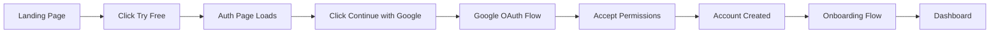
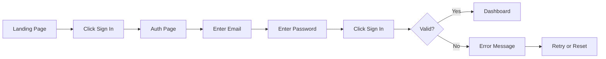
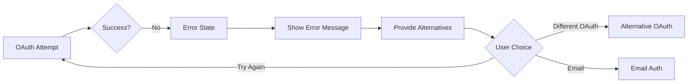

# Authentication User Journey

**Version:** 1.0  
**Last Updated:** September 1, 2025

---

## Journey Overview

The authentication journey represents the critical first touchpoint between users and the AIRI platform. This document maps all possible paths users may take during authentication, from initial landing to successful dashboard access.

## User Personas

### Primary Persona: Tech-Savvy AI Enthusiast
- **Age**: 18-35
- **Technical Level**: Comfortable with technology
- **Preference**: Quick, frictionless signup
- **Expectation**: One-click OAuth login
- **Pain Points**: Complex registration forms, email verification delays

### Secondary Persona: Cautious New User
- **Age**: 25-45
- **Technical Level**: Moderate
- **Preference**: Understanding before committing
- **Expectation**: Clear value proposition, security assurance
- **Pain Points**: Unclear pricing, privacy concerns

### Tertiary Persona: Gaming Community Member
- **Age**: 16-30
- **Technical Level**: High
- **Preference**: Discord integration
- **Expectation**: Gaming-focused features visible
- **Pain Points**: Generic onboarding, non-gaming focus

## Journey Maps

### Journey 1: New User - Google OAuth (Primary Path)



**Step-by-Step Breakdown:**

1. **Landing Page** (0s)
   - User sees hero section with value proposition
   - "Start Free" CTA prominently displayed
   - Social proof visible (user count, testimonials)

2. **Click Try Free** (2s)
   - Button provides immediate feedback (pressed state)
   - Smooth transition to auth page
   - Loading indicator if needed

3. **Auth Page Loads** (3s)
   - Split-screen design appears
   - Google button most prominent
   - Other options visible but secondary

4. **Click Continue with Google** (5s)
   - Button shows loading state
   - Google OAuth popup appears
   - Focus shifts to popup

5. **Google OAuth Flow** (8s)
   - User selects Google account
   - Familiar Google interface builds trust
   - Clear AIRI branding in consent screen

6. **Accept Permissions** (12s)
   - Minimal permissions requested
   - Clear explanation of data usage
   - One-click acceptance

7. **Account Created** (13s)
   - Success feedback (checkmark animation)
   - Brief loading while creating account
   - Session established

8. **Onboarding Flow** (15s)
   - Welcome message with user's name
   - 3-step quick setup
   - Skip option available

9. **Dashboard** (25s)
   - Personalized greeting
   - Quick start guide visible
   - First AI interaction prompted

**Total Time**: ~25 seconds from landing to dashboard

### Journey 2: Returning User - Email Login



**Step-by-Step Breakdown:**

1. **Landing Page** (0s)
   - "Sign In" link in header
   - Recognition of return visit (cookie)

2. **Auth Page** (2s)
   - Email field auto-focused
   - "Welcome back" messaging
   - Remember me checked by default

3. **Enter Credentials** (5s-10s)
   - Email autocomplete from browser
   - Password field with show/hide toggle
   - Real-time validation feedback

4. **Submit Form** (11s)
   - Loading state on button
   - Form disabled during submission
   - Progress indicator

5. **Success Path** (13s)
   - Brief success message
   - Redirect to last visited page
   - Session restored

6. **Error Path** (13s)
   - Clear error message
   - Field highlighting
   - Password reset option prominent

**Total Time**: ~13 seconds for successful login

### Journey 3: New User - Email Registration

```mermaid
graph LR
    A[Auth Page] --> B[Click Sign up with email]
    B --> C[Registration Form]
    C --> D[Enter Email]
    D --> E[Enter Password]
    E --> F[Confirm Password]
    F --> G[Accept Terms]
    G --> H[Create Account]
    H --> I[Account Created]
    I --> J[Onboarding]
    J --> K[Dashboard]
```



**Detailed Flow:**

1. **Initial State** (0s)
   - OAuth options shown first
   - "Sign up with email" as secondary option

2. **Form Expansion** (1s)
   - Smooth transition to email form
   - Clear heading change
   - Progress indicator appears

3. **Email Entry** (3s-5s)
   - Real-time validation
   - Check for existing account
   - Suggestion for typos (gmial→gmail)

4. **Password Creation** (6s-10s)
   - Strength meter visible
   - Requirements shown upfront
   - Real-time validation feedback

5. **Password Confirmation** (11s-13s)
   - Match validation
   - Visual confirmation when matching

6. **Terms Acceptance** (14s)
   - Links to terms and privacy policy
   - Checkbox with clear label
   - Required for continuation

7. **Account Creation** (15s)
   - Submit button enabled
   - Loading state during creation
   - Progress feedback

8. **Success & Redirect** (17s)
   - Success animation
   - Welcome message
   - Automatic redirect to onboarding

**Total Time**: ~30 seconds from start to dashboard

### Journey 4: Password Reset Flow

```mermaid
graph LR
    A[Login Page] --> B[Forgot Password?]
    B --> C[Reset Page]
    C --> D[Enter Email]
    D --> E[Send Reset Email]
    E --> F[Check Email]
    F --> G[Click Reset Link]
    G --> H[New Password Page]
    H --> I[Enter New Password]
    I --> J[Confirm Password]
    J --> K[Update Password]
    K --> L[Success]
    L --> M[Auto Login]
    M --> N[Dashboard]
```



**Recovery Process:**

1. **Initiate Reset** (0s)
   - "Forgot password?" link clearly visible
   - Positioned near password field

2. **Reset Request** (2s)
   - Simple form with just email field
   - Clear instructions
   - Rate limiting notice if applicable

3. **Email Sent** (5s)
   - Success message with email address
   - Check spam folder reminder
   - Resend option (after cooldown)

4. **Email Received** (Variable)
   - Clear subject line
   - AIRI branding
   - Secure reset link (expires in 1 hour)

5. **Reset Password** (Variable + 3s)
   - Pre-filled email field
   - New password requirements shown
   - Strength validation

6. **Success** (Variable + 10s)
   - Password updated confirmation
   - Auto-login option
   - Redirect to dashboard

### Journey 5: OAuth Error Recovery



**Error Handling:**

1. **OAuth Failure Detection** (Immediate)
   - Popup closed without success
   - Network error
   - Permission denied

2. **Error Communication** (1s)
   - Clear, non-technical message
   - Specific to error type
   - Maintains user confidence

3. **Recovery Options** (2s)
   - Retry same provider
   - Try different provider
   - Fall back to email
   - Contact support link

## Emotional Journey

### Emotional States Throughout Authentication

1. **Curiosity** → Landing page
2. **Interest** → Viewing auth options
3. **Decision** → Choosing auth method
4. **Trust** → Entering credentials
5. **Anticipation** → Waiting for validation
6. **Relief/Satisfaction** → Successful login
7. **Excitement** → Entering dashboard

### Friction Points & Mitigations

| Friction Point | Impact | Mitigation Strategy |
|---------------|---------|-------------------|
| Too many fields | High abandonment | OAuth-first approach |
| Password complexity | Frustration | Real-time feedback |
| Email verification | Delay frustration | Skip for MVP |
| OAuth popup blocked | Confusion | Clear instructions |
| Slow loading | Impatience | Loading indicators |
| Error messages | Anxiety | Friendly, helpful tone |

## Accessibility Considerations

### Screen Reader Journey
1. Page announces "AIRI Sign In"
2. Form structure clearly communicated
3. Field labels read before input
4. Error messages announced immediately
5. Success states communicated
6. Page transitions announced

### Keyboard Navigation Path
1. Tab to skip links
2. Tab to main auth option (Google)
3. Tab through alternative options
4. Tab to form fields (if email)
5. Tab to submit button
6. Enter to submit

### Visual Impairment Adaptations
- High contrast mode support
- Large click targets (minimum 44x44px)
- Clear focus indicators
- No color-only information
- Scalable to 200% without horizontal scroll

## Metrics & Success Indicators

### Key Performance Indicators
- **Time to authenticate**: Target <30 seconds
- **Completion rate**: Target >80%
- **OAuth vs Email ratio**: Target 70/30
- **Error rate**: Target <5%
- **Recovery success**: Target >60%

### Drop-off Analysis Points
1. Landing → Auth page (Target: <10% drop)
2. Auth page → Method selection (Target: <15% drop)
3. Method selection → Completion (Target: <20% drop)
4. Completion → Dashboard (Target: <5% drop)

### User Satisfaction Metrics
- **Ease of use**: Target 4.5/5
- **Speed**: Target 4.0/5
- **Security perception**: Target 4.5/5
- **Overall satisfaction**: Target 4.3/5

## Platform-Specific Journeys

### Mobile Journey Adaptations
- Biometric authentication option (Phase 2)
- Simplified form with larger inputs
- Native OAuth app switching
- Optimized keyboard interactions
- Thumb-friendly button placement

### Desktop Journey Optimizations
- Password manager integration
- Keyboard shortcuts (Cmd+Enter to submit)
- Side-by-side comparison of auth methods
- Extended session options
- Multi-tab handling

## Edge Cases & Special Scenarios

### Scenario 1: Existing User, Forgotten Method
- Show "Already have an account?" prompt
- Provide account recovery options
- Check email for account existence
- Suggest likely auth method

### Scenario 2: Corporate/Team Signup (Future)
- Detect corporate email domain
- Offer team signup flow
- SSO options for enterprise
- Bulk invite functionality

### Scenario 3: Age Verification Required
- Age gate before main auth
- Parental consent flow for <13
- Age-appropriate onboarding
- Restricted features for minors

### Scenario 4: Regional Restrictions
- Geo-detection on landing
- Appropriate legal disclaimers
- Region-specific auth methods
- Compliance with local laws

## Continuous Improvement

### A/B Testing Opportunities
1. Button placement and size
2. OAuth provider order
3. Form field arrangement
4. Error message wording
5. Loading state designs
6. Onboarding skip options

### User Feedback Integration
- Post-auth satisfaction survey (5% sample)
- Error report functionality
- Support chat during auth
- Community feedback channels

### Analytics Implementation
```javascript
// Track key events
analytics.track('auth_page_viewed');
analytics.track('auth_method_selected', { method: 'google' });
analytics.track('auth_completed', { method, time_taken });
analytics.track('auth_error', { error_type, recovery_attempted });
```

---

*This user journey documentation ensures all paths through authentication are optimized for conversion, accessibility, and user satisfaction.*