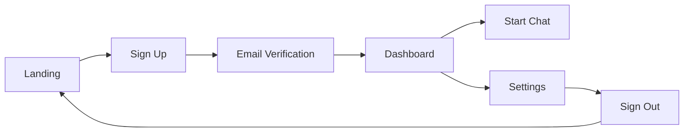
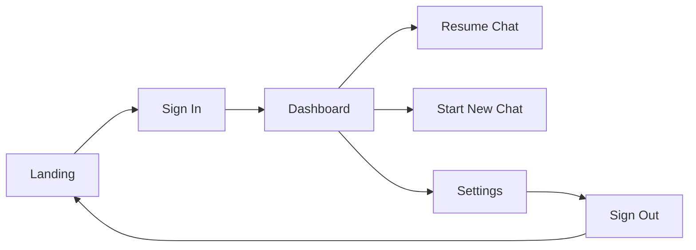

# User Flow Documentation

## Overview

The onboarding flow guides users through a four-stage journey: Landing → Authentication → Dashboard → Settings. Each stage is designed to progressively introduce functionality while maintaining cognitive simplicity.

## Primary User Journey

### Stage 1: Landing Page

**Entry Point**
- User arrives at application root URL
- Initial viewport displays branded landing experience
- Clear value proposition presented above the fold

**Key Elements**
- Hero section with product messaging
- Two primary CTAs: "Sign In" and "Sign Up"
- Minimal navigation to reduce decision fatigue

**User Actions**
1. View landing page content
2. Choose between Sign In or Sign Up
3. Navigate to authentication flow

### Stage 2: Authentication Flow

**Sign Up Path**
```
Landing → Sign Up Form → Email Verification → Dashboard
```

**Sign In Path**
```
Landing → Sign In Form → Dashboard
```

**Form States**
- Default: Empty form with field labels
- Active: Field focus with visual feedback
- Validation: Real-time error messaging
- Loading: Form submission with progress indicator
- Success: Redirect to dashboard
- Error: Inline error messages with recovery options

### Stage 3: Dashboard

**Initial Load**
- Welcome message for first-time users
- Empty state with clear CTA
- "Start New Chat" button prominently displayed

**Core Functions**
- Chat initiation via "Start New Chat" button
- Chat history display (if applicable)
- Quick access to settings
- User profile indicator

**Navigation Options**
- Settings access via gear icon or profile menu
- Chat management controls
- Help/support access

### Stage 4: Settings

**Page Structure**
- Profile management section
- Application preferences
- Account security options
- Sign out functionality

**Sign Out Flow**
```
Settings → Sign Out Button → Confirmation Modal → Landing Page
```

## User State Transitions

### New User Journey


### Returning User Journey


## Edge Cases

### Authentication Failures
- Invalid credentials: Display inline error with password reset option
- Network error: Show retry mechanism with offline mode notification
- Session timeout: Redirect to sign in with session expired message

### Empty States
- No chats: Display onboarding prompt with "Start New Chat" CTA
- Loading states: Skeleton screens for content areas
- Error states: Contextual error messages with recovery actions

## Progressive Disclosure

### Information Architecture
1. **Level 1**: Core actions (Sign In, Sign Up, Start Chat)
2. **Level 2**: Primary features (Chat History, Profile)
3. **Level 3**: Advanced settings (Preferences, Security)

### Cognitive Load Management
- Maximum 3 primary actions per screen
- Progressive revelation of complex features
- Contextual help at decision points

## Success Metrics

### Engagement Indicators
- Time to first chat: < 2 minutes from sign up
- Authentication completion rate: > 85%
- Feature discovery rate: > 60% within first session

### Friction Points
- Monitor form abandonment rates
- Track navigation path deviations
- Identify common error patterns

## Navigation Hierarchy

```
/
├── /auth
│   ├── /signin
│   └── /signup
├── /dashboard
│   ├── /chat/new
│   └── /chat/:id
└── /settings
    ├── /profile
    ├── /preferences
    └── /security
```

## State Management

### User Authentication States
- `unauthenticated`: Landing page access only
- `authenticating`: Loading state during sign in/up
- `authenticated`: Full application access
- `expired`: Session timeout requiring re-authentication

### Application States
- `onboarding`: First-time user experience
- `active`: Normal application usage
- `idle`: Inactive user with timeout warning
- `offline`: Network disconnection handling