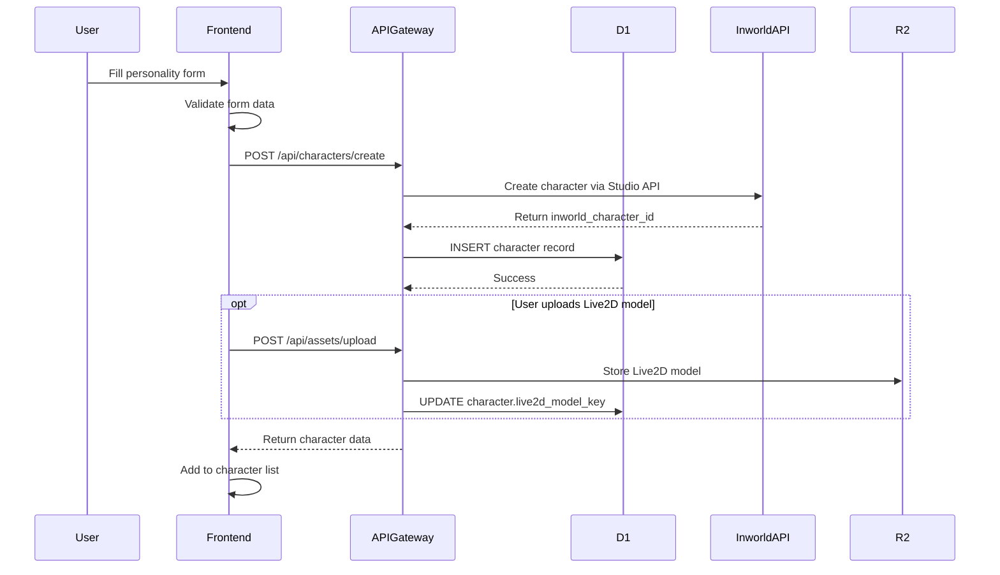

# MVP Architecture: Cloudflare + Inworld Runtime
## AI Companion Platform with Live2D & Voice Interaction

**Status:** MVP Implementation in Progress (Phase 1 Complete - API Gateway + Voice Agent)
**Target Scale:** 5,000 monthly active users (MVP), 10,000+ (Production)
**Created:** 2025-10-02
**Last Updated:** 2025-10-07
**Version:** 1.1

---

## Table of Contents

1. [Architecture Overview](#architecture-overview)
2. [System Components](#system-components)
3. [Authentication System](#authentication-system)
4. [Database Schema](#database-schema)
5. [API Gateway Design](#api-gateway-design)
6. [Inworld Runtime Integration](#inworld-runtime-integration)
7. [Character Creation & Ownership](#character-creation--ownership)
8. [Memory & Knowledge Management](#memory--knowledge-management)
9. [Live2D Asset Management](#live2d-asset-management)
10. [WebRTC Voice Pipeline](#webrtc-voice-pipeline)
11. [Cost Breakdown (MVP)](#cost-breakdown-mvp)
12. [Deployment Guide](#deployment-guide)
13. [Migration Path](#migration-path)

---

## 🚀 Implementation Status

### ✅ Phase 1: Backend Infrastructure (COMPLETE)

**API Gateway Worker** (`apps/workers/api-gateway`)
- ✅ Hono framework setup with TypeScript
- ✅ Better-Auth integration configured
- ✅ D1 database binding (`mirai-production`)
- ✅ R2 buckets configured (`USER_ASSETS`)
- ✅ KV namespaces for caching (`CACHE`, `SESSION_CACHE`)
- ✅ Service binding to voice-agent-container
- ✅ CORS and middleware setup
- ✅ Character routes (`/api/characters`)
- ✅ Voice session routes (`/api/voice`)
- ✅ Asset management routes (`/api/assets`)
- ✅ Polar webhook routes (`/api/webhooks`)
- 🔴 **Bug Found:** Voice WebSocket proxy using incorrect API (line 208 in `routes/voice.ts`)

**Voice Agent Container** (`apps/workers/container/voice-agent-template`)
- ✅ Cloudflare Container (Durable Object) configured
- ✅ Multi-stage Dockerfile with Node.js 20
- ✅ Express.js + Inworld Runtime integration
- ✅ Worker validation for incoming requests
- ✅ Header extraction for authentication
- ✅ Container lifecycle configuration (5min idle, max 10 instances)
- ⏳ **Pending:** Multi-tenant character pooling implementation
- ⏳ **Pending:** WebSocket message handling implementation
- ⏳ **Pending:** Inworld Runtime voice pipeline integration

**Database Schema** (`packages/database-schema`)
- ✅ Drizzle ORM setup with D1 adapter
- ✅ Auth tables (users, sessions, accounts, verification)
- ✅ Character tables (characters, ownership)
- ✅ Voice session tables (voiceSessions, conversations)
- ✅ Subscription tables (subscriptions, usageEvents)
- ⏳ **Pending:** Database migrations generated and applied
- ⏳ **Pending:** Test data seeding

### ⏳ Phase 2: Frontend Integration (NOT STARTED)

**Frontend App** (`apps/stage-web`)
- ❌ Better-Auth client integration
- ❌ Authentication pages (sign-in, sign-up)
- ❌ Character selector component
- ❌ Voice chat interface
- ❌ WebSocket audio streaming client
- ❌ Live2D/VRM renderer integration
- ❌ Chat history display

### ⏳ Phase 3: Payment & Subscriptions (NOT STARTED)

**Polar Integration**
- ❌ Webhook handler implementation
- ❌ Subscription status checks
- ❌ Usage-based billing tracking
- ❌ Customer portal integration

### 🔧 Critical Issues to Fix

1. **Voice WebSocket Proxy** (`apps/workers/api-gateway/src/routes/voice.ts:208`)
   ```typescript
   // ❌ Current (BROKEN)
   const container = getContainer(c.env.VOICE_AGENT_CONTAINER)

   // ✅ Should be
   return c.env.VOICE_AGENT.fetch(containerRequest)
   ```

2. **Missing Secrets Configuration**
   - Need to set secrets via `wrangler secret put`:
     - `BETTER_AUTH_SECRET`
     - `GOOGLE_CLIENT_ID` / `GOOGLE_CLIENT_SECRET`
     - `DISCORD_CLIENT_ID` / `DISCORD_CLIENT_SECRET`
     - `POLAR_ACCESS_TOKEN` / `POLAR_WEBHOOK_SECRET`
     - `INWORLD_API_KEY` / `INWORLD_WORKSPACE_ID`

3. **Database Migrations Not Applied**
   - Run `pnpm db:generate` in `packages/database-schema`
   - Apply migrations to D1: `wrangler d1 execute mirai-production --file=./migrations/xxx.sql`

4. **Container Runtime Not Implemented**
   - Voice agent Express.js server needs implementation
   - Inworld Runtime integration pending
   - Character pooling logic not written

### 📋 Next Steps (Priority Order)

1. **Fix critical bug** in voice WebSocket proxy (5 min)
2. **Set Cloudflare secrets** for API keys (10 min)
3. **Apply database migrations** to D1 (15 min)
4. **Implement voice agent runtime** (4-6 hours)
   - Express.js WebSocket server
   - Inworld Runtime integration
   - Character pooling manager
5. **Test end-to-end flow** with curl/Postman (1 hour)
6. **Begin frontend integration** (1-2 days)
   - Better-Auth client setup
   - Character selector UI
   - Voice chat component

---

## Architecture Overview

### High-Level Flow

```
┌──────────────────────────────────────────────────────────────┐
│                         End User                              │
│                    (Browser/Mobile App)                       │
└──────────────────────────────────────────────────────────────┘
                              │
                              ↓
┌──────────────────────────────────────────────────────────────┐
│              Static Asset Worker (stage-web)                  │
│  - React/Vite SPA                                            │
│  - Live2D Cubism rendering (WebGL)                           │
│  - WebRTC audio streaming                                    │
│  - Served from Cloudflare Pages                              │
└──────────────────────────────────────────────────────────────┘
                              │
                              ↓ (HTTPS/WebSocket)
┌──────────────────────────────────────────────────────────────┐
│         Cloudflare Worker (API Gateway - /api/*)             │
│  - Better-Auth authentication & JWT verification             │
│  - Polar payment webhooks & checkout                         │
│  - Rate limiting & DDoS protection                           │
│  - Request routing & orchestration                           │
│  - Service bindings to:                                      │
│    • D1 (user data, character ownership, subscriptions)      │
│    • R2 (Live2D models, avatars)                             │
│    • KV (session cache)                                      │
│    • Durable Objects (voice session state)                   │
│    • Containers (Inworld Runtime)                            │
└──────────────────────────────────────────────────────────────┘
         │                    │                    │
         ↓                    ↓                    ↓
┌──────────────┐   ┌──────────────────────────────────────┐   ┌──────────────────┐
│   D1 (SQL)   │   │         R2 Storage (2 Buckets)       │   │ Durable Objects  │
│              │   │                                      │   │                  │
│ • Users      │   │ PUBLIC_ASSETS (mirai-public-assets)  │   │ • Voice sessions │
│ • Characters │   │ • Default Live2D models              │   │ • WebRTC state   │
│ • Subs       │   │ • Shared textures/fonts              │   │ • Connection mgmt│
│ • Polar IDs  │   │ • VRM models                         │   │                  │
│              │   │ • WASM binaries (>25MB)              │   │                  │
│              │   │                                      │   │                  │
│              │   │ USER_ASSETS (mirai-user-assets)      │   │                  │
│              │   │ • User Live2D uploads                │   │                  │
│              │   │ • User avatars                       │   │                  │
│              │   │ • Audio recordings                   │   │                  │
└──────────────┘   └──────────────────────────────────────┘   └──────────────────┘
         │
         ↓ (Webhooks)
┌──────────────────────────────────────────────────────────────┐
│                     Polar (Payment Service)                   │
│  - Subscription management                                   │
│  - Usage-based billing                                       │
│  - Customer portal                                           │
│  - Checkout sessions                                         │
└──────────────────────────────────────────────────────────────┘
                              │
                              ↓
┌──────────────────────────────────────────────────────────────┐
│         Cloudflare Container (Inworld Runtime)               │
│  - Node.js + Express.js (port 4000)                          │
│  - Inworld Runtime Voice Agent Template                      │
│  - WebSocket server                                          │
│  - Graph-based orchestration (STT → LLM → TTS)               │
│  - Scale-to-zero when idle                                   │
└──────────────────────────────────────────────────────────────┘
                              │
                              ↓ (API Key)
┌──────────────────────────────────────────────────────────────┐
│                  Inworld Platform                             │
│  - Character Studio API                                      │
│  - Long-term Memory (Enterprise)                             │
│  - Knowledge Base (Enterprise)                               │
│  - STT/LLM/TTS orchestration                                 │
│  - Multi-provider failover                                   │
└──────────────────────────────────────────────────────────────┘
```

---

## System Components

### 1. Frontend (`apps/stage-web`)

**Technology Stack:**
- React 18 + Vite
- Three.js + WebGL
- Live2D Cubism SDK
- WebRTC (browser native)
- TanStack Query (data fetching)

**Responsibilities:**
```typescript
// Frontend component structure
apps/stage-web/
├── src/
│   ├── components/
│   │   ├── Live2DCharacter.tsx      // Cubism rendering
│   │   ├── VoiceChat.tsx            // WebRTC audio
│   │   ├── CharacterSelector.tsx    // User's character list
│   │   └── PersonalityEditor.tsx    // Character customization
│   ├── services/
│   │   ├── api.ts                   // API gateway client
│   │   ├── websocket.ts             // Inworld WS connection
│   │   ├── webrtc.ts                // Audio streaming
│   │   └── live2d.ts                // Model loader
│   ├── stores/
│   │   ├── authStore.ts             // Auth state
│   │   ├── characterStore.ts        // Character data
│   │   └── sessionStore.ts          // Voice session state
│   ├── worker.ts                    // Static Assets Worker
│   └── App.tsx
```

**Static Assets Worker (`worker.ts`):**
```typescript
// apps/stage-web/src/worker.ts
export interface Env {
  ASSETS: Fetcher
  PUBLIC_ASSETS: R2Bucket  // Public large assets (>25MB)
}

export default {
  async fetch(request: Request, env: Env): Promise<Response> {
    const url = new URL(request.url)
    const pathname = url.pathname

    // Serve large assets (fonts, models, WASM) from R2
    const r2AssetPaths = [
      '/assets/cjkFonts_allseto_v1.11-ByBdljxl.ttf',
      '/assets/XiaolaiSC-Regular-SNWuh554.ttf',
      '/assets/duckdb-coi-CSr8FQO4.wasm',
      '/assets/live2d/models/hiyori_pro_zh.zip',
      '/assets/vrm/models/AvatarSample-A/AvatarSample_A.vrm',
    ]

    if (r2AssetPaths.includes(pathname)) {
      const object = await env.PUBLIC_ASSETS.get(pathname.slice(1))
      if (!object) return new Response('Not found', { status: 404 })

      const headers = new Headers()
      object.writeHttpMetadata(headers)
      headers.set('Cache-Control', 'max-age=31536000, immutable')
      headers.set('Access-Control-Allow-Origin', '*')

      return new Response(object.body, { headers })
    }

    // Serve other assets from bundled static files
    return env.ASSETS.fetch(request)
  }
}
```

**Deployment:**
- Cloudflare Pages with Static Assets Worker
- Auto-deploy from `main` branch
- Custom domain: `app.miraichat.app`
- R2 binding: `PUBLIC_ASSETS` → `mirai-public-assets`

---

### 2. API Gateway (`apps/workers/api-gateway`)

**Worker Configuration:**
```toml
# wrangler.toml
name = "api-gateway"
main = "src/index.ts"
compatibility_date = "2025-01-01"

[[d1_databases]]
binding = "DB"
database_name = "mirai-production"
database_id = "your-d1-id"

[[r2_buckets]]
binding = "USER_ASSETS"
bucket_name = "mirai-user-assets"
# Private bucket: User uploads, avatars, audio recordings (auth required)

[[kv_namespaces]]
binding = "CACHE"
id = "your-kv-id"

[[durable_objects.bindings]]
name = "VOICE_SESSION"
class_name = "VoiceSession"
script_name = "api-gateway"

[[containers]]
binding = "INWORLD_RUNTIME"
class_name = "InworldContainer"
```

**Core Routes:**
```typescript
// src/index.ts
import { Hono } from 'hono'
import { cors } from 'hono/cors'
import { jwt } from 'hono/jwt'

const app = new Hono<Env>()

app.use('*', cors())
app.use('/api/*', jwt({ secret: env.JWT_SECRET }))

// Character routes
app.post('/api/characters/create', createCharacter)
app.get('/api/characters/:id', getCharacter)
app.put('/api/characters/:id', updateCharacter)
app.delete('/api/characters/:id', deleteCharacter)
app.get('/api/characters/user/:userId', getUserCharacters)

// Voice session routes
app.post('/api/voice/session/start', startVoiceSession)
app.get('/api/voice/session/:id', getVoiceSession)
app.post('/api/voice/session/:id/end', endVoiceSession)

// Asset routes
app.get('/api/assets/:characterId/model', getLive2DModel)
app.post('/api/assets/upload', uploadAsset)

// Inworld proxy (WebSocket upgrade)
app.get('/api/inworld/ws', upgradeToInworldWS)

export default app
```

---

### 3. Cloudflare Container (Inworld Runtime)

**Container Configuration:**
```typescript
// apps/workers/inworld-container/src/index.ts
import { Container, getContainer } from "@cloudflare/containers"

export class InworldContainer extends Container {
  defaultPort = 4000
  sleepAfter = "5m" // Scale to zero after 5 min idle
}

export default {
  async fetch(request: Request, env: Env) {
    // Forward WebSocket requests to container
    const container = getContainer(env.INWORLD_RUNTIME)
    return container.fetch(request)
  }
}
```

**Container Application (Node.js + Express):**
```dockerfile
# Dockerfile
FROM node:20-alpine

WORKDIR /app

# Copy Inworld Voice Agent template
COPY package.json yarn.lock ./
RUN yarn install --frozen-lockfile

COPY . .

# Expose port for WebSocket server
EXPOSE 4000

CMD ["node", "server.js"]
```

**Express Server:**
```javascript
// server.js (Inworld Voice Agent Template)
import express from 'express'
import { WebSocketServer } from 'ws'
import { InworldClient } from '@inworld/nodejs-sdk'

const app = express()
const port = 4000

// Inworld client configuration
const inworldClient = new InworldClient({
  apiKey: process.env.INWORLD_API_KEY,
  scene: process.env.INWORLD_SCENE
})

// WebSocket server for voice streaming
const wss = new WebSocketServer({ server: app.listen(port) })

wss.on('connection', async (ws, req) => {
  console.log('Client connected to Inworld Runtime')

  // Extract user/character from query params
  const url = new URL(req.url, `http://${req.headers.host}`)
  const userId = url.searchParams.get('userId')
  const characterId = url.searchParams.get('characterId')

  // Initialize Inworld session
  const session = await inworldClient.createSession({
    user: { id: userId },
    character: { id: characterId }
  })

  // Bidirectional audio streaming: Client ↔ Inworld
  ws.on('message', async (audioData) => {
    // Forward audio to Inworld (STT → LLM → TTS)
    const response = await session.sendAudio(audioData)

    // Stream TTS audio back to client
    ws.send(response.audio)

    // Send transcript + emotion metadata
    ws.send(JSON.stringify({
      type: 'transcript',
      text: response.text,
      emotion: response.emotion,
      characterId: response.character
    }))
  })

  ws.on('close', () => {
    session.close()
  })
})

console.log(`Inworld Runtime listening on port ${port}`)
```

---

## Authentication System

### Better-Auth (Recommended for MVP)

**Why Better-Auth:**
- ✅ Self-hosted on Cloudflare Workers (no vendor lock-in)
- ✅ Full control & customization
- ✅ Native D1 integration
- ✅ Built-in Polar payment plugin
- ✅ FREE (no usage limits)
- ✅ Pre-built OAuth (Google, Discord, GitHub, etc.)

**API Gateway Setup:**
```typescript
// apps/workers/api-gateway/src/auth.ts
import { betterAuth } from 'better-auth'
import { polar } from 'better-auth/plugins/polar'

export const auth = betterAuth({
  database: {
    provider: 'd1',
    d1: env.DB
  },
  emailAndPassword: {
    enabled: true,
    requireEmailVerification: true
  },
  socialProviders: {
    google: {
      clientId: env.GOOGLE_CLIENT_ID,
      clientSecret: env.GOOGLE_CLIENT_SECRET
    },
    discord: {
      clientId: env.DISCORD_CLIENT_ID,
      clientSecret: env.DISCORD_CLIENT_SECRET
    }
  },
  plugins: [
    polar({
      apiKey: env.POLAR_API_KEY,
      createCustomerOnSignUp: true, // Auto-create Polar customer
      use: [
        checkout({
          organizationId: env.POLAR_ORGANIZATION_ID
        }),
        portal(), // Customer portal for managing subscriptions
        usage(), // Usage-based billing (track voice minutes)
        webhooks({
          secret: env.POLAR_WEBHOOK_SECRET
        })
      ]
    })
  ]
})
```

**API Gateway Routes:**
```typescript
// apps/workers/api-gateway/src/index.ts
import { Hono } from 'hono'
import { auth } from './auth'

const app = new Hono<Env>()

// Mount auth routes at /api/auth/*
app.all('/api/auth/*', async (c) => {
  return auth.handler(c.req.raw)
})

// Protected routes - require JWT
app.use('/api/*', async (c, next) => {
  const authHeader = c.req.header('Authorization')
  if (!authHeader) {
    return c.json({ error: 'Unauthorized' }, 401)
  }

  const token = authHeader.replace('Bearer ', '')
  const session = await auth.api.getSession({ headers: { cookie: token } })

  if (!session) {
    return c.json({ error: 'Invalid session' }, 401)
  }

  c.set('user', session.user)
  await next()
})

// API routes here...
```

**Frontend Client:**
```typescript
// apps/stage-web/src/lib/auth.ts
import { createAuthClient } from '@better-auth/react'

export const authClient = createAuthClient({
  baseURL: 'https://api.miraichat.app/api/auth'
})

// Sign in with Google
export async function signInWithGoogle() {
  return authClient.signIn.social({
    provider: 'google',
    callbackURL: '/dashboard'
  })
}

// Sign in with email/password
export async function signIn(email: string, password: string) {
  return authClient.signIn.email({ email, password })
}

// Get current session
export async function getSession() {
  return authClient.getSession()
}

// Sign out
export async function signOut() {
  return authClient.signOut()
}
```

**Frontend Usage:**
```typescript
// apps/stage-web/src/App.tsx
import { useSession } from '@better-auth/react'

function App() {
  const { data: session, isPending } = useSession()

  if (isPending) return <div>Loading...</div>
  if (!session) return <LoginPage />

  return (
    <Dashboard user={session.user} />
  )
}
```

---

## Database Schema

### D1 Database: `mirai-production`

```sql
-- Users table (managed by Better-Auth)
-- Better-Auth auto-creates: user, session, account, verification tables
-- Add custom columns via migrations:
ALTER TABLE user ADD COLUMN display_name TEXT;
ALTER TABLE user ADD COLUMN avatar_url TEXT;
ALTER TABLE user ADD COLUMN polar_customer_id TEXT;
ALTER TABLE user ADD COLUMN subscription_tier TEXT DEFAULT 'free'; -- free, pro, enterprise
ALTER TABLE user ADD COLUMN subscription_status TEXT; -- active, canceled, past_due

-- Subscriptions table (synced from Polar webhooks)
CREATE TABLE subscriptions (
  id TEXT PRIMARY KEY, -- Polar subscription ID
  user_id TEXT NOT NULL REFERENCES user(id) ON DELETE CASCADE,
  polar_customer_id TEXT NOT NULL,
  product_id TEXT NOT NULL, -- Polar product ID
  price_id TEXT NOT NULL, -- Polar price ID
  status TEXT NOT NULL, -- active, canceled, incomplete, past_due
  current_period_start TIMESTAMP NOT NULL,
  current_period_end TIMESTAMP NOT NULL,
  cancel_at_period_end BOOLEAN DEFAULT FALSE,
  created_at TIMESTAMP DEFAULT CURRENT_TIMESTAMP,
  updated_at TIMESTAMP DEFAULT CURRENT_TIMESTAMP,

  INDEX idx_user_subscription (user_id),
  INDEX idx_polar_customer (polar_customer_id)
);

-- Characters table (user-owned AI characters)
CREATE TABLE characters (
  id TEXT PRIMARY KEY, -- UUID
  user_id TEXT NOT NULL REFERENCES users(id) ON DELETE CASCADE,
  inworld_character_id TEXT NOT NULL, -- Inworld Studio API character ID
  display_name TEXT NOT NULL,
  live2d_model_key TEXT, -- R2 key for Live2D model
  avatar_thumbnail TEXT, -- R2 URL

  -- Personality configuration (stored locally for UI/customization)
  personality_config JSON NOT NULL, -- { motivations, flaws, dialogue_style, etc. }

  -- Metadata
  is_public BOOLEAN DEFAULT FALSE, -- For marketplace
  total_conversations INTEGER DEFAULT 0,
  created_at TIMESTAMP DEFAULT CURRENT_TIMESTAMP,
  updated_at TIMESTAMP DEFAULT CURRENT_TIMESTAMP,

  INDEX idx_user_id (user_id),
  INDEX idx_inworld_id (inworld_character_id)
);

-- Example personality_config JSON:
-- {
--   "motivations": ["Help users relax", "Make people smile"],
--   "flaws": ["Sometimes too cheerful", "Forgets details"],
--   "dialogue_style": "Friendly and casual",
--   "adjectives": ["Cheerful", "Empathetic", "Curious"],
--   "voice_config": {
--     "pitch": 1.2,
--     "speed": 1.0,
--     "emotion_range": "high"
--   }
-- }

-- Conversations table (metadata only, actual messages in Inworld)
CREATE TABLE conversations (
  id TEXT PRIMARY KEY,
  user_id TEXT NOT NULL REFERENCES users(id),
  character_id TEXT NOT NULL REFERENCES characters(id),
  inworld_session_id TEXT, -- Inworld session ID
  started_at TIMESTAMP DEFAULT CURRENT_TIMESTAMP,
  ended_at TIMESTAMP,
  duration_seconds INTEGER,
  message_count INTEGER DEFAULT 0,

  INDEX idx_user_conversations (user_id, started_at DESC),
  INDEX idx_character_conversations (character_id, started_at DESC)
);

-- Voice sessions table (WebRTC/WebSocket state tracking)
CREATE TABLE voice_sessions (
  id TEXT PRIMARY KEY,
  conversation_id TEXT NOT NULL REFERENCES conversations(id),
  user_id TEXT NOT NULL REFERENCES users(id),
  character_id TEXT NOT NULL REFERENCES characters(id),

  -- Session state
  status TEXT NOT NULL, -- 'active', 'paused', 'ended'
  websocket_url TEXT, -- Cloudflare Container WS endpoint

  -- Metrics
  total_audio_seconds INTEGER DEFAULT 0,
  started_at TIMESTAMP DEFAULT CURRENT_TIMESTAMP,
  ended_at TIMESTAMP,

  INDEX idx_active_sessions (status, user_id)
);

-- Usage tracking (for usage-based billing via Polar)
CREATE TABLE usage_events (
  id TEXT PRIMARY KEY,
  user_id TEXT NOT NULL REFERENCES user(id),
  event_type TEXT NOT NULL, -- 'voice_minutes', 'character_creation', 'message_sent'
  quantity INTEGER NOT NULL, -- e.g., number of minutes
  metadata JSON, -- Additional context
  created_at TIMESTAMP DEFAULT CURRENT_TIMESTAMP,
  polar_synced BOOLEAN DEFAULT FALSE, -- Track if sent to Polar API

  INDEX idx_user_usage (user_id, created_at DESC),
  INDEX idx_polar_sync (polar_synced, created_at)
);

-- Marketplace purchases (future feature)
CREATE TABLE marketplace_items (
  id TEXT PRIMARY KEY,
  character_id TEXT REFERENCES characters(id),
  creator_user_id TEXT NOT NULL REFERENCES user(id),
  price_cents INTEGER NOT NULL,
  purchase_count INTEGER DEFAULT 0,
  rating_avg REAL DEFAULT 0.0,
  created_at TIMESTAMP DEFAULT CURRENT_TIMESTAMP
);

CREATE TABLE purchases (
  id TEXT PRIMARY KEY,
  buyer_user_id TEXT NOT NULL REFERENCES user(id),
  marketplace_item_id TEXT NOT NULL REFERENCES marketplace_items(id),
  polar_order_id TEXT, -- Polar order ID
  price_paid_cents INTEGER NOT NULL,
  purchased_at TIMESTAMP DEFAULT CURRENT_TIMESTAMP
);
```

---

## Payment System (Polar)

### Subscription Tiers

```typescript
// Polar Product Configuration
interface SubscriptionTier {
  id: string
  name: string
  priceMonthly: number // USD cents
  features: {
    characterSlots: number
    voiceMinutesPerMonth: number
    longTermMemory: boolean
    customLive2D: boolean
    marketplace: boolean
  }
}

const TIERS: SubscriptionTier[] = [
  {
    id: 'free',
    name: 'Free',
    priceMonthly: 0,
    features: {
      characterSlots: 1,
      voiceMinutesPerMonth: 60, // 1 hour/month
      longTermMemory: false,
      customLive2D: false,
      marketplace: false
    }
  },
  {
    id: 'pro',
    name: 'Pro',
    priceMonthly: 999, // $9.99/month
    features: {
      characterSlots: 5,
      voiceMinutesPerMonth: 600, // 10 hours/month
      longTermMemory: true,
      customLive2D: true,
      marketplace: true
    }
  },
  {
    id: 'enterprise',
    name: 'Enterprise',
    priceMonthly: 2999, // $29.99/month
    features: {
      characterSlots: 20,
      voiceMinutesPerMonth: 3000, // 50 hours/month
      longTermMemory: true,
      customLive2D: true,
      marketplace: true
    }
  }
]
```

### Checkout Flow

**Frontend Checkout:**
```typescript
// apps/stage-web/src/components/PricingPage.tsx
import { authClient } from '../lib/auth'

async function handleSubscribe(priceId: string) {
  // Create checkout session via Better-Auth Polar plugin
  const checkout = await authClient.polar.createCheckout({
    priceId: priceId,
    successUrl: 'https://app.miraichat.app/dashboard?checkout=success',
    cancelUrl: 'https://app.miraichat.app/pricing'
  })

  // Redirect to Polar checkout
  window.location.href = checkout.url
}
```

**API Gateway Webhook Handler:**
```typescript
// apps/workers/api-gateway/src/webhooks/polar.ts
export async function handlePolarWebhook(c: Context) {
  const signature = c.req.header('x-polar-signature')
  const payload = await c.req.text()

  // Verify webhook signature (handled by Better-Auth plugin)
  const event = await auth.polar.verifyWebhook(payload, signature)

  switch (event.type) {
    case 'subscription.created':
      await handleSubscriptionCreated(event.data)
      break

    case 'subscription.updated':
      await handleSubscriptionUpdated(event.data)
      break

    case 'subscription.canceled':
      await handleSubscriptionCanceled(event.data)
      break

    case 'order.created':
      await handleOrderCreated(event.data)
      break
  }

  return c.json({ received: true })
}

async function handleSubscriptionCreated(subscription: any) {
  const { customer_id, user_id, product_id, status } = subscription

  // Update user subscription tier
  await env.DB.prepare(`
    INSERT INTO subscriptions (id, user_id, polar_customer_id, product_id, price_id, status, current_period_start, current_period_end)
    VALUES (?, ?, ?, ?, ?, ?, ?, ?)
  `).bind(
    subscription.id,
    user_id,
    customer_id,
    product_id,
    subscription.price_id,
    status,
    new Date(subscription.current_period_start).toISOString(),
    new Date(subscription.current_period_end).toISOString()
  ).run()

  // Update user tier
  const tier = getTierFromProductId(product_id)
  await env.DB.prepare(`
    UPDATE user SET subscription_tier = ?, subscription_status = ? WHERE id = ?
  `).bind(tier, status, user_id).run()
}
```

### Usage-Based Billing

**Track Voice Minutes:**
```typescript
// apps/workers/api-gateway/src/services/usage.ts
export async function trackVoiceUsage(
  userId: string,
  conversationId: string,
  durationSeconds: number
) {
  // Store usage event in D1
  const eventId = crypto.randomUUID()
  await env.DB.prepare(`
    INSERT INTO usage_events (id, user_id, event_type, quantity, metadata, polar_synced)
    VALUES (?, ?, 'voice_minutes', ?, ?, FALSE)
  `).bind(
    eventId,
    userId,
    Math.ceil(durationSeconds / 60), // Convert to minutes
    JSON.stringify({ conversationId })
  ).run()

  // Report to Polar (async, non-blocking)
  await reportUsageToPolar(userId, 'voice_minutes', Math.ceil(durationSeconds / 60))
}

async function reportUsageToPolar(userId: string, eventName: string, quantity: number) {
  // Get user's Polar customer ID
  const user = await env.DB.prepare(
    'SELECT polar_customer_id FROM user WHERE id = ?'
  ).bind(userId).first()

  if (!user?.polar_customer_id) return

  // Send usage event to Polar
  await fetch(`https://api.polar.sh/v1/usage`, {
    method: 'POST',
    headers: {
      'Authorization': `Bearer ${env.POLAR_API_KEY}`,
      'Content-Type': 'application/json'
    },
    body: JSON.stringify({
      customer_id: user.polar_customer_id,
      event_name: eventName,
      quantity: quantity,
      timestamp: new Date().toISOString()
    })
  })

  // Mark as synced
  await env.DB.prepare(
    'UPDATE usage_events SET polar_synced = TRUE WHERE user_id = ? AND event_type = ? AND polar_synced = FALSE'
  ).bind(userId, eventName).run()
}
```

### Customer Portal

**Frontend:**
```typescript
// apps/stage-web/src/components/SubscriptionSettings.tsx
import { authClient } from '../lib/auth'

async function openCustomerPortal() {
  // Generate Polar customer portal URL via Better-Auth plugin
  const portal = await authClient.polar.getPortalUrl({
    returnUrl: 'https://app.miraichat.app/settings'
  })

  // Open in new tab
  window.open(portal.url, '_blank')
}
```

**Users can:**
- View subscription details
- Update payment method
- Cancel subscription
- View invoices
- Manage usage limits

---

## API Gateway Design

### Core API Endpoints

#### 1. Character Management

**POST `/api/characters/create`**
```typescript
// Request
interface CreateCharacterRequest {
  displayName: string
  personalityConfig: {
    motivations: string[]
    flaws: string[]
    dialogueStyle: string
    adjectives: string[]
    voiceConfig?: {
      pitch?: number
      speed?: number
      emotionRange?: 'low' | 'medium' | 'high'
    }
  }
  live2dModelKey?: string // Optional R2 key
}

// Response
interface CreateCharacterResponse {
  characterId: string // Local D1 UUID
  inworldCharacterId: string // Inworld Studio API ID
  displayName: string
  createdAt: string
}

// Implementation
async function createCharacter(c: Context) {
  const userId = c.get('jwtPayload').sub // From JWT middleware
  const body = await c.req.json<CreateCharacterRequest>()

  // 1. Create character in Inworld via Studio REST API
  const inworldChar = await fetch('https://studio.inworld.app/v1/workspaces/{workspace}/characters', {
    method: 'POST',
    headers: {
      'Authorization': `Bearer ${c.env.INWORLD_API_KEY}`,
      'Content-Type': 'application/json'
    },
    body: JSON.stringify({
      displayName: body.displayName,
      brain: {
        motivations: body.personalityConfig.motivations,
        flaws: body.personalityConfig.flaws,
        personalityTraits: body.personalityConfig.adjectives
      }
    })
  })

  const inworldData = await inworldChar.json()

  // 2. Store character in D1
  const characterId = crypto.randomUUID()
  await c.env.DB.prepare(`
    INSERT INTO characters (id, user_id, inworld_character_id, display_name, personality_config, live2d_model_key)
    VALUES (?, ?, ?, ?, ?, ?)
  `).bind(
    characterId,
    userId,
    inworldData.name, // Inworld character ID
    body.displayName,
    JSON.stringify(body.personalityConfig),
    body.live2dModelKey
  ).run()

  return c.json({
    characterId,
    inworldCharacterId: inworldData.name,
    displayName: body.displayName,
    createdAt: new Date().toISOString()
  })
}
```

**GET `/api/characters/user/:userId`**
```typescript
async function getUserCharacters(c: Context) {
  const userId = c.req.param('userId')

  // Verify JWT user matches requested userId
  if (c.get('jwtPayload').sub !== userId) {
    return c.json({ error: 'Unauthorized' }, 403)
  }

  const { results } = await c.env.DB.prepare(`
    SELECT
      id,
      inworld_character_id,
      display_name,
      live2d_model_key,
      personality_config,
      total_conversations,
      created_at
    FROM characters
    WHERE user_id = ?
    ORDER BY created_at DESC
  `).bind(userId).all()

  return c.json({ characters: results })
}
```

---

#### 2. Voice Session Management

**POST `/api/voice/session/start`**
```typescript
interface StartVoiceSessionRequest {
  characterId: string
}

interface StartVoiceSessionResponse {
  sessionId: string
  websocketUrl: string
  conversationId: string
}

async function startVoiceSession(c: Context) {
  const userId = c.get('jwtPayload').sub
  const { characterId } = await c.req.json<StartVoiceSessionRequest>()

  // 1. Verify character ownership
  const character = await c.env.DB.prepare(
    'SELECT * FROM characters WHERE id = ? AND user_id = ?'
  ).bind(characterId, userId).first()

  if (!character) {
    return c.json({ error: 'Character not found' }, 404)
  }

  // 2. Create conversation record
  const conversationId = crypto.randomUUID()
  await c.env.DB.prepare(`
    INSERT INTO conversations (id, user_id, character_id)
    VALUES (?, ?, ?)
  `).bind(conversationId, userId, characterId).run()

  // 3. Create voice session via Durable Object
  const voiceSessionId = crypto.randomUUID()
  const durableObjectId = c.env.VOICE_SESSION.idFromName(voiceSessionId)
  const durableObject = c.env.VOICE_SESSION.get(durableObjectId)

  await durableObject.fetch('https://internal/init', {
    method: 'POST',
    body: JSON.stringify({
      sessionId: voiceSessionId,
      conversationId,
      userId,
      characterId,
      inworldCharacterId: character.inworld_character_id
    })
  })

  // 4. Store session in D1
  const websocketUrl = `wss://api.miraichat.app/api/inworld/ws?sessionId=${voiceSessionId}`
  await c.env.DB.prepare(`
    INSERT INTO voice_sessions (id, conversation_id, user_id, character_id, status, websocket_url)
    VALUES (?, ?, ?, ?, 'active', ?)
  `).bind(voiceSessionId, conversationId, userId, characterId, websocketUrl).run()

  return c.json({
    sessionId: voiceSessionId,
    websocketUrl,
    conversationId
  })
}
```

---

#### 3. WebSocket Upgrade (Proxy to Inworld Container)

**GET `/api/inworld/ws`**
```typescript
async function upgradeToInworldWS(c: Context) {
  const sessionId = c.req.query('sessionId')

  if (!sessionId) {
    return c.json({ error: 'Missing sessionId' }, 400)
  }

  // Get session from D1
  const session = await c.env.DB.prepare(
    'SELECT * FROM voice_sessions WHERE id = ? AND status = "active"'
  ).bind(sessionId).first()

  if (!session) {
    return c.json({ error: 'Invalid or expired session' }, 404)
  }

  // Forward WebSocket upgrade to Cloudflare Container
  const containerUrl = `http://inworld-runtime:4000/ws?userId=${session.user_id}&characterId=${session.character_id}`
  const container = getContainer(c.env.INWORLD_RUNTIME)

  return container.fetch(new Request(containerUrl, {
    headers: c.req.raw.headers
  }))
}
```

---

## Inworld Runtime Integration

### Character Creation via Studio REST API

**Endpoint:** `POST https://studio.inworld.app/v1/workspaces/{workspace}/characters`

**Example Request:**
```typescript
async function createInworldCharacter(personality: PersonalityConfig) {
  const response = await fetch(
    `https://studio.inworld.app/v1/workspaces/${INWORLD_WORKSPACE_ID}/characters`,
    {
      method: 'POST',
      headers: {
        'Authorization': `Bearer ${INWORLD_API_KEY}`,
        'Content-Type': 'application/json'
      },
      body: JSON.stringify({
        displayName: personality.displayName,
        brain: {
          description: personality.description,
          motivations: personality.motivations,
          flaws: personality.flaws,
          characterRole: personality.role,
          personalityTraits: personality.adjectives,
          dialogueStyle: personality.dialogueStyle
        },
        defaultCharacterAssets: {
          avatarImg: personality.avatarUrl,
          voicePreset: personality.voiceConfig.preset
        }
      })
    }
  )

  const data = await response.json()
  return {
    inworldCharacterId: data.name, // e.g., "workspaces/abc/characters/def"
    resourceName: data.name
  }
}
```

**Personality Config Schema:**
```typescript
interface PersonalityConfig {
  displayName: string
  description: string
  motivations: string[] // ["Help users relax", "Make people laugh"]
  flaws: string[] // ["Sometimes too cheerful", "Forgets names"]
  role: string // "Supportive friend", "Wise mentor", "Playful companion"
  adjectives: string[] // ["Cheerful", "Empathetic", "Curious"]
  dialogueStyle: string // "Casual and friendly", "Formal and polite"
  voiceConfig: {
    preset: string // "feminine-young", "masculine-deep", etc.
    pitch?: number // 0.8 - 1.5
    speed?: number // 0.8 - 1.3
    emotionRange?: 'low' | 'medium' | 'high'
  }
  avatarUrl?: string
}
```

---

### Inworld Session Management

**Container → Inworld Platform Flow:**

```javascript
// In Cloudflare Container (server.js)
import { InworldClient } from '@inworld/nodejs-sdk'

const inworldClient = new InworldClient({
  apiKey: process.env.INWORLD_API_KEY,
  configuration: {
    capabilities: {
      audio: true,
      emotions: true,
      interruptions: true,
      narratedActions: true
    }
  }
})

// When user connects via WebSocket
wss.on('connection', async (ws, req) => {
  const { userId, characterId } = parseQueryParams(req.url)

  // Initialize Inworld session with long-term memory
  const session = inworldClient.createSession({
    user: {
      id: userId,
      name: await getUserDisplayName(userId) // Optional
    },
    character: {
      resourceName: characterId // e.g., "workspaces/abc/characters/def"
    },
    sessionContinuation: {
      // Enable long-term memory (Enterprise feature)
      previousState: await getInworldSessionState(userId, characterId)
    }
  })

  // Handle incoming audio from client
  ws.on('message', async (audioBuffer) => {
    // Send audio to Inworld (STT → LLM → TTS pipeline)
    session.sendAudio(audioBuffer)
  })

  // Handle outgoing audio from Inworld
  session.on('audio', (packet) => {
    ws.send(packet.audio.chunk) // Binary audio data
  })

  // Handle text transcripts
  session.on('text', (packet) => {
    ws.send(JSON.stringify({
      type: 'transcript',
      text: packet.text.text,
      speaker: packet.routing.source.name // 'PLAYER' or 'CHARACTER'
    }))
  })

  // Handle emotions for Live2D animation sync
  session.on('emotion', (packet) => {
    ws.send(JSON.stringify({
      type: 'emotion',
      emotion: packet.emotion.behavior, // 'HAPPY', 'SAD', 'SURPRISED', etc.
      intensity: packet.emotion.strength // 0.0 - 1.0
    }))
  })

  // Handle session close
  ws.on('close', async () => {
    // Save session state for long-term memory
    const sessionState = session.getState()
    await saveInworldSessionState(userId, characterId, sessionState)

    session.close()
  })
})
```

---

## Character Creation & Ownership

### User Flow: Creating a Custom Character



### Personality Customization UI

**Frontend Component:**
```typescript
// apps/stage-web/src/components/PersonalityEditor.tsx
import { useState } from 'react'

interface PersonalityFormData {
  displayName: string
  motivations: string[]
  flaws: string[]
  dialogueStyle: string
  adjectives: string[]
  voicePreset: string
}

export function PersonalityEditor({ onSubmit }: Props) {
  const [form, setForm] = useState<PersonalityFormData>({
    displayName: '',
    motivations: [],
    flaws: [],
    dialogueStyle: 'Friendly and casual',
    adjectives: [],
    voicePreset: 'feminine-young'
  })

  return (
    <form onSubmit={() => onSubmit(form)}>
      <input
        placeholder="Character name"
        value={form.displayName}
        onChange={e => setForm({ ...form, displayName: e.target.value })}
      />

      <TagInput
        label="Motivations (what drives them?)"
        tags={form.motivations}
        onAdd={tag => setForm({ ...form, motivations: [...form.motivations, tag] })}
        placeholder="e.g., Help people feel better, Make friends laugh"
      />

      <TagInput
        label="Flaws (what makes them human?)"
        tags={form.flaws}
        onAdd={tag => setForm({ ...form, flaws: [...form.flaws, tag] })}
        placeholder="e.g., Sometimes too cheerful, Forgets details"
      />

      <Select
        label="Dialogue Style"
        value={form.dialogueStyle}
        options={[
          'Friendly and casual',
          'Formal and polite',
          'Playful and teasing',
          'Wise and thoughtful'
        ]}
        onChange={value => setForm({ ...form, dialogueStyle: value })}
      />

      <TagInput
        label="Personality Traits"
        tags={form.adjectives}
        onAdd={tag => setForm({ ...form, adjectives: [...form.adjectives, tag] })}
        placeholder="e.g., Cheerful, Empathetic, Curious"
      />

      <Select
        label="Voice Preset"
        value={form.voicePreset}
        options={[
          { value: 'feminine-young', label: 'Feminine Young' },
          { value: 'feminine-mature', label: 'Feminine Mature' },
          { value: 'masculine-deep', label: 'Masculine Deep' },
          { value: 'neutral-calm', label: 'Neutral Calm' }
        ]}
        onChange={value => setForm({ ...form, voicePreset: value })}
      />

      <button type="submit">Create Character</button>
    </form>
  )
}
```

---

## Memory & Knowledge Management

### Hybrid Storage Architecture

```
┌─────────────────────────────────────────────────────────────┐
│                      User Conversation                       │
└─────────────────────────────────────────────────────────────┘
                              │
                              ↓
        ┌───────────────────────────────────────┐
        │    Inworld Platform (Managed)         │
        ├───────────────────────────────────────┤
        │  Flash Memory (Short-term)            │
        │  - Sequential storage                 │
        │  - All conversation turns             │
        │  - Auto-expires after 30 days         │
        │                                       │
        │  Long-Term Memory (Enterprise)        │
        │  - Synthesized topics                 │
        │  - User preferences                   │
        │  - Relationship context               │
        │  - Contradiction resolution           │
        │                                       │
        │  Knowledge Base (Enterprise)          │
        │  - Character-specific facts           │
        │  - Domain knowledge                   │
        │  - Retrieval-augmented generation     │
        └───────────────────────────────────────┘
                              │
                              ↓
        ┌───────────────────────────────────────┐
        │    Your Infrastructure (D1/R2)        │
        ├───────────────────────────────────────┤
        │  D1 Database                          │
        │  - User metadata                      │
        │  - Character ownership                │
        │  - Conversation summaries             │
        │  - Personality configs                │
        │                                       │
        │  R2 Storage                           │
        │  - Live2D models                      │
        │  - Avatar images                      │
        │  - Exported conversation logs         │
        └───────────────────────────────────────┘
```

### What You Store in D1 vs Inworld

| Data Type | Storage Location | Reason |
|-----------|------------------|--------|
| **Character personality config** | D1 (JSON) | UI customization, local editing |
| **Character brain/behavior** | Inworld Platform | Managed by Inworld Runtime |
| **Conversation messages** | Inworld (Flash Memory) | Real-time AI processing |
| **Long-term user preferences** | Inworld (LTM) | Automatic synthesis, Enterprise |
| **Character knowledge base** | Inworld (Knowledge API) | RAG, semantic search |
| **Conversation metadata** | D1 | Analytics, billing, summaries |
| **Live2D models** | R2 | Asset delivery, CDN |
| **User authentication** | Supabase/Better-Auth | OAuth, JWT tokens |

---

### Memory Workflow Example

**Scenario:** User talks to character about their favorite food over 3 sessions.

```
Session 1 (Day 1):
User: "I love pizza!"
→ Inworld Flash Memory: Stores "User mentioned loving pizza"

Session 2 (Day 3):
User: "Pizza is my favorite food"
→ Inworld Flash Memory: Stores second mention
→ Inworld LTM: Synthesizes → "User's favorite food is pizza"

Session 3 (Day 7):
Character: "Hey! Want to grab some pizza together?"
→ Uses Long-Term Memory to personalize conversation
```

**You don't need to:**
- Build vector database for embeddings
- Implement semantic search
- Handle memory consolidation
- Resolve contradictions

**Inworld handles it all automatically (if you have Enterprise plan).**

---

### Knowledge Base API (Enterprise)

**Use case:** Add character-specific knowledge that persists across all users.

**Example:** Creating a "Tech Support Bot" character with product knowledge.

```typescript
// Add knowledge to character
await fetch('https://studio.inworld.app/v1/workspaces/{workspace}/knowledge', {
  method: 'POST',
  headers: {
    'Authorization': `Bearer ${INWORLD_API_KEY}`,
    'Content-Type': 'application/json'
  },
  body: JSON.stringify({
    characterId: 'workspaces/abc/characters/tech-support-bot',
    knowledgeEntries: [
      {
        title: 'Product Return Policy',
        content: 'Customers can return products within 30 days for a full refund...'
      },
      {
        title: 'Shipping Information',
        content: 'We ship worldwide using FedEx and DHL. Standard shipping takes 3-5 days...'
      }
    ]
  })
})
```

**Character will now reference this knowledge during conversations.**

---

## Live2D Asset Management

### R2 Bucket Architecture

**Two-Bucket Strategy:**

1. **`mirai-public-assets` (Public, Edge-Cached)**
   - Accessed via Static Assets Worker
   - No authentication required
   - Edge-cached for performance
   - Contains shared/default assets

2. **`mirai-user-assets` (Private, Auth Required)**
   - Accessed via API Gateway
   - Authentication required
   - User-specific uploads
   - No public access

### R2 Bucket Structure

**mirai-public-assets/** (Public)
```
assets/
├── cjkFonts_allseto_v1.11-ByBdljxl.ttf      # >25MB
├── XiaolaiSC-Regular-SNWuh554.ttf           # >25MB
├── duckdb-coi-CSr8FQO4.wasm                 # >25MB
├── duckdb-eh-BJOC5S4x.wasm                  # >25MB
├── duckdb-mvp-8HYqhb4i.wasm                 # >25MB
├── ort-wasm-simd-threaded.jsep-B0T3yYHD.wasm # >25MB
├── live2d/
│   └── models/
│       └── hiyori_pro_zh.zip                # Default Live2D model
└── vrm/
    └── models/
        ├── AvatarSample-A/AvatarSample_A.vrm
        └── AvatarSample-B/AvatarSample_B.vrm
```

**mirai-user-assets/** (Private)
```
users/
├── {user-id}/
│   ├── avatar.png
│   └── live2d-models/
│       └── {character-id}/
│           ├── model.json
│           ├── textures/
│           │   ├── texture_00.png
│           │   └── texture_01.png
│           ├── motions/
│           │   ├── idle.motion3.json
│           │   ├── happy.motion3.json
│           │   └── surprised.motion3.json
│           └── expressions/
│               ├── smile.exp3.json
│               └── sad.exp3.json
└── audio/
    └── {conversation-id}/
        ├── user-audio-001.webm
        └── character-audio-001.webm
```

### Asset Upload API

**POST `/api/assets/upload`** (User Assets - Private)
```typescript
async function uploadAsset(c: Context) {
  const userId = c.get('user').id
  const formData = await c.req.formData()
  const file = formData.get('file') as File
  const characterId = formData.get('characterId') as string
  const assetType = formData.get('type') as 'live2d' | 'avatar'

  // Verify character ownership
  const character = await c.env.DB.prepare(
    'SELECT * FROM characters WHERE id = ? AND user_id = ?'
  ).bind(characterId, userId).first()

  if (!character) {
    return c.json({ error: 'Unauthorized' }, 403)
  }

  // Generate R2 key in user's private space
  const key = `users/${userId}/live2d-models/${characterId}/${file.name}`

  // Upload to USER_ASSETS bucket (private)
  await c.env.USER_ASSETS.put(key, file.stream(), {
    httpMetadata: {
      contentType: file.type
    }
  })

  // Update character in D1
  if (assetType === 'live2d') {
    await c.env.DB.prepare(
      'UPDATE characters SET live2d_model_key = ? WHERE id = ?'
    ).bind(key, characterId).run()
  }

  return c.json({
    key,
    url: `https://api.miraichat.app/api/assets/${key}` // Served via API Gateway (auth required)
  })
}
```

**GET `/api/assets/{key}`** (Serve Private Assets)
```typescript
async function getAsset(c: Context) {
  const userId = c.get('user').id
  const key = c.req.param('key')

  // Verify user owns this asset (key starts with users/{userId}/)
  if (!key.startsWith(`users/${userId}/`)) {
    return c.json({ error: 'Unauthorized' }, 403)
  }

  // Get from USER_ASSETS bucket
  const object = await c.env.USER_ASSETS.get(key)

  if (!object) {
    return new Response('Asset not found', { status: 404 })
  }

  const headers = new Headers()
  object.writeHttpMetadata(headers)
  headers.set('etag', object.httpEtag)
  headers.set('Cache-Control', 'max-age=86400') // 24 hour cache
  headers.set('Access-Control-Allow-Origin', 'https://app.miraichat.app')

  return new Response(object.body, { headers })
}
```

### Loading Live2D Models in Frontend

```typescript
// apps/stage-web/src/services/live2d.ts
import { Live2DModel } from 'pixi-live2d-display'

export async function loadLive2DModel(characterId: string, isDefault: boolean = false) {
  let modelUrl: string

  if (isDefault) {
    // Load default model from PUBLIC_ASSETS (no auth, edge-cached)
    modelUrl = `https://app.miraichat.app/assets/live2d/models/hiyori_pro_zh.zip`
  } else {
    // Load user's custom model from API Gateway (auth required)
    const authToken = await getAuthToken()
    const response = await fetch(`https://api.miraichat.app/api/characters/${characterId}`, {
      headers: { Authorization: `Bearer ${authToken}` }
    })
    const character = await response.json()

    // User asset URL requires auth
    modelUrl = `https://api.miraichat.app/api/assets/${character.live2d_model_key}`
  }

  const model = await Live2DModel.from(modelUrl, {
    headers: isDefault ? {} : {
      Authorization: `Bearer ${await getAuthToken()}`
    }
  })

  // Sync animations with Inworld emotions
  return {
    model,
    playEmotion: (emotion: string) => {
      const motionMap = {
        'HAPPY': 'happy',
        'SAD': 'sad',
        'SURPRISED': 'surprised',
        'NEUTRAL': 'idle'
      }
      model.motion(motionMap[emotion] || 'idle')
    }
  }
}
```

---

## WebRTC Voice Pipeline

### Client-Side WebRTC (Browser)

```typescript
// apps/stage-web/src/services/webrtc.ts
export class VoiceSession {
  private ws: WebSocket
  private audioContext: AudioContext
  private mediaStream: MediaStream

  async start(sessionId: string) {
    // 1. Request microphone permission
    this.mediaStream = await navigator.mediaDevices.getUserMedia({
      audio: {
        echoCancellation: true,
        noiseSuppression: true,
        sampleRate: 16000
      }
    })

    // 2. Create audio context
    this.audioContext = new AudioContext({ sampleRate: 16000 })
    const source = this.audioContext.createMediaStreamSource(this.mediaStream)

    // 3. Connect to WebSocket (→ API Gateway → Container)
    this.ws = new WebSocket(
      `wss://api.miraichat.app/api/inworld/ws?sessionId=${sessionId}`
    )

    // 4. Stream audio chunks to server
    const processor = this.audioContext.createScriptProcessor(4096, 1, 1)
    processor.onaudioprocess = (e) => {
      const audioData = e.inputBuffer.getChannelData(0)
      const int16Array = this.float32ToInt16(audioData)
      this.ws.send(int16Array.buffer)
    }
    source.connect(processor)
    processor.connect(this.audioContext.destination)

    // 5. Receive TTS audio from server
    this.ws.onmessage = async (event) => {
      if (event.data instanceof Blob) {
        // Binary audio data (TTS)
        this.playAudio(event.data)
      } else {
        // JSON metadata (transcript, emotion)
        const data = JSON.parse(event.data)
        if (data.type === 'transcript') {
          this.onTranscript(data.text, data.speaker)
        } else if (data.type === 'emotion') {
          this.onEmotion(data.emotion, data.intensity)
        }
      }
    }
  }

  private float32ToInt16(buffer: Float32Array): Int16Array {
    const int16 = new Int16Array(buffer.length)
    for (let i = 0; i < buffer.length; i++) {
      const s = Math.max(-1, Math.min(1, buffer[i]))
      int16[i] = s < 0 ? s * 0x8000 : s * 0x7FFF
    }
    return int16
  }

  private async playAudio(blob: Blob) {
    const arrayBuffer = await blob.arrayBuffer()
    const audioBuffer = await this.audioContext.decodeAudioData(arrayBuffer)

    const source = this.audioContext.createBufferSource()
    source.buffer = audioBuffer
    source.connect(this.audioContext.destination)
    source.start(0)
  }

  stop() {
    this.ws.close()
    this.mediaStream.getTracks().forEach(track => track.stop())
    this.audioContext.close()
  }
}
```

---

## Cost Breakdown (MVP)

### Monthly Cost Estimate (5,000 Monthly Active Users)

**Assumptions:**
- 5,000 monthly active users
- 30 min/day average usage per user
- 1 session/day per active user
- 20 conversation turns per session

| Service | Usage | Unit Price | Monthly Cost |
|---------|-------|------------|--------------|
| **Inworld Runtime** | 5,000 users × 30 days | <$0.01/user/day | **<$1,500** |
| (Includes: STT, LLM, TTS, Memory, Orchestration) | | | |
| | | | |
| **Cloudflare Services** | | | |
| Workers (API Gateway) | 150M requests | $5 base + $0.30/M | **$50** |
| D1 Database | 5 GB storage | $5 base + $1/GB | **$10** |
| R2 Storage (2 buckets) | 100 GB stored | $0.015/GB | **$1.50** |
| - mirai-public-assets | 50 GB (shared) | | |
| - mirai-user-assets | 50 GB (user uploads) | | |
| R2 Bandwidth | 500 GB (→ Workers = FREE) | $0 | **$0** |
| Durable Objects | 150M requests | $0.15/M | **$22.50** |
| Containers (Inworld Runtime) | ~720 hours | $5 base + $0.12/hour | **$91.40** |
| Pages (Frontend hosting) | Unlimited | FREE | **$0** |
| | | | |
| **Authentication & Payments** | | | |
| Better-Auth | Self-hosted | FREE | **$0** |
| Polar (Payment Processing) | 5K paying users | 5% + $0.25/txn | **~$125** |
| (Assumes 20% paid conversion) | | | |
| | | | |
| **Total Infrastructure** | | | **$1,800.40/mo** |

**Per Active User Cost:** $1,800.40 / 5,000 = **$0.36/user/month** or **$0.012/user/day**

**Revenue Estimate (20% paid conversion, avg $14.99/mo):**
- Paying users: 1,000
- MRR: $14,990
- Infrastructure cost: $1,800
- **Gross margin: ~88%**

---

### Cost Scaling Projections

| Monthly Active Users | Cloudflare | Inworld Runtime | Polar Fees | Total/Month | Per User |
|---------------------|------------|-----------------|------------|-------------|----------|
| 1,000 | $80 | $300 | $25 | **$405** | $0.41 |
| 5,000 | $175 | $1,500 | $125 | **$1,800** | $0.36 |
| 10,000 | $350 | $3,000 | $250 | **$3,600** | $0.36 |
| 50,000 | $1,750 | $15,000 | $1,250 | **$18,000** | $0.36 |

**Notes:**
- Inworld Runtime pricing <$0.01/user/day is estimated (contact sales for Enterprise pricing)
- Cloudflare Containers pricing based on usage (scales with active sessions)
- Better-Auth is FREE (self-hosted on Workers)
- Polar charges 5% + $0.25 per transaction (industry-standard for payment processing)

---

## Deployment Guide

### Prerequisites

```bash
# Install Wrangler CLI
npm install -g wrangler

# Authenticate with Cloudflare
wrangler login

# Install Node.js dependencies
cd apps/workers/api-gateway
npm install
```

---

### Step 1: Setup D1 Database

```bash
# Create D1 database
wrangler d1 create mirai-production

# Note the database_id from output, add to wrangler.toml

# Run migrations
wrangler d1 execute mirai-production --file=schema.sql
```

---

### Step 2: Setup R2 Buckets

```bash
# Create PUBLIC_ASSETS bucket (for Static Assets Worker)
wrangler r2 bucket create mirai-public-assets
# Note: Public access is handled by the Static Assets Worker, not direct bucket access

# Create USER_ASSETS bucket (for API Gateway - private)
wrangler r2 bucket create mirai-user-assets
# Note: This bucket remains private, accessed only via API Gateway with auth

# Upload default public assets to mirai-public-assets
wrangler r2 object put mirai-public-assets/assets/live2d/models/hiyori_pro_zh.zip --file=./public/assets/live2d/models/hiyori_pro_zh.zip
wrangler r2 object put mirai-public-assets/assets/cjkFonts_allseto_v1.11-ByBdljxl.ttf --file=./public/assets/cjkFonts_allseto_v1.11-ByBdljxl.ttf
# ... repeat for other large assets
```

**Bucket Configuration:**

| Bucket | Access | Binding | Worker | Purpose |
|--------|--------|---------|--------|---------|
| `mirai-public-assets` | Public via Worker | `PUBLIC_ASSETS` | Static Assets | Default models, fonts, WASM (>25MB) |
| `mirai-user-assets` | Private | `USER_ASSETS` | API Gateway | User uploads, avatars, audio |

---

### Step 3: Setup KV Namespace

```bash
# Create KV namespace for cache
wrangler kv:namespace create "CACHE"

# Add namespace ID to wrangler.toml
```

---

### Step 4: Deploy API Gateway Worker

```bash
cd apps/workers/api-gateway

# Configure secrets
wrangler secret put INWORLD_API_KEY
wrangler secret put INWORLD_WORKSPACE_ID
wrangler secret put GOOGLE_CLIENT_ID
wrangler secret put GOOGLE_CLIENT_SECRET
wrangler secret put DISCORD_CLIENT_ID
wrangler secret put DISCORD_CLIENT_SECRET
wrangler secret put POLAR_API_KEY
wrangler secret put POLAR_ORGANIZATION_ID
wrangler secret put POLAR_WEBHOOK_SECRET

# Deploy worker
wrangler deploy
```

---

### Step 5: Build & Deploy Inworld Container

```bash
cd apps/workers/inworld-container

# Build Docker image
docker build -t inworld-runtime .

# Push to Cloudflare Container Registry
wrangler container push inworld-runtime

# Deploy container
wrangler container deploy inworld-runtime
```

**wrangler.toml for Container:**
```toml
name = "inworld-runtime"
compatibility_date = "2025-01-01"

[[containers]]
name = "inworld-runtime"
image = "inworld-runtime:latest"
port = 4000
cpu = 0.5
memory = "4GB"

[env.production]
INWORLD_API_KEY = { value = "YOUR_API_KEY" }
INWORLD_SCENE = { value = "workspaces/abc/scenes/default" }
```

---

### Step 6: Deploy Frontend (Cloudflare Pages with Static Assets Worker)

```bash
cd apps/stage-web

# Build production bundle
npm run build

# Deploy to Cloudflare Pages with Worker
wrangler pages deploy dist --project-name=miraichat
```

**Configure R2 Binding in Cloudflare Dashboard:**
1. Go to Cloudflare Pages → `miraichat` project → Settings → Functions
2. Add R2 bucket binding:
   - Variable name: `PUBLIC_ASSETS`
   - R2 bucket: `mirai-public-assets`

**Auto-deploy via GitHub:**
```bash
# Connect GitHub repo in Cloudflare dashboard
# Settings → Pages → Create Project → Connect to Git

# Build configuration:
Build command: npm run build
Build output directory: dist
Root directory: apps/stage-web

# Add environment variables (for build):
NODE_ENV=production
VITE_API_URL=https://api.miraichat.app
```

---

### Step 7: Setup Custom Domains

```bash
# Add custom domain in Cloudflare dashboard
# Pages: app.miraichat.app → stage-web
# Workers: api.miraichat.app → api-gateway
# R2: assets.miraichat.app → mirai-assets bucket
```

---

## Migration Path

### Phase 1: MVP (Months 0-6)
- ✅ Use Inworld Runtime for all AI features
- ✅ Store character ownership in D1
- ✅ Validate product-market fit
- ✅ Focus on user growth, not infrastructure

### Phase 2: Data Portability (Months 6-12)
- 🔧 Build character export API
- 🔧 Implement conversation backup to D1
- 🔧 Design custom personality schema (future migration)
- 🔧 POC: Cloudflare Workers AI + Inworld TTS (hybrid)

### Phase 3: Gradual Migration (Year 2+)
**Only if Inworld becomes a problem (price hike, limits, etc.):**

1. **Test hybrid stack** (10% of users)
   - Keep Inworld TTS
   - Replace LLM with Workers AI
   - Build custom memory in Vectorize

2. **Build feature parity**
   - Long-term memory system
   - Knowledge base RAG
   - Emotion detection
   - Multi-turn orchestration

3. **Migrate user cohorts**
   - 10% → 25% → 50% → 100%
   - Monitor latency, quality, cost
   - Rollback if issues

4. **Full independence**
   - Deprecate Inworld dependency
   - Own entire AI stack
   - Cost: ~$2,697/mo (vs $1,675/mo with Inworld)

**Decision criteria to migrate:**
- ❌ Inworld raises prices >100%
- ❌ Customizability blocks critical features
- ❌ Vendor lock-in becomes existential risk
- ✅ You have 6+ months runway to rebuild

---

## Architecture Benefits

### ✅ Fast Time-to-Market
- 1-2 weeks to MVP (vs 6 weeks DIY)
- Pre-built voice agent template
- Zero MLOps setup

### ✅ Cost-Effective
- $0.34/user/month (5K MAU)
- 44% cheaper than DIY Cloudflare stack
- No upfront infrastructure costs

### ✅ Scalable
- 10 → 10M users with minimal code changes
- Cloudflare edge network (330+ locations)
- Inworld auto-scaling

### ✅ Manageable Vendor Risk
- Character data stored in YOUR D1
- Can export conversation logs
- Migration path documented
- Hybrid approach possible

### ✅ User Experience
- <800ms voice latency
- Long-term memory (Enterprise)
- Emotion-aware responses
- Live2D animation sync

---

## Next Steps

1. **Setup Cloudflare account** (Workers Paid plan)
2. **Create Polar account** and configure products/pricing
3. **Setup OAuth apps** (Google, Discord) and get client credentials
4. **Deploy Better-Auth** with Polar plugin to API Gateway worker
5. **Implement D1 schema** (auth tables + character ownership + subscriptions)
6. **Contact Inworld Sales** for Enterprise pricing (10K+ users)
7. **Clone Inworld Voice Agent template** and deploy to Container
8. **Build MVP frontend** (React + Live2D + Better-Auth client)
9. **Deploy to production** (follow deployment guide)
10. **Launch to 100 beta users** (validate before scaling)

---

## References

- [Inworld Runtime Docs](https://docs.inworld.ai/docs/node/templates/voice-agent)
- [Inworld Studio REST API](https://platform.inworld.ai/v2/documentation/docs/guides/runtime-character)
- [Cloudflare Containers Docs](https://developers.cloudflare.com/containers/)
- [Cloudflare Workers Static Assets](https://developers.cloudflare.com/workers/static-assets/)
- [Cloudflare D1 Docs](https://developers.cloudflare.com/d1/)
- [Cloudflare Workers AI](https://developers.cloudflare.com/workers-ai/)
- [Better-Auth Docs](https://www.better-auth.com/docs)
- [Better-Auth Polar Plugin](https://www.better-auth.com/docs/plugins/polar)
- [Polar Docs](https://polar.sh/docs)
- [Live2D Cubism SDK](https://www.live2d.com/en/download/cubism-sdk/)

---

**Document Version:** 1.0
**Last Updated:** 2025-10-02
**Author:** Jamaal (Phantom Systems Inc)
