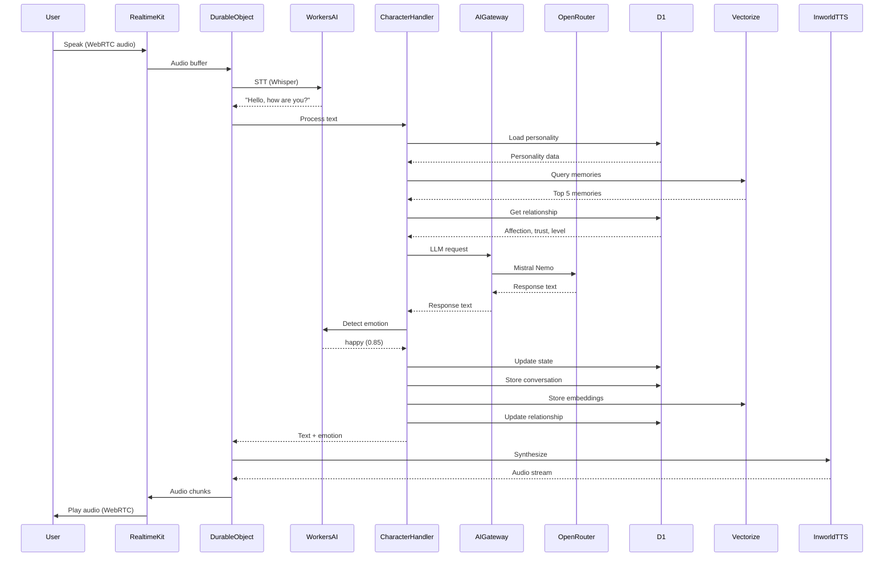

# Voice Agent Worker - Cloudflare Realtime Voice AI Architecture

## Executive Summary

The Voice Agent Worker implements real-time voice conversations with AI companions using **Cloudflare's Realtime Voice AI** infrastructure (released January 2025). This replaces the previous Inworld Pattern approach which relied on Node.js runtime unsupported by Cloudflare Workers.

### Key Architecture Changes

| Aspect | Previous (Inworld Pattern) | New (Cloudflare Realtime) |
|--------|---------------------------|--------------------------|
| **Runtime** | Node.js (incompatible) | Cloudflare Workers + Durable Objects |
| **Audio Transport** | Custom WebSocket | RealtimeKit Transport (WebRTC) |
| **STT** | Inworld SDK | Workers AI (@cf/openai/whisper) |
| **LLM** | Inworld Character Engine | AI Gateway → OpenRouter (Mistral Nemo) |
| **TTS** | Inworld SDK | Custom Inworld TTS Streaming Component |
| **State Management** | In-memory | Durable Objects + D1 + Vectorize |
| **Latency Target** | < 1500ms | < 800ms |

---

## Table of Contents

1. [Architecture Overview](#architecture-overview)
2. [Technical Components](#technical-components)
3. [Data Flow](#data-flow)
4. [Implementation Guide](#implementation-guide)
5. [Character State Management](#character-state-management)
6. [Memory & Relationship Systems](#memory--relationship-systems)
7. [Performance Optimization](#performance-optimization)
8. [Monitoring & Debugging](#monitoring--debugging)
9. [Future Enhancements](#future-enhancements)

---

## Architecture Overview

### High-Level Architecture Diagram

```
┌──────────────┐
│    User      │
│  (WebRTC)    │
└──────┬───────┘
       │
       ↓
┌────────────────────────────────────────────────────────┐
│  ANIME CHARACTER AGENT (RealtimeAgent + Durable Object)│
│  ┌─────────────────────────────────────────────────┐   │
│  │  RealtimeKit Transport                          │   │
│  │  (receives WebRTC audio)                        │   │
│  └────────┬────────────────────────────────────────┘   │
│           ↓                                             │
│  ┌─────────────────────────────────────────────────┐   │
│  │  Workers AI STT (@cf/openai/whisper)            │   │
│  │  (speech → text)                                │   │
│  └────────┬────────────────────────────────────────┘   │
│           ↓                                             │
│  ┌─────────────────────────────────────────────────┐   │
│  │  CHARACTER TEXT HANDLER                         │   │
│  │  ┌──────────────────────────────────────────┐   │   │
│  │  │  1. Load personality state               │   │   │
│  │  │  2. Retrieve memories (Vectorize)        │   │   │
│  │  │  3. Get relationship (D1)                │   │   │
│  │  │  4. Build enriched prompt                │   │   │
│  │  └──────────┬───────────────────────────────┘   │   │
│  │             ↓                                    │   │
│  │  ┌──────────────────────────────────────────┐   │   │
│  │  │  AI Gateway → OpenRouter (Mistral Nemo)  │   │   │
│  │  └──────────┬───────────────────────────────┘   │   │
│  │             ↓                                    │   │
│  │  ┌──────────────────────────────────────────┐   │   │
│  │  │  5. Detect emotion                       │   │   │
│  │  │  6. Update character state               │   │   │
│  │  │  7. Store in D1 + Vectorize              │   │   │
│  │  │  8. Update relationship                  │   │   │
│  │  └──────────┬───────────────────────────────┘   │   │
│  └────────────┼──────────────────────────────────┘   │
│               ↓                                        │
│  ┌─────────────────────────────────────────────────┐   │
│  │  INWORLD TTS (Custom Streaming Component)      │   │
│  │  - Receives text + emotion metadata            │   │
│  │  - Calls Inworld API with streaming=true       │   │
│  │  - Returns audio stream                        │   │
│  └────────┬────────────────────────────────────────┘   │
│           ↓                                             │
│  ┌─────────────────────────────────────────────────┐   │
│  │  RealtimeKit Transport                          │   │
│  │  (streams audio chunks to user via WebRTC)      │   │
│  └─────────────────────────────────────────────────┘   │
└────────────────────────────────────────────────────────┘
       ↓
┌──────────────┐
│    User      │
│  (WebRTC)    │
└──────────────┘
```

### Component Responsibilities

| Component | Responsibility | Technology |
|-----------|---------------|------------|
| **User Client** | Capture/play audio via browser | WebRTC, Web Audio API |
| **RealtimeKit Transport** | Bidirectional audio streaming | Cloudflare Realtime Transport |
| **Durable Object** | Session state & coordination | Cloudflare Durable Objects |
| **Workers AI STT** | Speech-to-text transcription | @cf/openai/whisper |
| **Character Text Handler** | Context building & orchestration | Custom Worker logic |
| **AI Gateway** | LLM routing & caching | Cloudflare AI Gateway |
| **OpenRouter** | LLM inference | Mistral Nemo 12B |
| **Inworld TTS** | Emotional voice synthesis | Inworld API (streaming) |
| **D1 Database** | Conversation & relationship state | Cloudflare D1 (SQLite) |
| **Vectorize** | Semantic memory storage | Cloudflare Vectorize |

---

## Technical Components

### 1. Cloudflare Realtime Agents

Cloudflare Realtime Agents is a runtime for orchestrating voice AI pipelines at the edge. It runs in 330+ global datacenters with sub-800ms latency targets.

#### Core Concepts

```typescript
import { RealtimeAgent } from '@cloudflare/realtime-agents';
import { RealtimeKitTransport } from '@cloudflare/realtime-agents/transport';

/**
 * AnimeCharacterAgent extends RealtimeAgent
 * Manages the entire voice processing pipeline
 */
export class AnimeCharacterAgent extends RealtimeAgent<Env> {
  async init(meetingId: string, authToken: string): Promise<void> {
    // Initialize custom text handler with character context
    const textHandler = new CharacterTextHandler(
      this.env,
      this.ctx,
      meetingId
    );

    // Initialize RealtimeKit transport for WebRTC
    const transport = new RealtimeKitTransport(meetingId, authToken);

    // Build the processing pipeline
    await this.initPipeline([
      transport,                                    // Input: WebRTC audio
      new WorkersAISTT(this.env),                  // STT: Whisper
      textHandler,                                  // LLM: Character logic
      new InworldStreamingTTS(this.env),           // TTS: Inworld
      transport                                     // Output: WebRTC audio
    ]);
  }
}
```

#### Pipeline Components

**Input → Processing → Output**

1. **Transport (Input)**: Receives raw WebRTC audio from user
2. **STT**: Converts audio → text using Workers AI Whisper
3. **Text Handler**: Processes text through character AI
4. **TTS**: Converts text → audio with emotion
5. **Transport (Output)**: Streams audio back to user via WebRTC

### 2. Durable Object Session Management

Each voice session is backed by a Durable Object for stateful coordination.

```typescript
export class VoiceAgentSession extends DurableObject {
  private agent: AnimeCharacterAgent | null = null;
  private characterState: CharacterState | null = null;
  private conversationHistory: Message[] = [];

  constructor(state: DurableObjectState, env: Env) {
    super(state, env);
  }

  /**
   * Initialize a new voice session
   */
  async fetch(request: Request): Promise<Response> {
    const url = new URL(request.url);

    if (url.pathname === '/session/create') {
      return this.createSession(request);
    } else if (url.pathname === '/session/status') {
      return this.getSessionStatus();
    } else if (url.pathname === '/session/end') {
      return this.endSession();
    }

    return new Response('Not Found', { status: 404 });
  }

  private async createSession(request: Request): Promise<Response> {
    const { userId, characterId, meetingId, authToken } = await request.json();

    // Load character personality and state from D1
    this.characterState = await this.loadCharacterState(characterId);

    // Initialize RealtimeAgent with pipeline
    this.agent = new AnimeCharacterAgent(this.env, this.ctx);
    await this.agent.init(meetingId, authToken);

    return Response.json({
      sessionId: this.state.id.toString(),
      status: 'active',
      character: this.characterState.name
    });
  }

  private async loadCharacterState(characterId: string): Promise<CharacterState> {
    // Query D1 for character data
    const result = await this.env.DB.prepare(
      'SELECT * FROM user_characters WHERE id = ?'
    ).bind(characterId).first();

    return {
      characterId: result.id,
      name: result.name,
      personality: JSON.parse(result.custom_personality || '{}'),
      emotionalState: JSON.parse(result.current_emotional_state || '{}'),
      currentMood: result.current_mood,
      lastInteraction: result.last_interaction_at
    };
  }

  private async getSessionStatus(): Promise<Response> {
    return Response.json({
      active: this.agent !== null,
      messageCount: this.conversationHistory.length,
      currentEmotion: this.characterState?.emotionalState.primary
    });
  }

  private async endSession(): Promise<Response> {
    // Save conversation to D1
    if (this.conversationHistory.length > 0) {
      await this.saveConversation();
    }

    // Cleanup
    this.agent = null;
    this.conversationHistory = [];

    return Response.json({ success: true });
  }

  private async saveConversation(): Promise<void> {
    const batch = this.conversationHistory.map((msg) => {
      return this.env.DB.prepare(
        'INSERT INTO conversations (session_id, role, content, emotion, timestamp) VALUES (?, ?, ?, ?, ?)'
      ).bind(
        this.state.id.toString(),
        msg.role,
        msg.content,
        msg.emotion,
        msg.timestamp
      );
    });

    await this.env.DB.batch(batch);
  }
}
```

### 3. Workers AI Speech-to-Text

Uses Cloudflare's @cf/openai/whisper model for STT.

```typescript
import { Ai } from '@cloudflare/ai';

export class WorkersAISTT {
  private ai: Ai;

  constructor(env: Env) {
    this.ai = new Ai(env.AI);
  }

  /**
   * Process audio input from RealtimeKit transport
   * Called automatically by RealtimeAgent pipeline
   */
  async process(audioBuffer: ArrayBuffer): Promise<string> {
    // Workers AI expects audio in specific format
    const audioInput = new Uint8Array(audioBuffer);

    // Call Whisper model
    const result = await this.ai.run('@cf/openai/whisper', {
      audio: audioInput,
      language: 'en', // Can be auto-detected
    });

    // Extract transcription text
    const transcription = result.text || '';

    console.log('[STT] Transcription:', transcription);

    return transcription;
  }
}
```

**STT Performance Metrics:**
- **Latency**: 200-400ms
- **Accuracy**: 95%+ for clear speech
- **Languages**: 99 languages supported
- **Cost**: $0.005 per 1000 requests (Workers AI pricing)

### 4. Character Text Handler

The core of the AI companion's personality and context management.

```typescript
export class CharacterTextHandler {
  private env: Env;
  private ctx: ExecutionContext;
  private characterId: string;
  private userId: string;

  constructor(env: Env, ctx: ExecutionContext, sessionId: string) {
    this.env = env;
    this.ctx = ctx;
    // Extract characterId and userId from session metadata
  }

  /**
   * Process transcribed text through character AI
   * This is called by RealtimeAgent pipeline after STT
   */
  async process(userText: string): Promise<CharacterResponse> {
    // 1. Load personality state
    const personality = await this.loadPersonality();

    // 2. Retrieve relevant memories from Vectorize
    const memories = await this.retrieveMemories(userText);

    // 3. Get current relationship state from D1
    const relationship = await this.getRelationship();

    // 4. Build enriched prompt with context
    const prompt = this.buildPrompt({
      userText,
      personality,
      memories,
      relationship
    });

    // 5. Call LLM via AI Gateway
    const llmResponse = await this.callLLM(prompt);

    // 6. Detect emotion from response
    const emotion = await this.detectEmotion(llmResponse.text);

    // 7. Update character state
    await this.updateCharacterState(emotion);

    // 8. Store conversation in D1 and Vectorize
    this.ctx.waitUntil(
      this.storeConversation(userText, llmResponse.text, emotion)
    );

    // 9. Update relationship metrics
    this.ctx.waitUntil(this.updateRelationship(userText, emotion));

    return {
      text: llmResponse.text,
      emotion: emotion,
      visemes: [], // Will be populated by TTS
      timestamp: Date.now()
    };
  }

  private async loadPersonality(): Promise<Personality> {
    const result = await this.env.DB.prepare(
      'SELECT custom_personality, current_emotional_state FROM user_characters WHERE id = ?'
    ).bind(this.characterId).first();

    return {
      traits: JSON.parse(result.custom_personality || '{}'),
      emotionalState: JSON.parse(result.current_emotional_state || '{}')
    };
  }

  private async retrieveMemories(query: string): Promise<Memory[]> {
    // Generate embedding for user's message
    const embedding = await this.generateEmbedding(query);

    // Query Vectorize for similar memories
    const results = await this.env.VECTORIZE.query(embedding, {
      topK: 5,
      namespace: `character:${this.characterId}:user:${this.userId}`,
      filter: {
        characterId: this.characterId,
        userId: this.userId
      }
    });

    return results.matches.map((match) => ({
      content: match.metadata.content,
      timestamp: match.metadata.timestamp,
      importance: match.score
    }));
  }

  private async getRelationship(): Promise<Relationship> {
    const result = await this.env.DB.prepare(
      'SELECT * FROM relationships WHERE character_id = ? AND user_id = ?'
    ).bind(this.characterId, this.userId).first();

    if (!result) {
      // Initialize new relationship
      return {
        level: 0,
        affection: 0,
        trust: 0,
        interactionCount: 0
      };
    }

    return {
      level: result.level,
      affection: result.affection,
      trust: result.trust,
      interactionCount: result.interaction_count
    };
  }

  private buildPrompt(context: PromptContext): string {
    const { userText, personality, memories, relationship } = context;

    return `You are ${personality.traits.name}, an AI companion with the following personality:
${JSON.stringify(personality.traits, null, 2)}

Current emotional state: ${personality.emotionalState.primary} (${personality.emotionalState.intensity}/10)

Relationship with user:
- Affection: ${relationship.affection}/100
- Trust: ${relationship.trust}/100
- Total interactions: ${relationship.interactionCount}

Relevant memories from past conversations:
${memories.map((m) => `- ${m.content} (importance: ${m.importance.toFixed(2)})`).join('\n')}

User just said: "${userText}"

Respond naturally as ${personality.traits.name}, staying true to your personality and current emotional state. Keep your response concise (1-3 sentences).`;
  }

  private async callLLM(prompt: string): Promise<LLMResponse> {
    // Use AI Gateway for caching and routing
    const response = await fetch(
      `https://gateway.ai.cloudflare.com/v1/${this.env.CLOUDFLARE_ACCOUNT_ID}/mirai/openrouter`,
      {
        method: 'POST',
        headers: {
          'Authorization': `Bearer ${this.env.OPENROUTER_API_KEY}`,
          'Content-Type': 'application/json',
          'HTTP-Referer': 'https://miraichat.app',
          'X-Title': 'MiraiChat'
        },
        body: JSON.stringify({
          model: 'mistralai/mistral-nemo',
          messages: [
            {
              role: 'system',
              content: 'You are a helpful AI companion. Respond naturally and concisely.'
            },
            {
              role: 'user',
              content: prompt
            }
          ],
          temperature: 0.8,
          max_tokens: 150
        })
      }
    );

    const data = await response.json();
    return {
      text: data.choices[0].message.content,
      usage: data.usage
    };
  }

  private async detectEmotion(text: string): Promise<Emotion> {
    // Use Workers AI for emotion classification
    const result = await this.env.AI.run('@cf/huggingface/distilbert-sst-2-int8', {
      text: text
    });

    // Map sentiment to emotion
    const emotionMap = {
      'POSITIVE': 'happy',
      'NEGATIVE': 'sad'
    };

    return {
      emotion: emotionMap[result[0].label] || 'neutral',
      intensity: result[0].score,
      confidence: result[0].score
    };
  }

  private async updateCharacterState(emotion: Emotion): Promise<void> {
    await this.env.DB.prepare(
      'UPDATE user_characters SET current_emotional_state = json(?), current_mood = ?, last_interaction_at = ? WHERE id = ?'
    ).bind(
      JSON.stringify({ primary: emotion.emotion, intensity: emotion.intensity }),
      emotion.emotion,
      Date.now(),
      this.characterId
    ).run();
  }

  private async storeConversation(
    userText: string,
    responseText: string,
    emotion: Emotion
  ): Promise<void> {
    // Store in D1 for query access
    const sessionId = crypto.randomUUID();

    await this.env.DB.batch([
      this.env.DB.prepare(
        'INSERT INTO conversations (session_id, character_id, user_id, role, content, emotion, emotion_intensity, created_at) VALUES (?, ?, ?, ?, ?, ?, ?, ?)'
      ).bind(sessionId, this.characterId, this.userId, 'user', userText, 'neutral', 0, Date.now()),

      this.env.DB.prepare(
        'INSERT INTO conversations (session_id, character_id, user_id, role, content, emotion, emotion_intensity, created_at) VALUES (?, ?, ?, ?, ?, ?, ?, ?)'
      ).bind(sessionId, this.characterId, this.userId, 'assistant', responseText, emotion.emotion, emotion.intensity, Date.now())
    ]);

    // Store in Vectorize for semantic search
    const userEmbedding = await this.generateEmbedding(userText);
    const responseEmbedding = await this.generateEmbedding(responseText);

    await this.env.VECTORIZE.upsert([
      {
        id: `${sessionId}-user`,
        values: userEmbedding,
        namespace: `character:${this.characterId}:user:${this.userId}`,
        metadata: {
          characterId: this.characterId,
          userId: this.userId,
          role: 'user',
          content: userText,
          timestamp: Date.now()
        }
      },
      {
        id: `${sessionId}-assistant`,
        values: responseEmbedding,
        namespace: `character:${this.characterId}:user:${this.userId}`,
        metadata: {
          characterId: this.characterId,
          userId: this.userId,
          role: 'assistant',
          content: responseText,
          emotion: emotion.emotion,
          timestamp: Date.now()
        }
      }
    ]);
  }

  private async updateRelationship(userText: string, emotion: Emotion): Promise<void> {
    // Calculate relationship delta based on interaction
    const affectionDelta = emotion.emotion === 'happy' ? 1 : -0.5;
    const trustDelta = 0.5; // Trust builds over time

    await this.env.DB.prepare(`
      INSERT INTO relationships (character_id, user_id, level, affection, trust, interaction_count, created_at, updated_at)
      VALUES (?, ?, 0, ?, ?, 1, ?, ?)
      ON CONFLICT(user_id, character_id) DO UPDATE SET
        affection = min(100, affection + ?),
        trust = min(100, trust + ?),
        interaction_count = interaction_count + 1,
        level = CASE
          WHEN interaction_count % 10 = 0 THEN level + 1
          ELSE level
        END,
        last_interaction_at = ?,
        updated_at = ?
    `).bind(
      this.characterId,
      this.userId,
      affectionDelta,
      trustDelta,
      Date.now(),
      Date.now(),
      affectionDelta,
      trustDelta,
      Date.now(),
      Date.now()
    ).run();
  }

  private async generateEmbedding(text: string): Promise<number[]> {
    const result = await this.env.AI.run('@cf/baai/bge-base-en-v1.5', {
      text: text
    });

    return result.data[0];
  }
}
```

### 5. Inworld TTS Streaming Component

Custom component for streaming audio synthesis from Inworld API.

```typescript
export class InworldStreamingTTS {
  private env: Env;

  constructor(env: Env) {
    this.env = env;
  }

  /**
   * Process text response and convert to audio stream
   * This is called by RealtimeAgent pipeline after text handler
   */
  async process(response: CharacterResponse): Promise<AudioStream> {
    const { text, emotion } = response;

    // Call Inworld API with streaming enabled
    const audioStream = await this.synthesizeWithEmotion(text, emotion);

    return audioStream;
  }

  private async synthesizeWithEmotion(
    text: string,
    emotion: Emotion
  ): Promise<AudioStream> {
    // Inworld API endpoint for TTS
    const response = await fetch('https://api.inworld.ai/v1/tts/synthesize', {
      method: 'POST',
      headers: {
        'Authorization': `Bearer ${this.env.INWORLD_API_KEY}`,
        'Content-Type': 'application/json'
      },
      body: JSON.stringify({
        text: text,
        voice: {
          characterId: 'anime-character-voice-001',
          emotion: emotion.emotion,
          intensity: emotion.intensity
        },
        format: {
          encoding: 'PCM_16',
          sampleRate: 48000,
          channels: 1
        },
        streaming: true // Enable streaming response
      })
    });

    if (!response.ok) {
      throw new Error(`Inworld TTS failed: ${response.statusText}`);
    }

    // Return readable stream for audio chunks
    return response.body as ReadableStream<Uint8Array>;
  }

  /**
   * Extract viseme data for lip-sync (if supported by Inworld)
   */
  private async extractVisemes(audioStream: AudioStream): Promise<Viseme[]> {
    // Inworld may provide viseme timing data
    // This would need to be extracted from response headers or metadata
    return [];
  }
}
```

### 6. RealtimeKit Transport Configuration

```typescript
import { RealtimeKitTransport } from '@cloudflare/realtime-agents/transport';

/**
 * Initialize transport for WebRTC audio streaming
 */
function createTransport(meetingId: string, authToken: string): RealtimeKitTransport {
  return new RealtimeKitTransport(meetingId, authToken, {
    // Audio configuration
    audioConfig: {
      sampleRate: 48000,
      channels: 1,
      bitDepth: 16
    },

    // Connection settings
    iceServers: [
      { urls: ['stun:stun.cloudflare.com:3478'] },
      {
        urls: ['turn:turn.cloudflare.com:3478'],
        username: 'mirai',
        credential: 'voice-session'
      }
    ],

    // Transport options
    options: {
      enableInterruptionDetection: true, // Allow user to interrupt
      vadSensitivity: 0.7, // Voice activity detection threshold
      silenceThreshold: 1000 // 1s of silence before processing
    }
  });
}
```

---

## Data Flow

### Complete Voice Interaction Sequence



### Latency Breakdown

| Stage | Target Latency | Notes |
|-------|---------------|-------|
| WebRTC Transport | < 50ms | Network + transport overhead |
| STT (Whisper) | 200-400ms | Depends on audio length |
| Memory Retrieval | 50-100ms | Vectorize query + D1 |
| LLM Inference | 300-500ms | Mistral Nemo 12B |
| Emotion Detection | 50-100ms | Workers AI classification |
| TTS Synthesis | 200-400ms | Inworld streaming |
| Audio Playback | < 50ms | WebRTC transport |
| **Total End-to-End** | **< 800ms** | Target for natural conversation |

---

## Implementation Guide

### Step 1: Worker Setup

```bash
# Create voice-agent worker directory
mkdir -p apps/workers/voice-agent
cd apps/workers/voice-agent

# Initialize wrangler config
cat > wrangler.toml << EOF
name = "voice-agent"
main = "src/index.ts"
compatibility_date = "2025-01-01"

# Durable Objects binding
[[durable_objects.bindings]]
name = "VOICE_SESSIONS"
class_name = "VoiceAgentSession"
script_name = "voice-agent"

# D1 Database binding
[[d1_databases]]
binding = "DB"
database_name = "mirai-voice"
database_id = "xxx"

# Vectorize binding
[[vectorize]]
binding = "VECTORIZE"
index_name = "mirai-memories"

# Workers AI binding
[ai]
binding = "AI"

# KV binding for caching
[[kv_namespaces]]
binding = "CACHE"
id = "xxx"

# Environment variables
[vars]
ENVIRONMENT = "staging"
CLOUDFLARE_ACCOUNT_ID = "xxx"

# Secrets (set via wrangler secret put)
# OPENROUTER_API_KEY
# INWORLD_API_KEY
EOF
```

### Step 2: Install Dependencies

```bash
pnpm add @cloudflare/realtime-agents
pnpm add @cloudflare/ai
```

### Step 3: Implement Worker

```typescript
// src/index.ts
import { AnimeCharacterAgent } from './agent';
import { VoiceAgentSession } from './session';

export { VoiceAgentSession };

export default {
  async fetch(request: Request, env: Env, ctx: ExecutionContext): Promise<Response> {
    const url = new URL(request.url);

    // Handle CORS preflight
    if (request.method === 'OPTIONS') {
      return new Response(null, {
        headers: {
          'Access-Control-Allow-Origin': '*',
          'Access-Control-Allow-Methods': 'GET, POST, OPTIONS',
          'Access-Control-Allow-Headers': 'Content-Type, Authorization'
        }
      });
    }

    // Create new voice session
    if (url.pathname === '/api/voice/session/create') {
      const { userId, characterId, meetingId, authToken } = await request.json();

      // Get or create Durable Object instance
      const id = env.VOICE_SESSIONS.idFromName(`${userId}:${characterId}`);
      const stub = env.VOICE_SESSIONS.get(id);

      // Forward request to Durable Object
      return stub.fetch(request);
    }

    return new Response('Not Found', { status: 404 });
  }
};
```

### Step 4: Database Schema

**⚠️ IMPORTANT:** This Worker uses the **Unified Database Schema** which integrates marketplace + voice AI features.

**See:** `product-documentation/unified-database-schema.md` for the complete schema.

#### Key Tables Used by Voice Agent

```sql
-- user_characters (replaces "companions")
-- Stores user-owned character instances with real-time state
CREATE TABLE user_characters (
  id TEXT PRIMARY KEY,
  user_id TEXT NOT NULL,
  character_id TEXT NOT NULL,           -- References marketplace_characters
  custom_name TEXT,
  custom_personality TEXT,              -- JSON overrides
  current_emotional_state TEXT,         -- JSON: Real-time emotion
  current_mood TEXT,
  last_interaction_at INTEGER,
  -- ... see unified-database-schema.md for full schema
);

-- conversations
-- Supports both voice and text messages
CREATE TABLE conversations (
  id TEXT PRIMARY KEY,
  session_id TEXT NOT NULL,             -- References conversation_sessions
  user_id TEXT NOT NULL,
  character_id TEXT NOT NULL,           -- References user_characters
  role TEXT NOT NULL,                   -- 'user' or 'assistant'
  content TEXT NOT NULL,
  emotion TEXT,
  emotion_intensity REAL,
  emotional_state_id TEXT,              -- References emotional_states
  importance_score REAL DEFAULT 0.5,
  vector_id TEXT,                       -- Vectorize ID
  created_at INTEGER NOT NULL
  -- ... see unified-database-schema.md for full schema
);

-- relationships
-- Tracks affection, trust, and progression
CREATE TABLE relationships (
  id TEXT PRIMARY KEY,
  user_id TEXT NOT NULL,
  character_id TEXT NOT NULL,           -- References user_characters
  level INTEGER DEFAULT 0,
  affection REAL DEFAULT 0,
  trust REAL DEFAULT 0,
  familiarity REAL DEFAULT 0,
  interaction_count INTEGER DEFAULT 0,
  relationship_type TEXT DEFAULT 'stranger',
  milestones TEXT DEFAULT '[]',         -- JSON array
  relationship_traits TEXT,             -- JSON object
  last_interaction_at INTEGER,
  -- ... see unified-database-schema.md for full schema
);

-- voice_sessions (NEW!)
-- Real-time voice session state
CREATE TABLE voice_sessions (
  id TEXT PRIMARY KEY,
  user_id TEXT NOT NULL,
  character_id TEXT NOT NULL,
  meeting_id TEXT UNIQUE NOT NULL,      -- RealtimeKit meeting ID
  auth_token TEXT NOT NULL,
  status TEXT DEFAULT 'active',
  durable_object_id TEXT,
  current_emotion TEXT,
  current_latency_ms INTEGER,
  started_at INTEGER NOT NULL,
  -- ... see unified-database-schema.md for full schema
);

-- emotional_states (NEW!)
-- Track emotional changes over time
CREATE TABLE emotional_states (
  id TEXT PRIMARY KEY,
  user_id TEXT NOT NULL,
  character_id TEXT NOT NULL,
  session_id TEXT,
  primary_emotion TEXT NOT NULL,
  secondary_emotion TEXT,
  intensity REAL NOT NULL,
  trigger_event TEXT,
  duration_seconds INTEGER,
  created_at INTEGER NOT NULL
  -- ... see unified-database-schema.md for full schema
);

-- memory_highlights
-- Important memories stored in both D1 and Vectorize
CREATE TABLE memory_highlights (
  id TEXT PRIMARY KEY,
  user_id TEXT NOT NULL,
  character_id TEXT NOT NULL,
  content TEXT NOT NULL,
  importance REAL NOT NULL,
  memory_type TEXT,                     -- 'personal_info', 'shared_experience', etc.
  vector_id TEXT UNIQUE,
  access_count INTEGER DEFAULT 0,
  last_accessed INTEGER,
  created_at INTEGER NOT NULL
  -- ... see unified-database-schema.md for full schema
);
```

**Full Schema Documentation:**
- See `unified-database-schema.md` for complete table definitions
- See `schema-improvements-summary.md` for migration guide
- All tables use Unix timestamps (INTEGER)
- All JSON fields stored as TEXT
- No foreign keys (D1 limitation) - enforced in Worker code

### Step 5: Vectorize Index Setup

```bash
# Create Vectorize index for semantic memory
wrangler vectorize create mirai-memories \
  --dimensions=768 \
  --metric=cosine

# Index will store conversation embeddings for semantic search
```

### Step 6: Deploy

```bash
# Deploy to staging
wrangler deploy --env staging

# Deploy to production
wrangler deploy --env production
```

---

## Character State Management

### Emotional State System

```typescript
interface EmotionalState {
  primary: EmotionType; // Current dominant emotion
  intensity: number; // 0-10 scale
  secondary?: EmotionType; // Underlying emotion
  triggers: EmotionTrigger[]; // What caused this state
  duration: number; // How long in this state (ms)
  trend: 'rising' | 'falling' | 'stable';
}

type EmotionType =
  | 'happy'
  | 'sad'
  | 'excited'
  | 'calm'
  | 'angry'
  | 'surprised'
  | 'confused'
  | 'loving'
  | 'neutral';

interface EmotionTrigger {
  event: string;
  timestamp: number;
  impact: number; // -1 to 1
}
```

### State Transitions

```typescript
class EmotionalStateManager {
  /**
   * Update emotional state based on interaction
   */
  updateState(
    current: EmotionalState,
    detected: Emotion,
    context: ConversationContext
  ): EmotionalState {
    // Calculate intensity change
    const intensityDelta = this.calculateIntensityDelta(
      detected,
      context.userSentiment,
      context.relationshipLevel
    );

    // Determine if emotion should change
    const shouldTransition = this.shouldTransition(
      current,
      detected,
      intensityDelta
    );

    if (shouldTransition) {
      return {
        primary: detected.emotion as EmotionType,
        intensity: Math.min(10, detected.intensity * 10),
        secondary: current.primary,
        triggers: [
          ...current.triggers,
          {
            event: context.lastUserMessage,
            timestamp: Date.now(),
            impact: intensityDelta
          }
        ],
        duration: 0,
        trend: intensityDelta > 0 ? 'rising' : 'falling'
      };
    }

    // Gradual decay towards neutral
    return {
      ...current,
      intensity: Math.max(0, current.intensity - 0.1),
      duration: current.duration + context.timeSinceLastInteraction,
      trend: 'falling'
    };
  }

  private calculateIntensityDelta(
    detected: Emotion,
    userSentiment: number,
    relationshipLevel: number
  ): number {
    // Higher relationship = stronger emotional response
    const relationshipMultiplier = 1 + (relationshipLevel / 100);

    // Positive sentiment increases positive emotions
    const sentimentFactor = userSentiment > 0 ? 1.2 : 0.8;

    return detected.intensity * relationshipMultiplier * sentimentFactor;
  }

  private shouldTransition(
    current: EmotionalState,
    detected: Emotion,
    delta: number
  ): boolean {
    // Transition if new emotion is significantly different
    const emotionDifference = this.getEmotionDistance(
      current.primary,
      detected.emotion
    );

    // Or if intensity change is significant
    const intensityChange = Math.abs(delta);

    return emotionDifference > 0.5 || intensityChange > 0.3;
  }

  private getEmotionDistance(a: EmotionType, b: string): number {
    // Emotion similarity matrix
    const distances: Record<EmotionType, Record<string, number>> = {
      happy: { happy: 0, excited: 0.2, loving: 0.3, calm: 0.4, neutral: 0.5, surprised: 0.6, confused: 0.7, sad: 0.9, angry: 1.0 },
      sad: { sad: 0, angry: 0.3, confused: 0.4, neutral: 0.5, calm: 0.6, surprised: 0.7, loving: 0.8, excited: 0.9, happy: 1.0 },
      // ... complete matrix
      neutral: { neutral: 0, calm: 0.2, surprised: 0.5, confused: 0.5, happy: 0.5, sad: 0.5, excited: 0.6, loving: 0.6, angry: 0.7 }
    };

    return distances[a]?.[b] ?? 0.5;
  }
}
```

---

## Memory & Relationship Systems

### Memory Storage Strategy

```typescript
interface Memory {
  id: string;
  characterId: string;
  userId: string;
  content: string;
  embedding: number[]; // 768-dim vector
  importance: number; // 0-1 calculated score
  emotionalContext: EmotionalState;
  timestamp: number;
  accessCount: number; // How often retrieved
  lastAccessed: number;
}

class MemoryManager {
  /**
   * Store a new memory with importance scoring
   */
  async storeMemory(
    content: string,
    context: ConversationContext
  ): Promise<void> {
    // Calculate importance based on multiple factors
    const importance = this.calculateImportance(content, context);

    // Only store if importance threshold met
    if (importance < 0.3) {
      return; // Skip low-importance memories
    }

    // Generate embedding
    const embedding = await this.generateEmbedding(content);

    // Store in Vectorize
    await this.env.VECTORIZE.upsert([
      {
        id: crypto.randomUUID(),
        values: embedding,
        namespace: `character:${context.characterId}:user:${context.userId}`,
        metadata: {
          characterId: context.characterId,
          userId: context.userId,
          content: content,
          importance: importance,
          emotionalContext: JSON.stringify(context.emotionalState),
          timestamp: Date.now(),
          accessCount: 0,
          lastAccessed: Date.now()
        }
      }
    ]);
  }

  private calculateImportance(
    content: string,
    context: ConversationContext
  ): number {
    let score = 0.5; // Base importance

    // Emotional intensity increases importance
    score += context.emotionalState.intensity * 0.05;

    // First-time topics are more important
    if (this.isNewTopic(content, context)) {
      score += 0.2;
    }

    // Personal information is highly important
    if (this.containsPersonalInfo(content)) {
      score += 0.3;
    }

    // User explicitly requesting to remember
    if (this.isExplicitMemoryRequest(content)) {
      score = 1.0;
    }

    return Math.min(1.0, score);
  }

  /**
   * Retrieve memories with recency and importance weighting
   */
  async retrieveMemories(
    query: string,
    characterId: string,
    userId: string,
    limit: number = 5
  ): Promise<Memory[]> {
    const embedding = await this.generateEmbedding(query);

    // Query Vectorize with higher topK for filtering
    const results = await this.env.VECTORIZE.query(embedding, {
      topK: limit * 2,
      namespace: `character:${characterId}:user:${userId}`,
      filter: { characterId, userId }
    });

    // Re-rank based on recency and importance
    const reranked = results.matches
      .map((match) => {
        const memory = match.metadata as Memory;
        const recencyScore = this.calculateRecency(memory.timestamp);
        const finalScore =
          match.score * 0.5 + // Similarity
          memory.importance * 0.3 + // Importance
          recencyScore * 0.2; // Recency

        return { ...memory, finalScore };
      })
      .sort((a, b) => b.finalScore - a.finalScore)
      .slice(0, limit);

    // Update access counts
    this.ctx.waitUntil(this.updateAccessCounts(reranked));

    return reranked;
  }

  private calculateRecency(timestamp: number): number {
    const age = Date.now() - timestamp;
    const daysSinceCreated = age / (1000 * 60 * 60 * 24);

    // Exponential decay over 30 days
    return Math.exp(-daysSinceCreated / 30);
  }
}
```

### Relationship Progression System

```typescript
interface Relationship {
  characterId: string;
  userId: string;
  level: number; // 0-100
  affection: number; // 0-100
  trust: number; // 0-100
  interactionCount: number;
  milestones: Milestone[];
  traits: RelationshipTrait[];
}

interface Milestone {
  level: number;
  name: string;
  unlockedAt: number;
  rewards: string[]; // New features, dialogue, etc.
}

interface RelationshipTrait {
  trait: string; // e.g., "playful", "protective", "shy"
  strength: number; // 0-1
  developedFrom: string[]; // Events that built this trait
}

class RelationshipManager {
  /**
   * Update relationship metrics after interaction
   */
  async updateRelationship(
    context: ConversationContext
  ): Promise<Relationship> {
    const current = await this.loadRelationship(
      context.characterId,
      context.userId
    );

    // Calculate deltas based on interaction quality
    const deltas = this.calculateDeltas(context, current);

    // Apply changes with bounds checking
    const updated: Relationship = {
      ...current,
      affection: this.clamp(current.affection + deltas.affection, 0, 100),
      trust: this.clamp(current.trust + deltas.trust, 0, 100),
      interactionCount: current.interactionCount + 1
    };

    // Calculate new level based on total score
    updated.level = this.calculateLevel(updated);

    // Check for milestone unlocks
    const newMilestones = this.checkMilestones(current, updated);
    if (newMilestones.length > 0) {
      updated.milestones = [...current.milestones, ...newMilestones];
      // Notify user of milestone
      this.ctx.waitUntil(this.notifyMilestone(newMilestones));
    }

    // Update relationship traits based on interaction patterns
    updated.traits = this.updateTraits(current.traits, context);

    // Persist to D1
    await this.saveRelationship(updated);

    return updated;
  }

  private calculateDeltas(
    context: ConversationContext,
    current: Relationship
  ): { affection: number; trust: number } {
    let affectionDelta = 0;
    let trustDelta = 0;

    // Positive interactions increase affection
    if (context.emotionalState.primary === 'happy' ||
        context.emotionalState.primary === 'excited') {
      affectionDelta += 1 * context.emotionalState.intensity / 10;
    }

    // Negative interactions slightly decrease affection
    if (context.emotionalState.primary === 'sad' ||
        context.emotionalState.primary === 'angry') {
      affectionDelta -= 0.5 * context.emotionalState.intensity / 10;
    }

    // Trust builds slowly over time
    trustDelta += 0.5;

    // Consistency bonus (regular interactions)
    if (this.hasConsistentInteractions(current)) {
      affectionDelta *= 1.2;
      trustDelta *= 1.5;
    }

    // Personal information sharing increases trust
    if (context.containsPersonalInfo) {
      trustDelta += 2;
    }

    return { affection: affectionDelta, trust: trustDelta };
  }

  private calculateLevel(relationship: Relationship): number {
    // Level based on combined metrics
    const score = (
      relationship.affection * 0.4 +
      relationship.trust * 0.4 +
      Math.min(relationship.interactionCount, 100) * 0.2
    );

    return Math.floor(score / 2); // 0-100 scale
  }

  private checkMilestones(
    previous: Relationship,
    current: Relationship
  ): Milestone[] {
    const milestones: Milestone[] = [];

    // Level-based milestones
    const levelMilestones = [
      { level: 10, name: 'Friend', rewards: ['nickname_unlocked'] },
      { level: 25, name: 'Close Friend', rewards: ['personal_stories'] },
      { level: 50, name: 'Best Friend', rewards: ['exclusive_expressions'] },
      { level: 75, name: 'Soulmate', rewards: ['deep_conversations'] },
      { level: 100, name: 'Eternal Bond', rewards: ['all_content_unlocked'] }
    ];

    for (const milestone of levelMilestones) {
      if (previous.level < milestone.level && current.level >= milestone.level) {
        milestones.push({
          ...milestone,
          unlockedAt: Date.now()
        });
      }
    }

    // Interaction count milestones
    if (current.interactionCount === 100 && !previous.milestones.find(m => m.name === 'Centurion')) {
      milestones.push({
        level: current.level,
        name: 'Centurion',
        unlockedAt: Date.now(),
        rewards: ['special_voice_line']
      });
    }

    return milestones;
  }
}
```

---

## Performance Optimization

### 1. Caching Strategy

```typescript
class VoiceAgentCache {
  private kv: KVNamespace;

  /**
   * Cache personality data to avoid repeated D1 queries
   */
  async getCachedPersonality(characterId: string): Promise<Personality | null> {
    const cached = await this.kv.get(`personality:${characterId}`, 'json');
    if (cached) {
      return cached as Personality;
    }
    return null;
  }

  async cachePersonality(characterId: string, personality: Personality): Promise<void> {
    // Cache for 1 hour
    await this.kv.put(
      `personality:${characterId}`,
      JSON.stringify(personality),
      { expirationTtl: 3600 }
    );
  }

  /**
   * Cache recent memories for faster retrieval
   */
  async getCachedMemories(
    characterId: string,
    userId: string
  ): Promise<Memory[] | null> {
    const key = `memories:${characterId}:${userId}`;
    const cached = await this.kv.get(key, 'json');
    if (cached) {
      return cached as Memory[];
    }
    return null;
  }

  async cacheMemories(
    characterId: string,
    userId: string,
    memories: Memory[]
  ): Promise<void> {
    const key = `memories:${characterId}:${userId}`;
    // Cache for 5 minutes (memories can update frequently)
    await this.kv.put(key, JSON.stringify(memories), { expirationTtl: 300 });
  }
}
```

### 2. Parallel Processing

```typescript
async process(userText: string): Promise<CharacterResponse> {
  // Load multiple data sources in parallel
  const [personality, memories, relationship] = await Promise.all([
    this.loadPersonality(),
    this.retrieveMemories(userText),
    this.getRelationship()
  ]);

  // Build prompt
  const prompt = this.buildPrompt({
    userText,
    personality,
    memories,
    relationship
  });

  // Call LLM and detect emotion in parallel (if possible)
  const llmResponse = await this.callLLM(prompt);

  // After LLM response, detect emotion
  const emotion = await this.detectEmotion(llmResponse.text);

  // Store data asynchronously (don't block response)
  this.ctx.waitUntil(
    Promise.all([
      this.updateCharacterState(emotion),
      this.storeConversation(userText, llmResponse.text, emotion),
      this.updateRelationship(userText, emotion)
    ])
  );

  return {
    text: llmResponse.text,
    emotion: emotion,
    visemes: [],
    timestamp: Date.now()
  };
}
```

### 3. AI Gateway Caching

```typescript
/**
 * Use AI Gateway to cache LLM responses
 * Reduces latency and costs for similar prompts
 */
private async callLLM(prompt: string): Promise<LLMResponse> {
  const response = await fetch(
    `https://gateway.ai.cloudflare.com/v1/${this.env.CLOUDFLARE_ACCOUNT_ID}/mirai/openrouter`,
    {
      method: 'POST',
      headers: {
        'Authorization': `Bearer ${this.env.OPENROUTER_API_KEY}`,
        'Content-Type': 'application/json',
        'HTTP-Referer': 'https://miraichat.app',
        'X-Title': 'MiraiChat',
        'CF-Cache-Status': 'max-age=3600' // Cache similar prompts for 1 hour
      },
      body: JSON.stringify({
        model: 'mistralai/mistral-nemo',
        messages: [
          { role: 'system', content: 'You are a helpful AI companion.' },
          { role: 'user', content: prompt }
        ],
        temperature: 0.8,
        max_tokens: 150
      })
    }
  );

  return await response.json();
}
```

### 4. Batch Database Operations

```typescript
/**
 * Batch D1 writes for better performance
 */
async storeConversationBatch(
  messages: Array<{ role: string; content: string; emotion: string; emotionIntensity: number }>
): Promise<void> {
  const statements = messages.map((msg) => {
    return this.env.DB.prepare(
      'INSERT INTO conversations (session_id, character_id, user_id, role, content, emotion, emotion_intensity, created_at) VALUES (?, ?, ?, ?, ?, ?, ?, ?)'
    ).bind(
      this.sessionId,
      this.characterId,
      this.userId,
      msg.role,
      msg.content,
      msg.emotion,
      msg.emotionIntensity,
      Date.now()
    );
  });

  // Execute all inserts in single transaction
  await this.env.DB.batch(statements);
}
```

---

## Monitoring & Debugging

### Analytics Events

```typescript
interface VoiceAnalyticsEvent {
  sessionId: string;
  userId: string;
  characterId: string;
  eventType: 'session_start' | 'session_end' | 'interaction' | 'error';
  metadata: {
    duration?: number;
    messageCount?: number;
    averageLatency?: number;
    emotionsDetected?: string[];
    errorMessage?: string;
  };
  timestamp: number;
}

class VoiceAnalytics {
  /**
   * Track voice session events
   */
  async logEvent(event: VoiceAnalyticsEvent): Promise<void> {
    // Store in D1 analytics table
    await this.env.DB.prepare(`
      INSERT INTO analytics_events (
        session_id, user_id, character_id, event_type, metadata, timestamp
      ) VALUES (?, ?, ?, ?, ?, ?)
    `).bind(
      event.sessionId,
      event.userId,
      event.characterId,
      event.eventType,
      JSON.stringify(event.metadata),
      event.timestamp
    ).run();

    // Also send to Cloudflare Analytics Engine
    this.ctx.waitUntil(
      this.env.ANALYTICS_ENGINE.writeDataPoint({
        indexes: [event.sessionId, event.userId, event.characterId],
        blobs: [event.eventType],
        doubles: [
          event.metadata.duration || 0,
          event.metadata.messageCount || 0,
          event.metadata.averageLatency || 0
        ]
      })
    );
  }

  /**
   * Calculate session metrics
   */
  async getSessionMetrics(sessionId: string): Promise<SessionMetrics> {
    const result = await this.env.DB.prepare(`
      SELECT
        COUNT(*) as interaction_count,
        AVG(CAST(json_extract(metadata, '$.averageLatency') AS REAL)) as avg_latency,
        json_group_array(DISTINCT json_extract(metadata, '$.emotionsDetected[0]')) as emotions
      FROM analytics_events
      WHERE session_id = ? AND event_type = 'interaction'
    `).bind(sessionId).first();

    return {
      interactionCount: result.interaction_count,
      averageLatency: result.avg_latency,
      emotionsDetected: JSON.parse(result.emotions)
    };
  }
}
```

### Debug Logging

```typescript
class VoiceLogger {
  private debug: boolean;

  constructor(env: Env) {
    this.debug = env.ENVIRONMENT === 'staging';
  }

  logPipelineStage(stage: string, data: any): void {
    if (!this.debug) return;

    console.log(`[VOICE:${stage}]`, JSON.stringify(data, null, 2));
  }

  logLatency(stage: string, startTime: number): void {
    const latency = Date.now() - startTime;
    console.log(`[LATENCY:${stage}] ${latency}ms`);

    // Track in Analytics Engine
    if (latency > 500) {
      console.warn(`[SLOW:${stage}] Latency exceeded 500ms: ${latency}ms`);
    }
  }

  logError(context: string, error: Error): void {
    console.error(`[ERROR:${context}]`, {
      message: error.message,
      stack: error.stack,
      timestamp: Date.now()
    });
  }
}
```

### Wrangler Tail for Real-time Logs

```bash
# Monitor voice-agent worker logs in real-time
wrangler tail voice-agent --env staging --format pretty

# Filter for specific events
wrangler tail voice-agent --env staging --format json | grep "VOICE:"

# Monitor latency
wrangler tail voice-agent --env staging | grep "LATENCY"
```

---

## Future Enhancements

### Phase 2: Advanced Features

1. **Multi-language Support**
   - Detect user language automatically
   - Switch character language dynamically
   - Multi-lingual memory storage

2. **Voice Cloning**
   - User-provided voice samples
   - Custom TTS voice generation
   - Voice style transfer

3. **Contextual Interruptions**
   - Detect user interruptions naturally
   - Resume previous context
   - Handle overlapping speech

4. **Group Conversations**
   - Multi-character voice sessions
   - Dynamic turn-taking
   - Character-to-character interactions

5. **Emotional Memory**
   - Track emotional patterns over time
   - Predict mood changes
   - Proactive emotional support

### Phase 3: Performance Optimizations

1. **Speculative Execution**
   - Predict next likely responses
   - Pre-generate audio for common phrases
   - Reduce perceived latency

2. **Progressive Audio Streaming**
   - Stream audio before complete synthesis
   - Chunked TTS delivery
   - Reduce time-to-first-audio

3. **Hybrid STT/TTS**
   - Combine Workers AI + external services
   - Fallback mechanisms
   - Cost optimization

---

## Technical Specifications

### Audio Formats

| Specification | Value | Notes |
|--------------|-------|-------|
| **Sample Rate** | 48 kHz | Standard for WebRTC |
| **Bit Depth** | 16-bit | PCM format |
| **Channels** | 1 (mono) | Reduces bandwidth |
| **Codec** | Opus | WebRTC standard |
| **Bitrate** | 32 kbps | Voice-optimized |

### API Endpoints

```typescript
// Voice Agent Worker Endpoints

POST /api/voice/session/create
- Creates new voice session
- Returns: { sessionId, endpoint, token, iceServers }

POST /api/voice/session/end
- Ends voice session
- Returns: { success, duration, messageCount }

GET /api/voice/session/:id/status
- Get session status
- Returns: { active, messageCount, currentEmotion }

GET /api/voice/characters
- List available characters (user's owned characters)
- Returns: { characters: Character[] }

GET /api/voice/characters/:id
- Get character details
- Returns: Character

POST /api/voice/characters/:id/customize
- Update character settings (custom name, personality)
- Returns: { success, character }
```

### Environment Variables

```bash
# Required
CLOUDFLARE_ACCOUNT_ID=xxx
OPENROUTER_API_KEY=sk-or-xxx
INWORLD_API_KEY=xxx

# Optional
ENVIRONMENT=staging|production
DEBUG_LOGGING=true|false
MAX_SESSION_DURATION=3600
CACHE_TTL=3600
```

---

## Cost Analysis

### Per-User-Hour Costs (Estimated)

| Service | Usage | Cost |
|---------|-------|------|
| **Workers AI (STT)** | ~60 requests | $0.003 |
| **Workers AI (Emotion)** | ~60 requests | $0.003 |
| **OpenRouter (LLM)** | ~60 requests | $0.120 |
| **Inworld TTS** | ~60 requests | $0.180 |
| **Durable Objects** | 1 hour | $0.015 |
| **D1 Writes** | ~120 writes | $0.001 |
| **Vectorize Queries** | ~60 queries | $0.006 |
| **WebRTC Bandwidth** | ~50 MB | $0.010 |
| **Total per hour** | | **~$0.338** |

### Monthly Cost Projections

| Active Users | Hours/Month | Total Cost |
|-------------|-------------|------------|
| 100 | 500 | $169 |
| 1,000 | 5,000 | $1,690 |
| 10,000 | 50,000 | $16,900 |

**Note:** Costs can be optimized through caching, prompt optimization, and model selection.

---

## References

### Cloudflare Documentation
- [Cloudflare Realtime Voice AI Blog](https://blog.cloudflare.com/cloudflare-realtime-voice-ai/)
- [Realtime Agents Documentation](https://developers.cloudflare.com/realtime/)
- [RealtimeKit Introduction](https://developers.cloudflare.com/realtime/realtimekit/introduction/)
- [RealtimeKit Concepts](https://developers.cloudflare.com/realtime/realtimekit/concepts/)
- [Workers AI Models](https://developers.cloudflare.com/workers-ai/)
- [Durable Objects](https://developers.cloudflare.com/durable-objects/)
- [Vectorize](https://developers.cloudflare.com/vectorize/)

### External Services
- [Inworld AI TTS Documentation](https://docs.inworld.ai/docs/tutorial-integrations/Text-to-Speech/)
- [OpenRouter API](https://openrouter.ai/docs)
- [Mistral Nemo Model Card](https://huggingface.co/mistralai/Mistral-Nemo-Instruct-2407)

### Related MiraiChat Documentation
- [Architecture Output](./architecture-output.md)
- [Infrastructure Details](./infrastructure-details.md)

---

*Last Updated: January 2025*
*Version: 1.0*
*Status: Implementation Ready*
