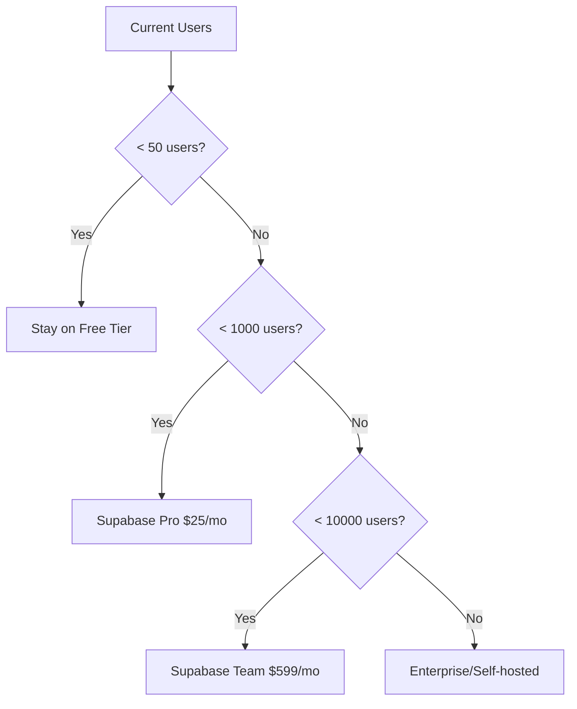

# MIRAI SaaS Platform - Scaling Roadmap

**Version:** 1.0  
**Date:** January 9, 2025  
**Status:** Active Roadmap  
**Budget Context:** $5k initial budget (primarily for marketing/customer acquisition)  

---

## Executive Summary

This roadmap provides a practical, milestone-based approach to scaling MIRAI from 0 to 100,000+ users. Each phase is triggered by actual user growth and revenue milestones, not arbitrary timelines. The focus is on sustainable growth with minimal infrastructure costs until product-market fit is achieved.

**Core Principles:**
- No premature optimization
- Infrastructure scales with revenue
- Free/cheap tools until proven necessary
- Every dollar spent must drive growth or retention

---

## Phase 0: Current State (0-10 Users)
*"Build fast, validate faster"*

### Current Infrastructure
- **Database:** Supabase Free Tier (500MB database, 1GB bandwidth, 2GB storage)
- **Hosting:** Vercel Free Tier
- **Authentication:** Supabase Auth (included)
- **File Storage:** Supabase Storage (included)
- **Monitoring:** Supabase Dashboard (basic)

### What's Sufficient Now
- Single database instance
- Basic RLS policies
- No caching needed
- Manual customer support
- Direct database queries
- Basic error logging

### Cost Analysis
- **Monthly Cost:** $0
- **Per User Cost:** $0
- **Infrastructure Reserve:** $0 (use free tiers)

### Key Metrics to Track
```sql
-- Add to migration 006_startup_essentials.sql (already exists)
-- Track these daily via simple queries:
SELECT COUNT(DISTINCT user_id) as daily_active_users FROM analytics_events 
WHERE DATE(created_at) = CURRENT_DATE;

SELECT COUNT(*) as total_messages FROM chat_messages 
WHERE DATE(created_at) = CURRENT_DATE;
```

### Action Items
✅ Use existing analytics_events table from migration 006
✅ Set up basic daily metrics dashboard
✅ Manual user onboarding calls
✅ Direct feedback collection via user_feedback table

---

## Phase 1: Early Validation (10-100 Users)
*"Find the users who love you"*

### Trigger Points
- 10+ active daily users
- 100+ messages per day
- First paying customer interest

### Minimal Additions Needed
1. **Basic Analytics Enhancement**
   ```sql
   -- Simple cohort tracking view
   CREATE MATERIALIZED VIEW user_cohorts AS
   SELECT 
     DATE_TRUNC('week', u.created_at) as cohort_week,
     COUNT(DISTINCT u.id) as cohort_size,
     COUNT(DISTINCT CASE WHEN ae.created_at > u.created_at + INTERVAL '7 days' 
           THEN u.id END) as week_1_retained
   FROM auth.users u
   LEFT JOIN analytics_events ae ON ae.user_id = u.id
   GROUP BY 1;
   ```

2. **Performance Monitoring**
   - Enable Supabase query performance insights (free)
   - Set up basic alerting via Supabase webhooks

3. **Customer Success**
   - Waitlist conversion tracking (use existing waitlist table)
   - Weekly user interviews
   - Feature request prioritization

### Infrastructure Changes
- **Stay on Free Tier** until 50 users
- Consider Supabase Pro at 75+ users ($25/month)

### Estimated Costs
- **0-50 users:** $0/month
- **50-100 users:** $25/month (Supabase Pro)
- **Marketing Budget:** $200-500/month for ads
- **Total:** $25-525/month

### Migration to Apply
```sql
-- None needed - use existing tables and add views as needed
```

---

## Phase 2: Initial Growth (100-1,000 Users)
*"Prove you can retain and monetize"*

### Trigger Points
- 100+ active users
- 1,000+ messages per day
- First 10 paying customers
- $500+ MRR

### First Scaling Considerations

1. **Upgrade Infrastructure**
   - Move to Supabase Pro ($25/month)
   - 8GB database, 50GB bandwidth, 100GB storage
   - This handles up to ~1,000 users easily

2. **Performance Optimizations**
   ```sql
   -- Create migration: 007_initial_scaling.sql
   
   -- Add message caching for frequent queries
   CREATE MATERIALIZED VIEW recent_messages_cache AS
   SELECT * FROM chat_messages 
   WHERE created_at > NOW() - INTERVAL '7 days'
   WITH DATA;
   
   -- Refresh every hour
   CREATE OR REPLACE FUNCTION refresh_recent_messages()
   RETURNS void AS $$
   BEGIN
     REFRESH MATERIALIZED VIEW CONCURRENTLY recent_messages_cache;
   END;
   $$ LANGUAGE plpgsql;
   
   -- Add connection pooling config
   ALTER SYSTEM SET max_connections = 100;
   ALTER SYSTEM SET shared_buffers = '256MB';
   ```

3. **Basic Revenue Infrastructure**
   - Stripe integration (pay-as-you-go pricing)
   - Simple subscription tiers
   - Usage-based billing preparation

4. **Monitoring Upgrades**
   - PostHog free tier for product analytics
   - Sentry free tier for error tracking
   - Basic custom dashboards

### Team Requirements
- 1 full-stack developer (founder)
- 1 part-time customer success (could be founder)

### Estimated Monthly Costs
- **Infrastructure:** $25 (Supabase Pro)
- **Monitoring:** $0 (free tiers)
- **Payment Processing:** ~$30 + 2.9% of revenue
- **Marketing:** $500-1,000
- **Total:** $555-1,055/month

### Revenue Targets
- **Target MRR:** $1,000-5,000
- **Price per user:** $10-50/month
- **Conversion rate target:** 5-10%

### Key Metrics
```sql
-- Revenue metrics
SELECT 
  COUNT(DISTINCT user_id) as paying_users,
  SUM(amount) as mrr
FROM subscription_history
WHERE status = 'active';

-- Engagement metrics
SELECT 
  AVG(messages_per_user) as avg_messages,
  PERCENTILE_CONT(0.5) WITHIN GROUP (ORDER BY messages_per_user) as median_messages
FROM (
  SELECT user_id, COUNT(*) as messages_per_user
  FROM chat_messages
  WHERE created_at > NOW() - INTERVAL '30 days'
  GROUP BY user_id
) user_activity;
```

---

## Phase 3: Product-Market Fit (1,000-10,000 Users)
*"Scale what works"*

### Trigger Points
- 1,000+ active users
- $5,000+ MRR
- <5% monthly churn
- Clear ICP (Ideal Customer Profile) identified

### Revenue Model Implementation
1. **Tiered Pricing**
   - Free: 10 messages/day
   - Starter: $19/month - 100 messages/day
   - Pro: $49/month - 500 messages/day
   - Team: $99/month - unlimited + collaboration

2. **Team Features (Basic)**
   ```sql
   -- Create migration: 008_team_features.sql
   
   CREATE TABLE organizations (
     id UUID PRIMARY KEY DEFAULT gen_random_uuid(),
     name TEXT NOT NULL,
     owner_id UUID REFERENCES auth.users(id),
     plan_type TEXT DEFAULT 'free',
     created_at TIMESTAMPTZ DEFAULT NOW()
   );
   
   CREATE TABLE organization_members (
     org_id UUID REFERENCES organizations(id),
     user_id UUID REFERENCES auth.users(id),
     role TEXT DEFAULT 'member',
     PRIMARY KEY (org_id, user_id)
   );
   ```

### Infrastructure Scaling
- **Database:** Consider Supabase Team plan ($599/month) at 5,000 users
- **Caching:** Redis for session management (Redis Cloud free tier)
- **CDN:** Cloudflare free tier for static assets
- **Search:** Keep using PostgreSQL full-text search (no Elasticsearch yet)

### Essential Compliance
- GDPR compliance basics
- Data export functionality
- Privacy policy and ToS
- Basic audit logging (use existing analytics_events)

### Team Scaling
- 2 full-stack developers
- 1 customer success manager
- 1 part-time marketer
- Consider first DevOps hire at 8,000 users

### Estimated Costs
- **Infrastructure:** $25-599/month
- **Monitoring:** $0-100/month (consider paid tiers)
- **Team:** $10,000-20,000/month (if hiring)
- **Marketing:** $2,000-5,000/month
- **Total:** $12,025-25,699/month

### Revenue Targets
- **Target MRR:** $10,000-50,000
- **Target Gross Margin:** 70-80%
- **CAC Payback:** <6 months

### Migration Scripts
```bash
# Apply team features when hitting 2,000 users
psql $DATABASE_URL -f migrations/008_team_features.sql

# Add performance optimizations at 5,000 users
psql $DATABASE_URL -f migrations/007_initial_scaling.sql
```

---

## Phase 4: Scale-Up (10,000-100,000 Users)
*"Build the machine"*

### Trigger Points
- 10,000+ active users
- $50,000+ MRR
- Enterprise customer interest
- Series A funding consideration

### Enterprise Features Introduction

Now it's time to implement the enterprise migrations from the architecture document:

1. **Advanced Security & Compliance**
   ```sql
   -- Apply migration: 009_enterprise_security.sql
   -- Includes: Audit logging, encryption at rest, SSO prep
   ```

2. **Performance at Scale**
   ```sql
   -- Apply migration: 010_enterprise_performance.sql
   -- Includes: Partitioning, read replicas, query optimization
   ```

3. **Multi-tenancy & Isolation**
   ```sql
   -- Apply migration: 011_enterprise_multitenancy.sql
   -- Includes: Schema-based isolation, resource quotas
   ```

### Infrastructure Requirements
- **Database:** Supabase Enterprise or self-hosted PostgreSQL cluster
- **Caching:** Dedicated Redis cluster
- **Search:** Elasticsearch for advanced search
- **Queue:** PostgreSQL LISTEN/NOTIFY → Redis/RabbitMQ
- **Monitoring:** DataDog or New Relic
- **CDN:** Cloudflare Pro

### Compliance Certifications
- SOC 2 Type I (start process at 20,000 users)
- GDPR full compliance
- CCPA compliance
- HIPAA (if healthcare customers)

### Team Requirements
- 5-10 engineers
- 2-3 DevOps/SRE
- 3-5 customer success
- 2-3 sales
- 1-2 security engineers

### Cost Projections
- **Infrastructure:** $5,000-15,000/month
- **Monitoring/Security:** $2,000-5,000/month
- **Team:** $100,000-200,000/month
- **Compliance:** $50,000-100,000/year
- **Total:** $107,000-220,000/month

### Revenue Projections
- **Target MRR:** $200,000-1,000,000
- **Enterprise deals:** $10,000-50,000/year
- **Gross Margin:** 75-85%

### Critical Migrations
```bash
# Performance optimizations
psql $DATABASE_URL -f migrations/010_enterprise_performance.sql

# Security hardening
psql $DATABASE_URL -f migrations/009_enterprise_security.sql

# Multi-tenancy
psql $DATABASE_URL -f migrations/011_enterprise_multitenancy.sql
```

---

## Phase 5: Enterprise Ready (100,000+ Users)
*"Compete with the giants"*

### Trigger Points
- 100,000+ users
- $1M+ MRR
- Fortune 500 customers
- International expansion

### Full Enterprise Architecture

1. **Multi-Region Deployment**
   - Primary region: US-East
   - Secondary regions: EU-West, APAC
   - Data residency compliance
   - <100ms latency globally

2. **High Availability Setup**
   ```yaml
   architecture:
     database:
       - Primary: Multi-AZ PostgreSQL cluster
       - Read replicas: 3+ per region
       - Failover: <30 seconds RTO
     application:
       - Load balancers: Multi-region
       - Auto-scaling: Based on CPU/memory
       - Circuit breakers: All external services
   ```

3. **Advanced Security**
   - Zero-trust architecture
   - Hardware security modules (HSM)
   - Advanced threat detection
   - Penetration testing quarterly
   - Bug bounty program

4. **Full Audit & Compliance**
   - SOC 2 Type II
   - ISO 27001
   - HIPAA certified
   - FedRAMP (for government)

### Infrastructure at Scale
- **Database:** Aurora PostgreSQL or CockroachDB
- **Caching:** Redis Enterprise with geo-distribution
- **Search:** Elasticsearch cluster with ML ranking
- **Stream Processing:** Kafka for event streaming
- **API Gateway:** Kong or AWS API Gateway
- **Monitoring:** Full observability stack

### Team at Scale
- 50+ engineers
- 10+ DevOps/SRE
- 20+ customer success
- 15+ sales
- 5+ security team
- 10+ product team

### Financial Projections
- **Infrastructure:** $50,000-150,000/month
- **Team:** $1,000,000+/month
- **Compliance/Security:** $500,000/year
- **Total Operating Cost:** $1,100,000+/month
- **Target MRR:** $3,000,000-10,000,000
- **Target Gross Margin:** 80-90%

---

## Decision Trees

### When to Upgrade Infrastructure



### When to Add Features

| Feature | User Trigger | Revenue Trigger | Don't Build Until |
|---------|-------------|-----------------|-------------------|
| Basic Analytics | Day 1 | - | Already built |
| Payment Processing | 50 users | First customer | Phase 1 |
| Team Features | 500 users | $5k MRR | Phase 3 |
| API Access | 1,000 users | Enterprise request | Phase 3 |
| SSO/SAML | 5,000 users | $50k MRR | Phase 4 |
| Audit Logs | 10,000 users | Compliance need | Phase 4 |
| Multi-region | 50,000 users | International customers | Phase 5 |

### When to Hire

```
0-100 users: Founder only
100-1,000 users: +1 engineer
1,000-5,000 users: +2 engineers, +1 customer success
5,000-10,000 users: +3 engineers, +1 DevOps, +2 CS
10,000-50,000 users: Double the team
50,000+ users: Departmental structure
```

---

## Cost Optimization Strategies

### Phase 0-2 (0-1,000 users)
1. **Use free tiers aggressively**
   - Supabase free → Pro only when needed
   - Vercel free tier for hosting
   - GitHub Actions free tier for CI/CD
   - Cloudflare free for CDN

2. **Avoid premature costs**
   - No dedicated servers
   - No expensive monitoring
   - No compliance certifications
   - No dedicated support tools

### Phase 3-4 (1,000-100,000 users)
1. **Optimize database costs**
   ```sql
   -- Regular maintenance
   VACUUM ANALYZE;
   
   -- Drop unused indexes
   SELECT schemaname, tablename, indexname, idx_scan
   FROM pg_stat_user_indexes
   WHERE idx_scan = 0;
   
   -- Archive old data
   INSERT INTO chat_messages_archive 
   SELECT * FROM chat_messages 
   WHERE created_at < NOW() - INTERVAL '6 months';
   ```

2. **Efficient caching**
   - Cache expensive queries
   - Use CDN for all static assets
   - Implement browser caching
   - Redis for session management only

3. **Smart scaling**
   - Vertical scaling before horizontal
   - Auto-scaling based on actual usage
   - Reserved instances for predictable load

### Phase 5 (100,000+ users)
1. **Negotiate enterprise deals**
   - Annual commitments for discounts
   - Volume-based pricing
   - Multi-year contracts

2. **Optimize architecture**
   - Microservices only where needed
   - Event-driven for async operations
   - GraphQL to reduce API calls

---

## Common Pitfalls to Avoid

### Technical Pitfalls
1. **Over-engineering early**
   - ❌ Don't: Build microservices for 10 users
   - ✅ Do: Monolith until 10,000+ users

2. **Premature optimization**
   - ❌ Don't: Set up Kubernetes for 100 users
   - ✅ Do: Use managed services until scale demands it

3. **Wrong technology choices**
   - ❌ Don't: NoSQL because it's "web scale"
   - ✅ Do: PostgreSQL handles 99% of use cases

4. **Ignoring database basics**
   - ❌ Don't: Forget indexes on foreign keys
   - ✅ Do: Profile queries regularly

### Business Pitfalls
1. **Scaling before product-market fit**
   - ❌ Don't: Hire 10 engineers with 50 users
   - ✅ Do: Stay lean until $10k+ MRR

2. **Building for enterprise too early**
   - ❌ Don't: SSO for your first customer
   - ✅ Do: Manual processes until pattern emerges

3. **Ignoring unit economics**
   - ❌ Don't: Spend $100 to acquire $10/mo customer
   - ✅ Do: CAC < 3-6 months of revenue

---

## Monitoring & Alerting Priorities

### Phase 0-1: Basics Only
```sql
-- Daily health check queries
SELECT 
  COUNT(DISTINCT user_id) as dau,
  COUNT(*) as total_messages,
  AVG(response_time_ms) as avg_response
FROM analytics_events
WHERE DATE(created_at) = CURRENT_DATE;
```

### Phase 2-3: Key Metrics
- **Application**: Response time, error rate
- **Database**: Query time, connection count
- **Business**: DAU, messages/user, revenue

### Phase 4-5: Full Observability
- **Golden Signals**: Latency, traffic, errors, saturation
- **Business KPIs**: CAC, LTV, churn, NPS
- **Security**: Failed auth, suspicious patterns
- **Compliance**: Data access, changes, exports

---

## Migration Execution Guide

### How to Apply Migrations Safely

1. **Always backup first**
```bash
pg_dump $DATABASE_URL > backup_$(date +%Y%m%d).sql
```

2. **Test in development**
```bash
# Create test branch in Supabase
supabase db branch create test-migration
supabase db push --branch test-migration
```

3. **Apply with transaction**
```sql
BEGIN;
-- Run migration
\i migrations/007_initial_scaling.sql
-- Verify
SELECT * FROM pg_stat_user_tables;
COMMIT;
```

4. **Monitor after deployment**
```sql
-- Check for slow queries
SELECT query, calls, mean_exec_time
FROM pg_stat_statements
WHERE mean_exec_time > 100
ORDER BY mean_exec_time DESC;
```

### Migration Schedule

| Phase | Users | Migrations to Apply | When to Apply |
|-------|-------|-------------------|---------------|
| 0 | 0-10 | 001-006 (already done) | Complete |
| 1 | 10-100 | None | - |
| 2 | 100-1k | 007_initial_scaling | At 500 users |
| 3 | 1k-10k | 008_team_features | At 2,000 users |
| 4 | 10k-100k | 009-011_enterprise | At 15,000 users |
| 5 | 100k+ | 012+_global_scale | At 100,000 users |

---

## Success Metrics by Phase

### Phase 0: Learning
- 10+ user interviews completed
- 1+ core problem validated
- 50%+ users return within 7 days

### Phase 1: Validation  
- 20%+ week-1 retention
- 10+ paying customer conversations
- NPS > 50

### Phase 2: Growth
- 30%+ week-1 retention
- 5%+ free to paid conversion
- CAC payback < 12 months

### Phase 3: Product-Market Fit
- 40%+ week-1 retention
- < 5% monthly churn
- CAC payback < 6 months
- NPS > 60

### Phase 4: Scale
- < 3% monthly churn
- CAC payback < 3 months
- Gross margin > 75%
- NPS > 70

### Phase 5: Domination
- < 2% monthly churn
- Net negative churn (expansion > churn)
- Gross margin > 80%
- Market leader position

---

## Conclusion

This roadmap is a living document. Update it based on actual growth patterns, not projections. The key is to stay lean until product-market fit, then scale aggressively with proven unit economics.

**Remember:**
- Don't build it until you need it
- Free/cheap tools are good enough until 1,000+ users
- Every optimization should be driven by actual bottlenecks
- Revenue before infrastructure
- Customer love before scale

**Next Steps:**
1. Implement basic analytics (already done via migration 006)
2. Set up daily metrics dashboard
3. Start user interviews
4. Focus on retention, not acquisition
5. Document learnings and iterate

---

## Appendix: Quick Reference

### Database Size Estimates
- 1 user ≈ 1MB of data/month
- 1,000 users ≈ 1GB of data
- 10,000 users ≈ 10GB of data
- 100,000 users ≈ 100GB of data

### Supabase Tier Limits
- **Free**: 500MB database, 1GB bandwidth, 2GB storage
- **Pro ($25)**: 8GB database, 50GB bandwidth, 100GB storage
- **Team ($599)**: 16GB database, 250GB bandwidth, 250GB storage
- **Enterprise**: Custom

### Cost per User (Infrastructure Only)
- 0-50 users: $0/user
- 50-1,000 users: $0.025-0.25/user
- 1,000-10,000 users: $0.25-0.60/user
- 10,000-100,000 users: $0.50-1.50/user
- 100,000+ users: $0.50-1.00/user

### When You Actually Need It
- Redis: 1,000+ concurrent users
- Elasticsearch: 10,000+ users or complex search
- Kubernetes: 50,000+ users
- Multi-region: International customers
- Microservices: 50+ engineers
- Data warehouse: 1M+ events/day